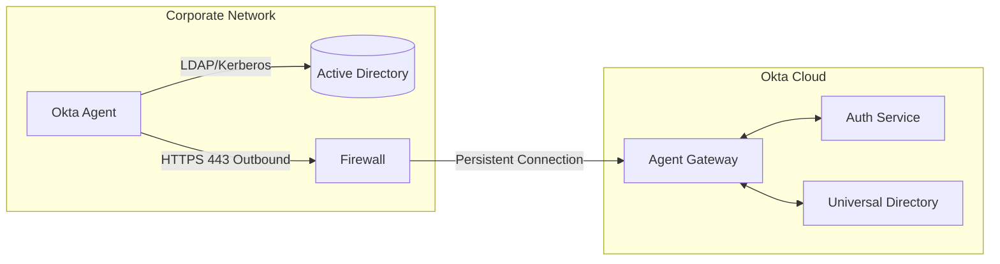
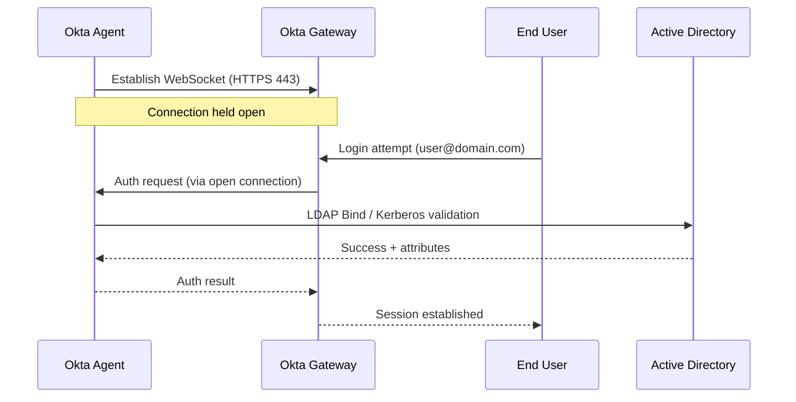
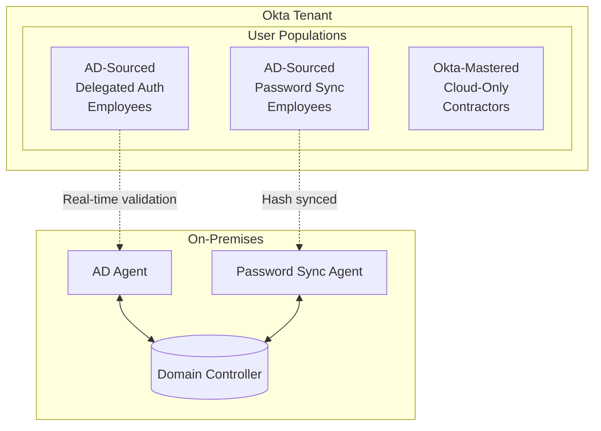
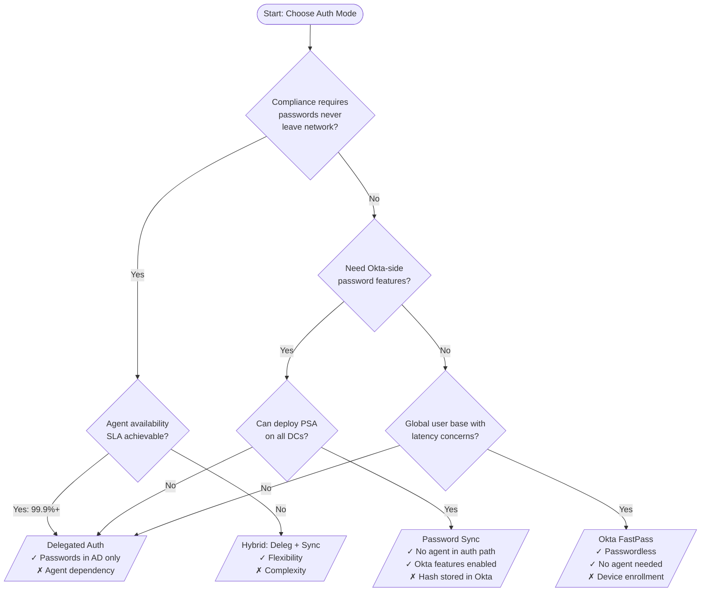
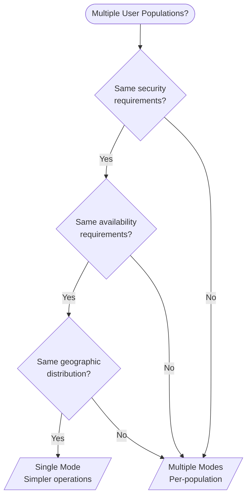
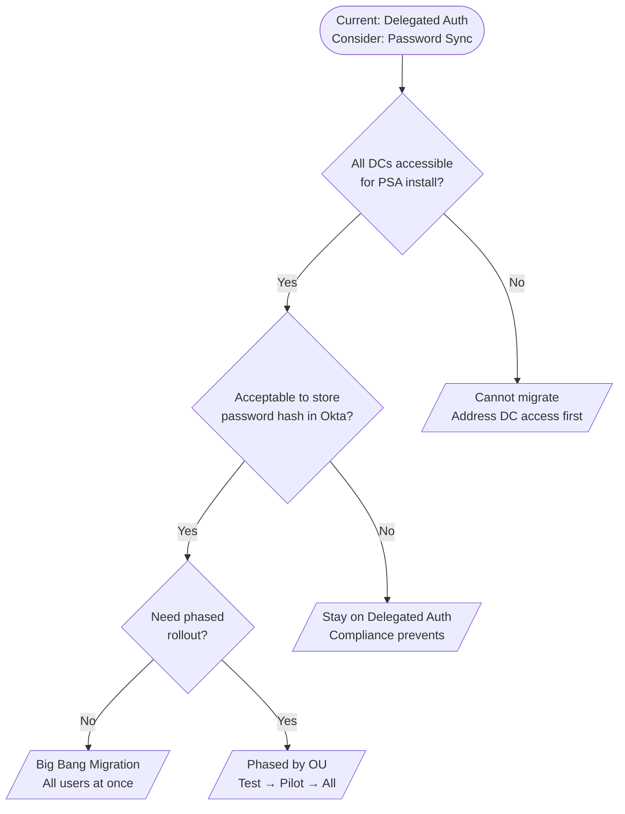
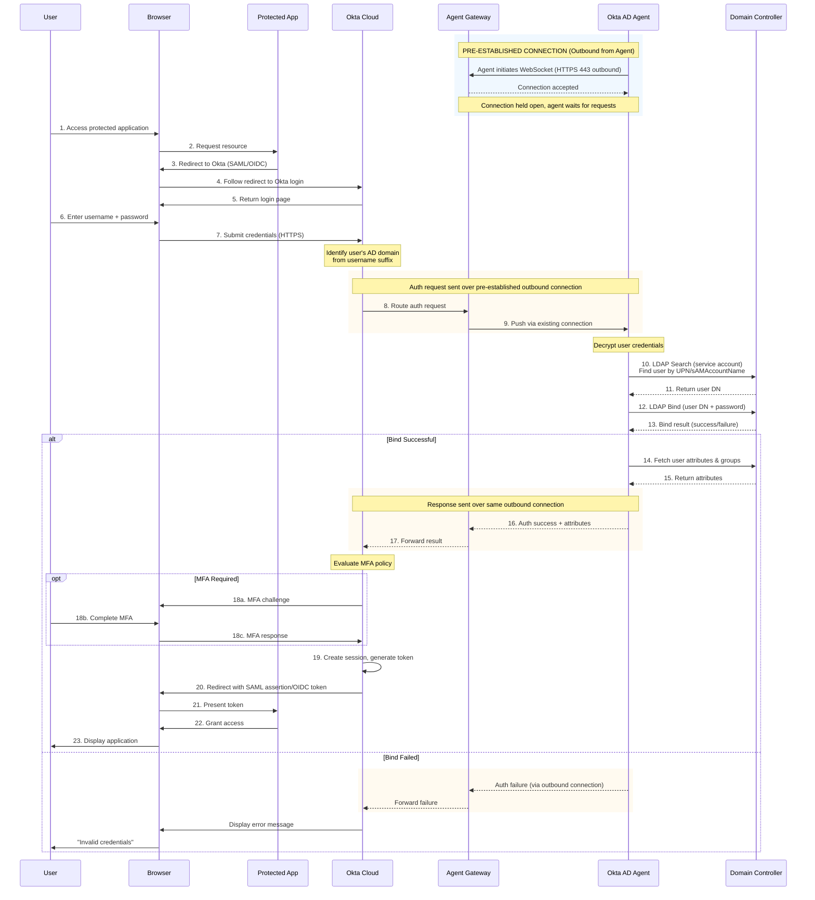

# Okta AD Agents: Architecture

## Outbound-Only Connection Model

All Okta agents use an outbound-only connection architecture, eliminating the need for inbound firewall rules while maintaining near real-time responsiveness.



**Key Characteristics:**

- Agents initiate all connections (outbound HTTPS on port 443)
- Connections use WebSocket or HTTP long-polling for bidirectional communication
- No DMZ or inbound firewall rules required
- TLS 1.2+ encryption for all traffic

## Connection Persistence Mechanism

The agent maintains a persistent connection to Okta's agent gateway, enabling the cloud service to push requests to on-premises infrastructure.



## Authentication Modes

Okta does not always use delegated authentication. The platform supports multiple authentication strategies, and the choice depends on organizational requirements.

### Available Authentication Modes

| Mode | How It Works | Password Location |
|------|--------------|-------------------|
| **Delegated Auth** | Credentials validated against AD in real-time via agent | AD only |
| **Password Sync** | Password hash synced to Okta, validated in cloud | Both AD and Okta |
| **Okta-Mastered** | Password exists only in Okta Universal Directory | Okta only |
| **Social/IdP** | Federated to external identity provider | External IdP |

### Mode Selection Criteria

**Delegated Authentication**

- AD is authoritative, credentials validated against AD in real-time
- Okta caches credentials for **5 days** after successful auth ([source](https://support.okta.com/help/s/article/Cache-AD-Credentials-using-Delegated-Authentication))
- If agent is unreachable, cached credentials allow fallback authentication
- Users who never authenticated (or cache expired) cannot log in during outage
- Best for strict compliance requirements

**Password Sync (via Password Sync Agent)**

- Passwords sync from AD to Okta in near real-time
- Users can authenticate even if agent is offline
- Enables Okta-side password policies and breach detection
- Required for some Okta features (e.g., offline MFA)

**Okta-Mastered Users**

- Cloud-only users with no AD account
- Contractors, partners, B2C customers
- Password stored and managed entirely in Okta

### Hybrid Authentication Topology

Many organizations use a mix of authentication modes based on user population:



### Configuration

The authentication method is configured per AD integration in Okta Admin Console:

- Navigate to **Directory > Directory Integrations > Active Directory**
- Select the AD instance and go to **Provisioning** settings
- Choose "Delegated Authentication" or enable password synchronization
- Configuration can be changed without reinstalling agents

**Note:** The Password Sync Agent is a separate installation. If only the AD Agent is deployed, delegated authentication is used by default.

## Authentication Mode Decision Framework

For large enterprises, choosing the right authentication mode is a critical architectural decision with security, availability, and performance implications.

### Decision Tree: Primary Authentication Mode



### Decision Matrix: Mode by Use Case

| Use Case | Recommended Mode | Rationale |
|----------|------------------|-----------|
| Financial services (SOX, PCI) | Delegated Auth | Credentials never leave network |
| Healthcare (HIPAA) | Delegated Auth or Password Sync | Either acceptable with proper controls |
| Global enterprise (100K+ users) | Password Sync | Removes latency dependency on agents |
| Startup/SMB | Password Sync | Simpler operations, fewer failure modes |
| Zero Trust initiative | Okta FastPass | Passwordless, strongest security |
| Hybrid cloud migration | Hybrid (per-OU) | Gradual transition |
| Contractors/externals | Okta-Mastered | No AD account needed |

### Mode Comparison: Large Enterprise Perspective

| Factor | Delegated Auth | Password Sync | Okta FastPass |
|--------|----------------|---------------|---------------|
| **Security** |
| Password storage | AD + Okta cache (5-day TTL) | AD + Okta (hashed) | None (passwordless) |
| Breach detection | Limited | Okta breach detection | N/A |
| Credential phishing | Vulnerable | Vulnerable | Resistant |
| **Availability** |
| Agent dependency | Primary; cache fallback for 5 days | Sync only (not auth) | None |
| Offline auth | Yes (cached, 5 days) | Yes (from Okta) | Device-dependent |
| Global latency | Agent location-bound | Okta edge POPs | Okta edge POPs |
| **Operations** |
| Agent count | High (per auth load) | Lower (sync only) | None |
| DC dependency | Real-time | Near-real-time | None |
| Password reset flow | AD-initiated | AD or Okta | N/A |
| **Scale** |
| Rate limits | Auth + Sync | Sync only | Minimal |
| Peak handling | Agent-constrained | Okta cloud | Okta cloud |
| User capacity | Agent-limited | Cloud-limited | Cloud-limited |

### Decision Tree: When to Use Multiple Modes



### Multi-Mode Architecture Example

```
Large Enterprise: 150,000 users across multiple populations

┌─────────────────────────────────────────────────────────────────┐
│ Population: Executives & Privileged (500 users)                  │
│ Mode: Delegated Auth + Okta FastPass                            │
│ Rationale: Maximum security, MFA always required                │
│ Agents: Dedicated hardened agents, 15-min sync                  │
└─────────────────────────────────────────────────────────────────┘

┌─────────────────────────────────────────────────────────────────┐
│ Population: Corporate Employees (80,000 users)                   │
│ Mode: Password Sync                                              │
│ Rationale: Balance of security and availability                 │
│ Agents: PSA on all DCs, standard AD agents for sync             │
└─────────────────────────────────────────────────────────────────┘

┌─────────────────────────────────────────────────────────────────┐
│ Population: Field Workers (50,000 users)                         │
│ Mode: Password Sync + Okta FastPass (encouraged)                │
│ Rationale: Offline capability, reduce password resets           │
│ Agents: Regional sync, FastPass for regular users               │
└─────────────────────────────────────────────────────────────────┘

┌─────────────────────────────────────────────────────────────────┐
│ Population: Contractors (15,000 users)                           │
│ Mode: Okta-Mastered                                              │
│ Rationale: No AD account, self-service password                 │
│ Agents: None (cloud-only)                                        │
└─────────────────────────────────────────────────────────────────┘

┌─────────────────────────────────────────────────────────────────┐
│ Population: Service Accounts (5,000 accounts)                    │
│ Mode: Delegated Auth                                             │
│ Rationale: Programmatic access, no password in Okta             │
│ Agents: Dedicated, monitored, strict policies                   │
└─────────────────────────────────────────────────────────────────┘
```

### Migration Decision Tree: Moving Between Modes



### Phased Migration Example

```
Week 1-2: Preparation
  - Install PSA on all writable DCs
  - Verify password sync for test accounts
  - Create separate test integration

Week 3-4: Pilot (IT Department - 500 users)
  - Move IT OU to new integration with Password Sync
  - Monitor for issues
  - Validate Okta password features work

Week 5-8: Early Adopters (Engineering - 5,000 users)
  - Migrate engineering OUs
  - Stress test during peak hours
  - Refine runbooks

Week 9-16: General Rollout (Remaining 80,000 users)
  - Migrate by region/department
  - 10,000 users per week
  - Keep delegated auth integration as fallback

Week 17+: Cleanup
  - Decommission delegated auth agents (keep 1 for emergency)
  - Update documentation
  - Final security review
```

### Trade-off Summary for Architects

| If You Prioritize... | Choose... | Accept... |
|----------------------|-----------|-----------|
| **Credential security** | Delegated Auth | Agent availability risk |
| **Availability** | Password Sync | Hash in Okta cloud |
| **User experience** | Okta FastPass | Device enrollment burden |
| **Simplicity** | Password Sync | Less control over password storage |
| **Compliance (strict)** | Delegated Auth | Operational complexity |
| **Global scale** | Password Sync + FastPass | Multiple modes to manage |

## Complete Delegated Authentication Flow

The following diagram shows the end-to-end delegated authentication flow from user access through application grant. Note that the agent establishes an **outbound** persistent connection to Okta before any authentication occurs - all subsequent communication flows over this pre-established connection.



**Key Point:** The arrows between Gateway and Agent represent bidirectional data flow over a connection that the **agent initiated outbound**. No inbound firewall rules are required.

### Authentication Flow Phases

| Phase | Steps | Description |
|-------|-------|-------------|
| **Connection Setup** | Pre-auth | Agent establishes outbound WebSocket to Okta gateway |
| **App Redirect** | 1-4 | User accesses app, redirected to Okta |
| **Credential Entry** | 5-7 | User submits AD credentials to Okta |
| **Agent Routing** | 8-9 | Okta pushes request to agent via pre-established connection |
| **User Lookup** | 10-11 | Agent finds user DN using service account |
| **Credential Validation** | 12-13 | Agent performs LDAP bind with user's password |
| **Attribute Fetch** | 14-15 | On success, agent retrieves user attributes |
| **MFA (if required)** | 18a-c | Okta enforces MFA policy |
| **Token Issuance** | 19-21 | Okta issues SAML/OIDC token, user accesses app |

## Document Navigation

- **Previous:** [01-overview.md](01-overview.md) - Overview and terminology
- **Next:** [03-agent-types.md](03-agent-types.md) - Agent type details
- **Index:** [README.md](../README.md)
