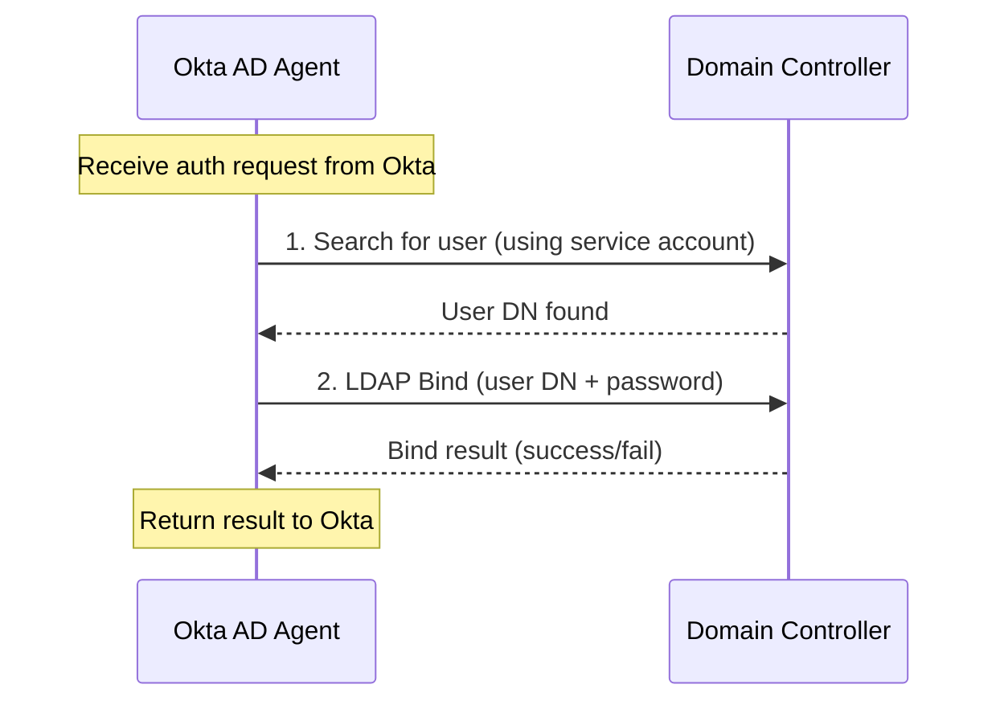
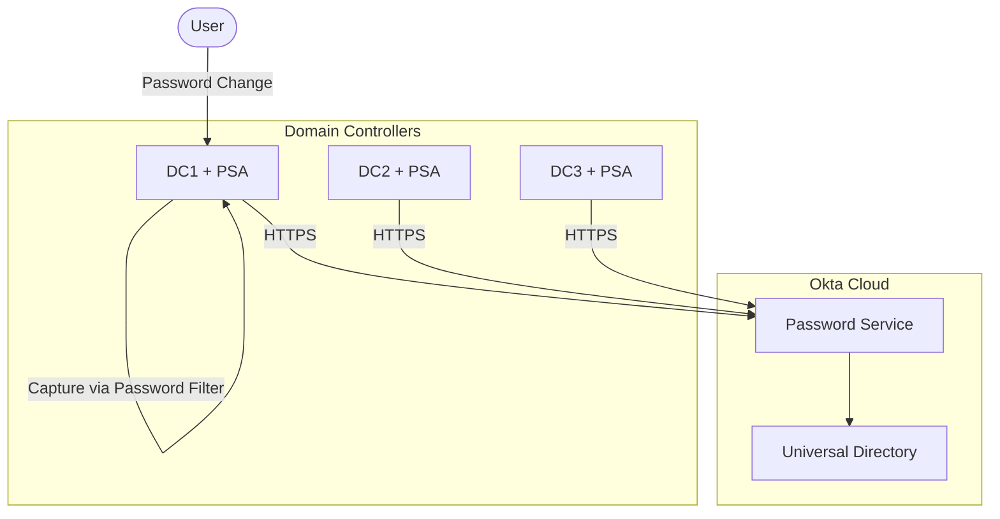
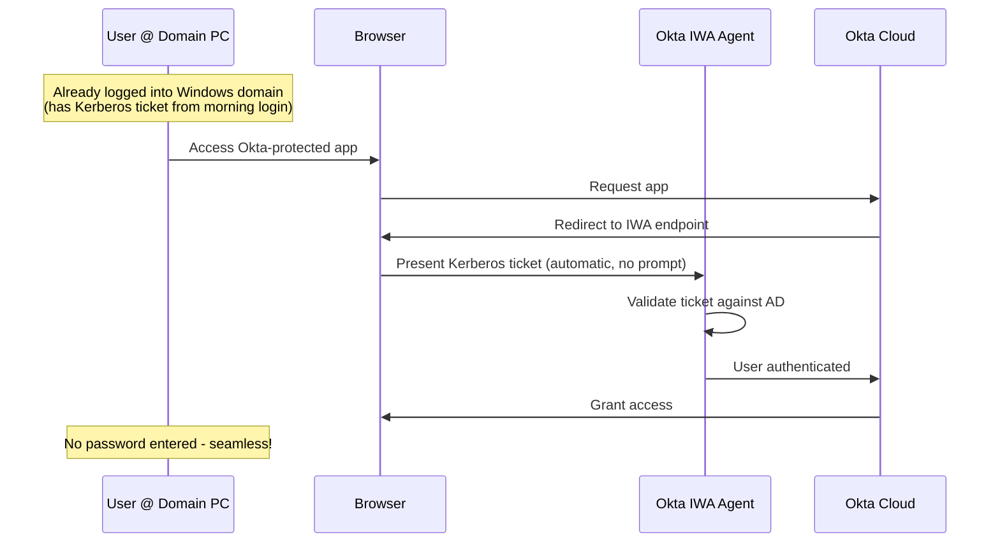
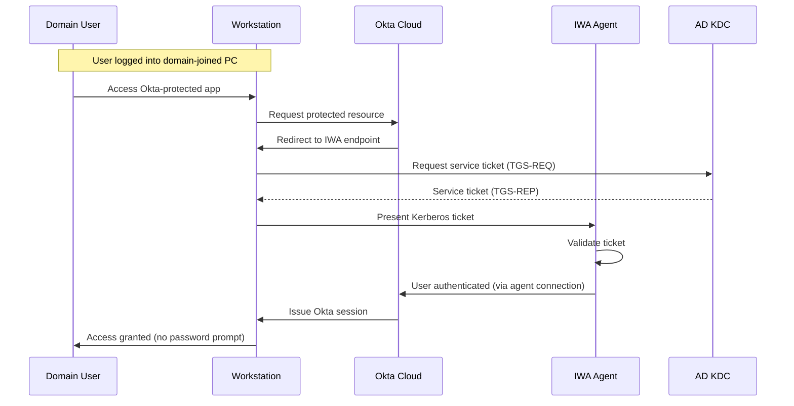
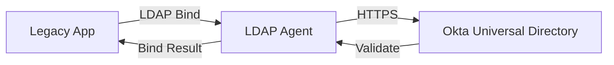

# Okta AD Agents: Agent Types

## AD Agent

The AD Agent is the primary integration point for Active Directory environments.

### Core Functionalities

**1. Directory Synchronization**

- Imports users, groups, and organizational units from AD to Okta
- Supports attribute mapping between AD schema and Okta Universal Directory profile
- Uses DirSync control (USN tracking) for efficient incremental imports
- Supports configurable import schedules with manual trigger capability

**2. Delegated Authentication**

- Validates user credentials against AD without syncing password hashes
- Supports LDAP simple bind and Kerberos authentication
- Enforces MFA through Okta while using AD credentials
- Maintains password policies defined in AD

**3. Just-in-Time Provisioning**

- Creates Okta user profiles on first authentication
- Automatically assigns group memberships based on AD groups
- Applies Okta policies based on user attributes

**4. Profile Mastering**

Configurable source of truth for user attributes:

| Mastering Mode | Behavior |
|----------------|----------|
| AD Masters Okta | AD attributes overwrite Okta on each sync |
| Okta Masters AD | Okta pushes attribute changes to AD (writeback) |
| Profile-specific | Different attributes mastered by different sources |

### Delegated Authentication: LDAP Bind Mechanism

Delegated authentication uses an LDAP bind to AD to validate user credentials. The agent performs a simple LDAP bind using the submitted password:

**Two-Step Validation Process:**

| Step | Account Used | Operation | Purpose |
|------|--------------|-----------|---------|
| 1. User Lookup | Service account | LDAP Search | Resolve username to Distinguished Name (DN) |
| 2. Credential Check | User's credentials | LDAP Bind | Validate password by attempting bind |

The bind operation asks AD: "Are these credentials valid?" A successful bind confirms the password is correct; a failed bind indicates invalid credentials.

**Service Account Requirements:**

The AD Agent's service account needs the following permissions:

| Permission | Purpose |
|------------|---------|
| Read access to user objects | Look up users by UPN/sAMAccountName |
| Read access to group objects | Retrieve group memberships |
| Read access to attributes | Fetch profile attributes for sync |

The service account does **not** need write permissions unless you enable Okta-to-AD provisioning or writeback.

**Alternative: Kerberos**

Some configurations use Kerberos instead of LDAP bind, but LDAP simple bind is the most common method for delegated authentication. Kerberos is primarily used by the IWA Agent for desktop SSO scenarios where the user already has a valid Kerberos ticket from domain login.

### Supported AD Topologies

| Topology | Support Level | Considerations |
|----------|---------------|----------------|
| Single Domain | Full | Standard deployment |
| Single Forest, Multiple Domains | Full | Agent per domain or forest-level |
| Multiple Forests (Trust) | Full | Configure trust relationships in Okta |
| Multiple Forests (No Trust) | Full | Separate agent set per forest |
| Azure AD Domain Services | Supported | Specific configuration required |

## Password Sync Agent

The Password Sync Agent enables real-time password synchronization from AD to Okta.

### Architecture

**Key Points:**

- Must be installed on every writable Domain Controller
- Uses Windows Password Filter DLL to capture password changes at the source
- Transmits salted hash (not cleartext) over TLS
- Near real-time sync (typically under 10 seconds)

### When to Use Password Sync vs Delegated Auth

| Scenario | Recommended Approach |
|----------|---------------------|
| AD is authoritative, need offline Okta auth | Password Sync |
| Strict compliance (no cloud password storage) | Delegated Auth |
| Low latency auth required | Password Sync |
| Multiple AD forests | Delegated Auth (simpler) |
| Gradual cloud migration | Password Sync |

## IWA (Integrated Windows Authentication) Agent

> **Note:** Okta recommends migrating from IWA Agent to **Agentless Desktop SSO**. The IWA Agent is in limited support mode with no new functionality being added. See [Migrate from IWA to Agentless DSSO](https://help.okta.com/en-us/Content/Topics/Directory/ad-dsso-iwa-migrate.htm).

### What is IWA?

**Integrated Windows Authentication (IWA)** is a Microsoft authentication mechanism that allows users logged into a Windows domain to automatically authenticate to web applications without re-entering credentials. It's also known as "Desktop SSO" or "Seamless SSO."

**The User Experience:**

| Step | What Happens |
|------|--------------|
| 1. Morning login | User logs into Windows laptop with AD credentials |
| 2. Kerberos ticket issued | Domain Controller issues a Kerberos TGT (Ticket Granting Ticket) |
| 3. Access app later | User opens browser, navigates to Okta-protected app |
| 4. Automatic auth | No password prompt - browser presents Kerberos ticket automatically |

This seamless experience works only when:

- User is on a **domain-joined Windows PC**
- PC can reach the **IWA agent** (typically on corporate network)
- Browser supports Kerberos/NTLM (Edge, Chrome, Firefox with configuration)

### How the Okta IWA Agent Enables Desktop SSO

The Okta IWA Agent validates Kerberos tickets from domain-joined workstations and translates them into Okta sessions:

### Detailed Authentication Flow

**Requirements:**

- Domain-joined Windows workstations
- IWA Agent with SPN (Service Principal Name) registered
- DNS configuration for IWA endpoint
- Kerberos delegation configured if needed

### IWA vs Other Authentication Methods

| Authentication Method | User Experience | When Used |
|-----------------------|-----------------|-----------|
| **Standard Okta login** | Enter username + password | Remote users, non-domain PCs |
| **IWA / Desktop SSO** | Automatic, no prompt | Domain-joined PCs on corporate network |
| **Okta FastPass** | Click to approve (passwordless) | Okta Verify with device trust |
| **Smart Card / PIV** | Insert card, enter PIN | High-security environments |

### Alternatives to IWA Agent

Okta recommends Agentless Desktop SSO over the IWA Agent:

| Method | Requires Agent? | Status | Notes |
|--------|-----------------|--------|-------|
| **Agentless Desktop SSO** | No | **Recommended** | Kerberos validation in Okta cloud; 1,000 req/min limit |
| **Okta FastPass** | No | Recommended | Passwordless with biometrics/device trust |
| IWA Web Agent | Yes | Limited support | Legacy; no new features being added |
| Azure AD Seamless SSO | No | Active | For Azure AD hybrid environments |

**Benefits of Agentless DSSO over IWA Agent:**

- No on-premises infrastructure to maintain
- Okta handles Kerberos validation in the cloud
- Higher availability (Okta SLA vs on-prem agent uptime)
- Reduced operational overhead

## LDAP Agent

The LDAP Agent provides an LDAP interface to Okta's Universal Directory for legacy applications.

### Use Cases

- Applications requiring LDAP authentication that cannot use SAML/OIDC
- Migration path for legacy LDAP directories
- Centralized directory for heterogeneous environments

## Document Navigation

- **Previous:** [02-architecture.md](02-architecture.md) - Architecture and auth flows
- **Next:** [04-high-availability.md](04-high-availability.md) - HA and load balancing
- **Index:** [README.md](../README.md)
