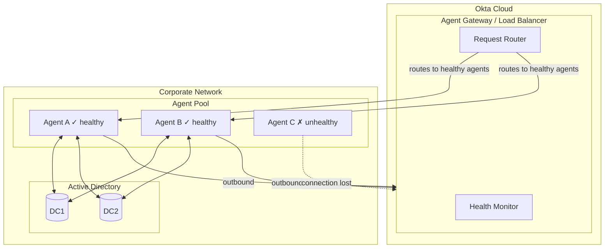
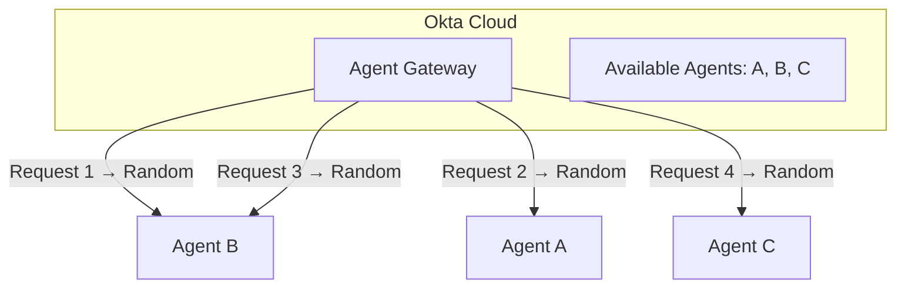
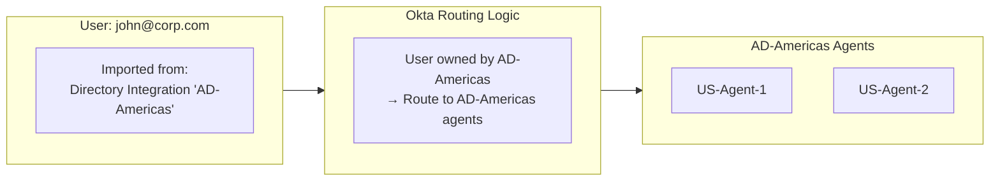
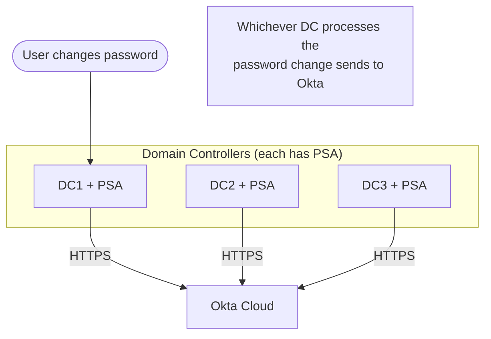
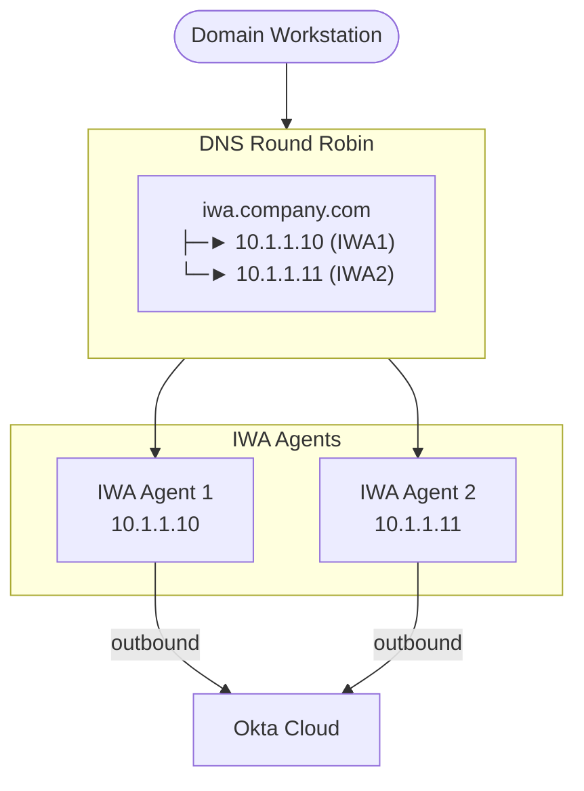
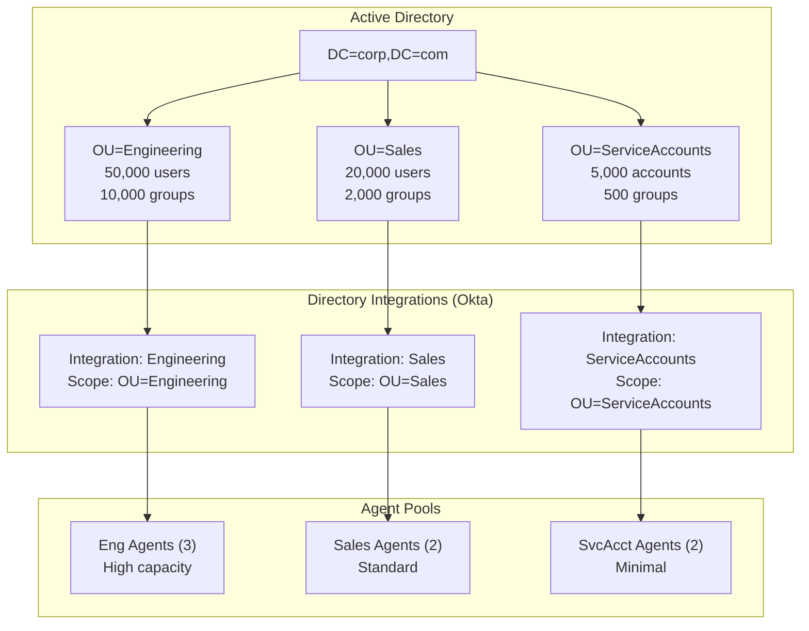

# Okta AD Agents: High Availability

## Overview

Okta's HA recommendations for AD agents are straightforward since the agents are stateless for authentication operations.

**Minimum Production Deployment:**

- **2 agents per AD domain** for redundancy
- Agents should be on **separate physical/virtual hosts**
- Deploy in **different failure domains** (racks, availability zones, data centers)

**No External Load Balancer Required:**

- Okta's cloud automatically load balances across all healthy agents
- Agent health monitored via heartbeat over the persistent connection
- Unhealthy agents automatically removed from rotation

## How HA Works



## Failure Scenarios

| Scenario | Behavior |
|----------|----------|
| Single agent fails | Traffic automatically routes to remaining agents |
| Agent loses network to Okta | Connection drops, agent marked unhealthy |
| Agent loses network to AD | Auth requests fail, Okta may mark unhealthy after threshold |
| All agents fail | Delegated auth unavailable (password sync users unaffected) |

## Load Balancing and Agent Routing

Okta uses **random selection** to distribute authentication requests across healthy agents. There is no round-robin, weighted distribution, or least-connections algorithm.



**Why random works:** Agents are stateless for authentication - no session affinity needed, any agent can handle any request.

## Routing Is Based on User Identity, Not Request Origin

**Critical limitation:** Okta routes authentication requests based on **which directory integration owns the user**, not where the request originates from.



| Scenario | Request Origin | Routed To | Result |
|----------|----------------|-----------|--------|
| John in NYC office | NYC | US agents | Good latency |
| John travels to London | London | US agents | High latency (crosses Atlantic) |
| John on VPN from Tokyo | Tokyo | US agents | High latency |

**The binding is:** User → Directory Integration → Agents registered to that integration

**Request origin factors NOT used for routing:**
- Source IP address
- Geographic location
- Network/VPN location
- Time of day

## Workarounds for Geographic Latency

If location-aware authentication is required:

| Approach | How It Works | Trade-off |
|----------|--------------|-----------|
| **Password Sync** | Passwords validated in Okta cloud, no agent in auth path | Password hashes stored in Okta |
| **Okta FastPass** | Passwordless via Okta Verify, no agent needed | Requires device enrollment |
| **Regional OUs** | Move users between regional OUs/integrations | Operational complexity, users can't easily roam |

For most organizations, **Password Sync** or **Okta FastPass** is the recommended solution for globally distributed users, as it removes agents from the authentication critical path entirely.

## Agent-Specific HA Considerations

| Agent Type | HA Recommendation | Notes |
|------------|-------------------|-------|
| **AD Agent** | 2+ agents per domain | Separate hosts, Okta handles load balancing |
| **Password Sync Agent** | Install on every writable DC | Inherent HA - no single point of failure |
| **IWA Agent** | 2+ agents with DNS/LB | Requires LB or DNS round-robin; **consider Agentless DSSO** |
| **LDAP Agent** | 2+ agents | Applications may need their own load balancer |

## Password Sync Agent - Built-in HA

Password Sync is inherently HA because it must be installed on every writable Domain Controller:



No additional HA configuration needed - as long as you have multiple DCs, password sync is resilient.

## IWA Agent HA - Requires DNS or Load Balancer

> **Recommendation:** Consider migrating to **Agentless Desktop SSO**, which eliminates on-premises IWA agents entirely. Okta handles Kerberos validation in the cloud with built-in HA. See [03-agent-types.md](03-agent-types.md#alternatives-to-iwa-agent).

Unlike the AD Agent, IWA requires client-side configuration since workstations connect directly to the IWA endpoint:



**Options for IWA HA:**

| Method | Pros | Cons |
|--------|------|------|
| **Agentless DSSO (recommended)** | No on-prem agents, Okta SLA, built-in HA | 1,000 req/min rate limit |
| DNS round-robin | Simple, no extra infrastructure | No health checking |
| Hardware/software LB | Health checks, session affinity | Additional infrastructure |

## Sizing for HA

Per [Okta documentation](https://help.okta.com/en-us/content/topics/directory/ad-agent-prerequisites.htm):

| Users | Minimum Agents | Notes |
|-------|----------------|-------|
| < 30,000 | 2 | Minimum for HA/redundancy |
| > 30,000 | 3 | Okta-documented threshold |
| 50,000+ | 3-4 | Scale based on authentication volume |
| 100,000+ | 4+ | Geographic distribution recommended; consult Okta |

## Scaling Considerations: AD Object Complexity

User count alone doesn't determine agent load. AD object complexity significantly impacts agent performance during both **sync operations** and **authentication**.

### AD Objects That Affect Agent Performance

| Object Type | Impact on Sync | Impact on Auth | Scaling Concern |
|-------------|----------------|----------------|-----------------|
| **Users** | Linear - more users = longer sync | Per-request LDAP lookup | Primary sizing factor |
| **Groups** | High - group membership queries | Group fetch per auth | Can exceed user impact |
| **Nested Groups** | Very High - recursive expansion | Recursive membership resolution | Major performance killer |
| **OUs** | Low - structural only | Minimal | Affects scope configuration |
| **Attributes** | Moderate - more data per user | Attribute fetch per auth | Custom attributes add overhead |

### Group Membership: The Hidden Scale Factor

Large or deeply nested group structures can have more impact than user count:

| Scenario | Users | Groups | Nested Depth | Effective Complexity |
|----------|-------|--------|--------------|---------------------|
| Simple | 50,000 | 500 | 1-2 levels | Low |
| Moderate | 50,000 | 5,000 | 3-4 levels | Medium |
| Complex | 50,000 | 20,000 | 5+ levels | High |
| Extreme | 50,000 | 50,000+ | Deep nesting | Very High |

**Example:** A user in 50 groups, where each group is nested 4 levels deep, requires the agent to resolve potentially hundreds of group memberships per authentication.

### Sync vs Authentication Load

| Operation | What Happens | Load Characteristics |
|-----------|--------------|---------------------|
| **Full Sync** | Import all users/groups in scope | Bulk LDAP queries, high sustained load |
| **Incremental Sync** | Import changes since last sync (USN-based) | Lower load, depends on change rate |
| **Authentication** | Lookup user, validate password, fetch groups | Per-request, latency-sensitive |
| **JIT Provisioning** | Create Okta profile on first auth | Heavier than auth alone |

**Key insight:** Sync operations can run for hours in large environments. During sync, authentication continues but may experience increased latency.

## Sharding Agents by OU

For large or complex AD environments, **shard agents by Organizational Unit (OU)** using multiple directory integrations.

### Why Shard by OU?

| Benefit | Description |
|---------|-------------|
| **Reduced scope per agent** | Each agent set handles fewer objects |
| **Faster sync times** | Smaller scope = faster full/incremental sync |
| **Workload isolation** | High-churn OUs don't impact stable OUs |
| **Independent scaling** | Add agents where needed |
| **Blast radius reduction** | Agent issues affect only one OU's users |

### OU Sharding Architecture



### OU Sharding Strategies

**Strategy 1: By Business Unit**

| OU | Users | Groups | Agents | Rationale |
|----|-------|--------|--------|-----------|
| OU=Engineering | 50,000 | 10,000 | 3-4 | High group complexity, CI/CD automation |
| OU=Sales | 20,000 | 2,000 | 2 | Standard complexity |
| OU=Corporate | 10,000 | 1,000 | 2 | Low volume |
| OU=Contractors | 5,000 | 500 | 2 | Separate for security |

**Strategy 2: By Geography**

| OU | Region | Users | Agents | Rationale |
|----|--------|-------|--------|-----------|
| OU=Americas | US/Canada/LATAM | 40,000 | 3 | Agents in US DC |
| OU=EMEA | Europe/ME/Africa | 30,000 | 3 | Agents in EU DC |
| OU=APAC | Asia-Pacific | 20,000 | 2 | Agents in APAC DC |

**Strategy 3: By Sensitivity**

| OU | Population | Agents | Sync Frequency | Rationale |
|----|------------|--------|----------------|-----------|
| OU=Privileged | Admins, Executives | 2 (hardened) | 15 min | Rapid offboarding, audit |
| OU=Employees | Standard users | 3 | 1 hour | Normal operations |
| OU=External | Contractors, vendors | 2 | 4 hours | Lower change rate |

### Calculating Agent Requirements by Object Complexity

**Rule of thumb (adjust based on testing):**

| Factor | Multiplier | Example |
|--------|------------|---------|
| Base: Users | 1x | 50,000 users = 50K |
| Groups (flat) | +0.5x per 10K groups | 5,000 groups = +25K |
| Nested groups | +1x per nesting level | 3 levels = +150K |
| Custom attributes | +0.1x per 10 attributes | 20 attrs = +10K |
| **Effective load** | Sum | 50K + 25K + 150K + 10K = 235K |

Use effective load instead of raw user count when sizing agents.

### Sync Schedule Considerations for Sharded Environments

| OU Type | Sync Frequency | Rationale |
|---------|----------------|-----------|
| High-churn (contractors, temp) | 15-30 min | Rapid onboarding/offboarding |
| Standard employees | 1-4 hours | Balance freshness vs load |
| Service accounts | Daily | Rarely change |
| Privileged accounts | 15-30 min | Security-critical |

**Stagger sync schedules** to avoid all integrations syncing simultaneously:

```
00:00 - Engineering sync starts
00:15 - Sales sync starts
00:30 - Corporate sync starts
00:45 - Contractors sync starts
```

### Monitoring Object-Related Performance

Key metrics to watch:

| Metric | Warning Sign | Action |
|--------|--------------|--------|
| Sync duration | Increasing over time | Review group complexity, add agents |
| Auth latency | > 500ms average | Check group nesting, DC performance |
| Agent CPU | > 70% sustained | Add agents or reduce scope |
| Failed syncs | Recurring timeouts | Reduce batch size, check network |

## HA Best Practices Summary

1. **Never run a single agent in production** - eliminates HA entirely
2. **Separate failure domains** - different hosts, racks, or data centers
3. **Monitor agent health** - Okta Admin Console shows connection status
4. **Test failover periodically** - stop one agent, verify auth continues seamlessly
5. **Keep agents updated** - same version across all agents recommended
6. **Geographic distribution** - for global organizations, deploy agents near users to reduce latency
7. **Document recovery procedures** - know how to re-register agents if tokens are lost

## Document Navigation

- **Previous:** [03-agent-types.md](03-agent-types.md) - Agent type details
- **Next:** [05-deployment.md](05-deployment.md) - Deployment and sizing
- **Index:** [README.md](../README.md)
