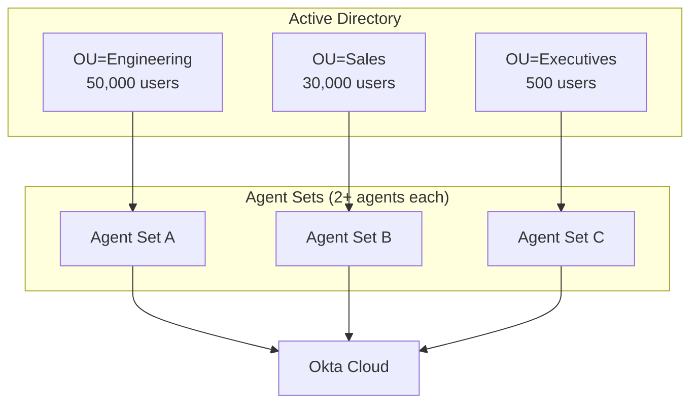
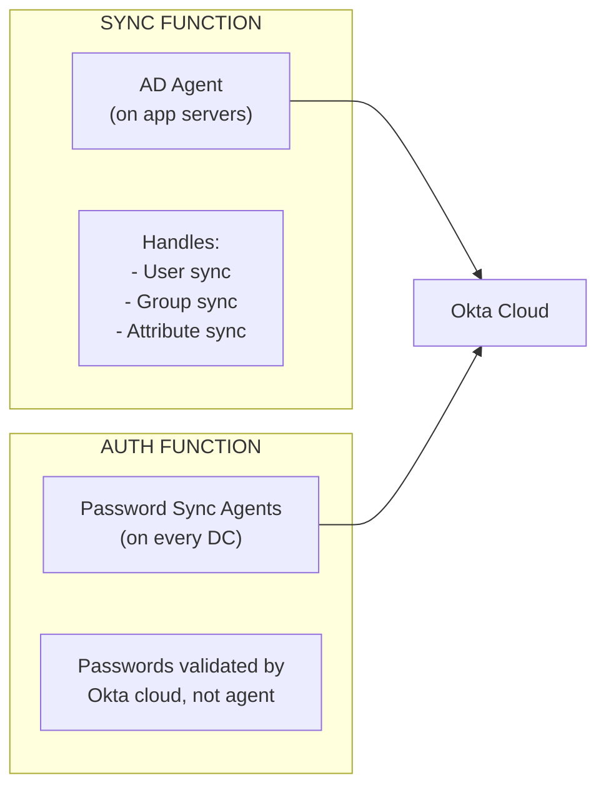
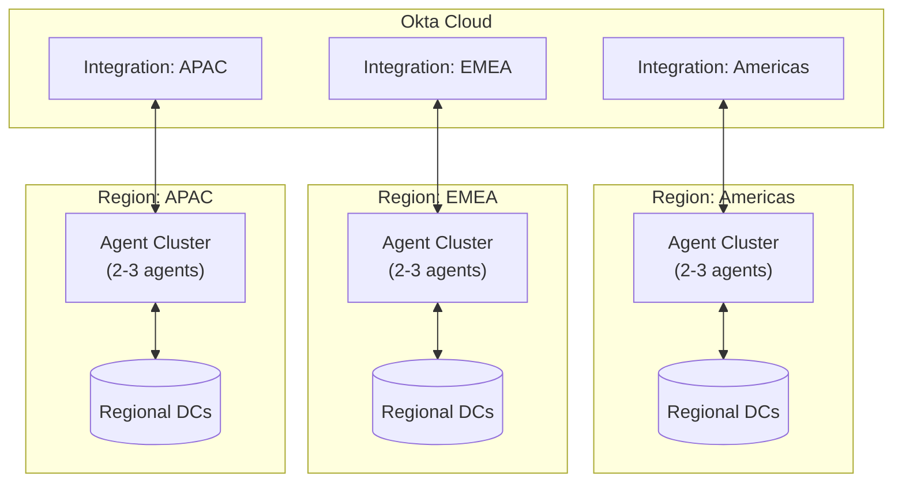
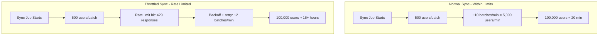

# Okta AD Agents: Large Enterprise Patterns

For organizations with 100,000+ users, additional architectural considerations apply.

## Agent Role Scoping Limitations

**Important:** A single AD Agent installation handles all functions (sync, delegated auth, JIT provisioning). You cannot install separate "sync-only" or "auth-only" agents.

| Desired Separation | Supported? | Alternative |
|--------------------|------------|-------------|
| Sync-only agents | No | Use Password Sync + disable delegated auth |
| Auth-only agents | No | N/A - auth requires user lookup |
| Separate read vs write agents | No | Use Okta-mastered for writeback users |
| Dedicated JIT provisioning agents | No | JIT is part of auth flow |

## Strategies for Large Deployments

### 1. OU/Group Scoping per Agent Set

Configure different agent sets to handle different parts of AD:



### 2. Multiple Directory Integrations

Create separate directory integrations in Okta for the same AD domain with different OU scopes. Each integration has its own agents, settings, and sync schedule.

**Directory Integration Hierarchy:**

```
Okta Tenant
  └── Directory Integrations
        ├── "corp.company.com - Engineering"
        │     ├── Agents: eng-agent-01, eng-agent-02
        │     ├── Scope: OU=Engineering,DC=corp,DC=company,DC=com
        │     └── Settings: delegated auth, 4-hour sync
        │
        ├── "corp.company.com - Sales"
        │     ├── Agents: sales-agent-01, sales-agent-02
        │     ├── Scope: OU=Sales,DC=corp,DC=company,DC=com
        │     └── Settings: delegated auth, 1-hour sync
        │
        └── "corp.company.com - Privileged"
              ├── Agents: sec-agent-01, sec-agent-02 (hardened)
              ├── Scope: OU=Admins,DC=corp,DC=company,DC=com
              └── Settings: delegated auth, 30-min sync
```

**Example Configurations:**

| Integration | Scope | Delegated Auth | Sync Frequency | Use Case |
|-------------|-------|----------------|----------------|----------|
| AD-Engineering | OU=Engineering | Enabled | Every 4 hours | High-volume, CI/CD automation |
| AD-Sales | OU=Sales | Enabled | Every 1 hour | Standard users |
| AD-Contractors | OU=Contractors | Disabled | Daily | Okta-mastered passwords |
| AD-Privileged | OU=Admins | Enabled | Every 30 min | Rapid offboarding, enhanced monitoring |

**Key Benefits:**
- **Workload isolation:** Engineering automation doesn't impact Sales auth
- **Security segmentation:** Privileged accounts on dedicated, hardened agents
- **Operational flexibility:** Different sync frequencies per population
- **Compliance:** Separate audit trails per integration

**Agent Registration:** When installing an agent, the installer is downloaded from a specific directory integration and contains a registration token that binds the agent to that integration only.

### 3. Sync vs Auth Separation (Using Password Sync)

Achieve partial functional separation by using Password Sync instead of Delegated Auth:



**Benefits of this model:**
- AD Agents handle sync only (delegated auth disabled)
- Password Sync Agents push credentials to Okta
- Authentication happens in Okta cloud (no agent in auth critical path)
- Sync agent outage doesn't affect authentication

### 4. Geographic Distribution



## Large Enterprise Recommendations

| Requirement | Recommendation |
|-------------|----------------|
| Sync/auth isolation | Use Password Sync, disable delegated auth on AD agents |
| Regional performance | Deploy agents per region, near DCs and users |
| Security segmentation | Separate integrations for sensitive OUs (executives, admins) |
| Operational isolation | Different agent clusters per business unit |
| Scale | Per Okta: 3+ agents for >30,000 users; scale based on auth volume |
| Resilience | Password Sync removes agents from auth critical path |
| Thread tuning | Increase from default 2 to up to 10 threads per agent for high volume |
| Version parity | All agents in a domain must run the same version |

## Rate Limits and Quotas

Okta applies rate limits at the tenant level, not per-agent. Understanding these limits is critical for large enterprise deployments.

### Rate Limit Categories

| Category | Endpoint Pattern | Default Limit | Notes |
|----------|------------------|---------------|-------|
| **Authentication** | `/api/v1/authn` | Varies by subscription | Delegated auth uses this |
| **OAuth Authorization** | `/oauth2/*/authorize` | 2,000/min org-wide, 600/min per client | Token flows |
| **Users API** | `/api/v1/users/*` | 1,000/min org-wide | Sync operations use this |
| **Users (authenticated)** | `/api/v1/users/me` | 40/10 sec per user | Self-service calls |
| **Groups API** | `/api/v1/groups/*` | Varies (check Admin Console) | Group sync uses this |
| **System Log** | `/api/v1/logs` | Varies (check Admin Console) | SIEM polling |
| **Agentless DSSO** | `/login/agentlessDSSO` | 1,000/min | Desktop SSO endpoint |

**Note:** Specific limits vary by subscription type (Workforce vs Customer Identity), license count, and add-ons like DynamicScale. Check your org's actual limits in **Admin Console → Reports → Rate Limits**.

**Reference:** [Rate limits | Okta Developer](https://developer.okta.com/docs/reference/rate-limits/)

### Impact on Sync Operations

#### Full Sync Rate Limit Scenarios



#### Sync Duration Under Rate Limiting

| User Count | Normal Duration | Rate-Limited Duration | Impact |
|------------|-----------------|----------------------|--------|
| 10,000 | 5-10 min | 30-60 min | Minor |
| 50,000 | 15-30 min | 2-4 hours | Significant |
| 100,000 | 30-60 min | 8-16 hours | Major |
| 500,000 | 2-4 hours | 24-48 hours | Critical |

#### Why Rate Limits Get Hit During Sync

| Cause | Scenario | Mitigation |
|-------|----------|------------|
| **Concurrent syncs** | Multiple integrations sync simultaneously | Stagger sync schedules |
| **Large group fetch** | User in 100+ groups, each fetched | Reduce group scope |
| **Custom attributes** | Many extended attributes per user | Sync only needed attributes |
| **API competition** | SCIM provisioning + sync + SIEM polling | Use separate API tokens with quotas |
| **Aggressive retry** | Retry logic too fast after 429 | Implement exponential backoff |

### Rate Limit Headers

Okta returns rate limit status in response headers:

```
X-Rate-Limit-Limit: 600          # Your limit for this endpoint
X-Rate-Limit-Remaining: 450      # Requests remaining in window
X-Rate-Limit-Reset: 1609459200   # Unix time when limit resets
```

**Best Practice:** Monitor these headers in sync logs to predict throttling before it occurs.

### Strategies for Large-Scale Sync

#### 1. Stagger Sync Schedules

```
Example: 3 integrations, 100K users each

BAD: All sync at midnight
  00:00 - All 3 start → Rate limit hit immediately
  00:01 - 429 errors, exponential backoff
  08:00 - Still syncing...

GOOD: Staggered by 4 hours
  00:00 - Integration A starts (100K users, completes 01:30)
  04:00 - Integration B starts (100K users, completes 05:30)
  08:00 - Integration C starts (100K users, completes 09:30)
```

#### 2. Use Incremental Sync Aggressively

| Sync Type | API Calls | Recommended Frequency |
|-----------|-----------|----------------------|
| Full Sync | O(n) where n = users + groups | Weekly or less |
| Incremental Sync | O(delta) changes since last sync | Every 15-60 min |

**Implementation:**
- Set full sync to weekly during maintenance window
- Set incremental sync to 30 min for standard users
- Set incremental sync to 15 min for privileged OUs

#### 3. Reduce Group Sync Scope

Group fetching is often the rate limit killer:

| Strategy | How | Trade-off |
|----------|-----|-----------|
| **Filter by prefix** | Only sync groups matching pattern | Apps must use filtered groups |
| **Exclude nested groups** | Don't sync recursive membership | Loss of inherited permissions |
| **Use push groups** | Only sync explicitly assigned groups | Manual group selection |

#### 4. DynamicScale Add-on

For enterprises consistently hitting limits:

| Capability | Standard | DynamicScale |
|------------|----------|--------------|
| Rate limit multiplier | 1x | 5x or more |
| Concurrent sessions | 75 | Higher (negotiated) |
| Burst handling | Fixed | Dynamic bursting |
| Cost | Included | Additional license fee |

Contact Okta sales/account team to evaluate DynamicScale requirements.

### Authentication Rate Limits at Scale

#### Per-User Limits

The 20 auth/user/minute limit prevents brute force but can cause legitimate issues:

| Scenario | Risk | Mitigation |
|----------|------|------------|
| Shared service account | Multiple services use same account | Use unique service principals |
| Kiosk/terminal users | Rapid logout/login cycles | Extend session timeout |
| Testing/automation | CI/CD rapid auth | Use separate test tenant |

#### Global Authentication Throughput

```
Maximum delegated auth capacity (theoretical):
  2,000 auths/min ÷ 60 sec = 33.3 auths/sec global

For 100,000 user peak (morning login rush):
  If 10% login in 30 min = 10,000 logins
  Required rate = 10,000 / 1,800 sec = 5.5 auths/sec
  Headroom = 33.3 / 5.5 = 6x (comfortable)

For 500,000 user peak:
  If 10% login in 30 min = 50,000 logins
  Required rate = 50,000 / 1,800 sec = 27.8 auths/sec
  Headroom = 33.3 / 27.8 = 1.2x (at risk!)
```

**Implication:** At 500K+ users, consider Password Sync to move auth load off agents and avoid rate limits.

### Monitoring Rate Limit Health

Create dashboards tracking:

| Metric | Warning Threshold | Critical Threshold |
|--------|-------------------|-------------------|
| `X-Rate-Limit-Remaining` | < 25% of limit | < 10% of limit |
| 429 responses per hour | > 10 | > 100 |
| Sync duration trend | 1.5x baseline | 2x baseline |
| Auth p99 latency | > 1 sec | > 3 sec |

### Rate Limit Incident Response

```
Trigger: > 50 429 responses in 5 minutes

1. IDENTIFY source:
   - Which integration?
   - Which API endpoints?

2. IMMEDIATE actions:
   - Pause non-critical syncs (if possible)
   - Check for runaway automation/scripts

3. REMEDIATION:
   - Stagger sync schedules
   - Reduce batch sizes
   - Implement backoff in custom integrations

4. LONG-TERM:
   - Evaluate DynamicScale
   - Reduce sync scope
   - Consider Password Sync for auth load
```

## Document Navigation

- **Previous:** [05-deployment.md](05-deployment.md) - Deployment and sizing
- **Next:** [07-security-operations.md](07-security-operations.md) - Security and operations
- **Index:** [README.md](../README.md)
