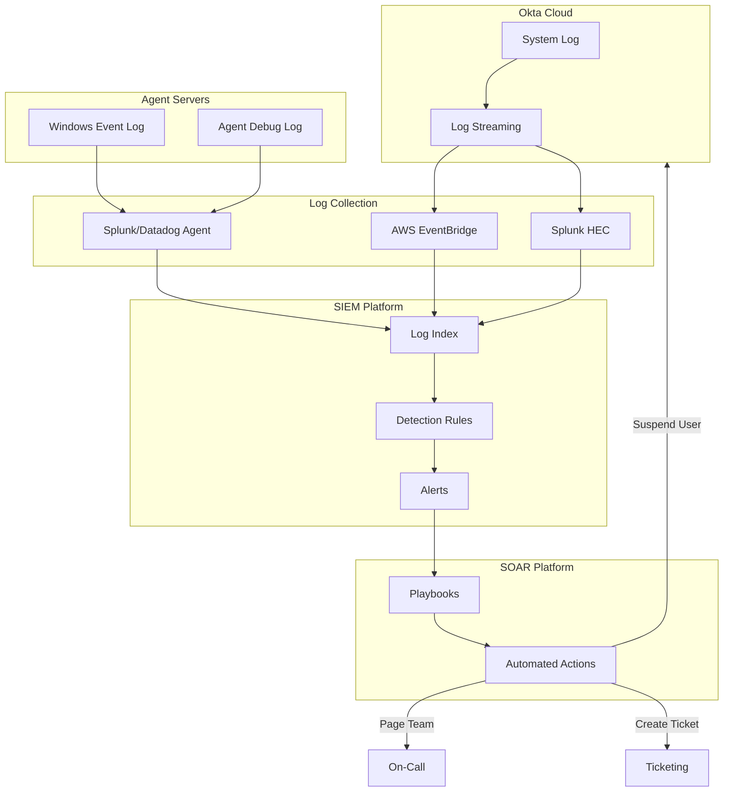
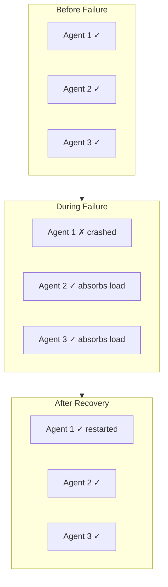
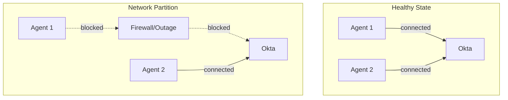
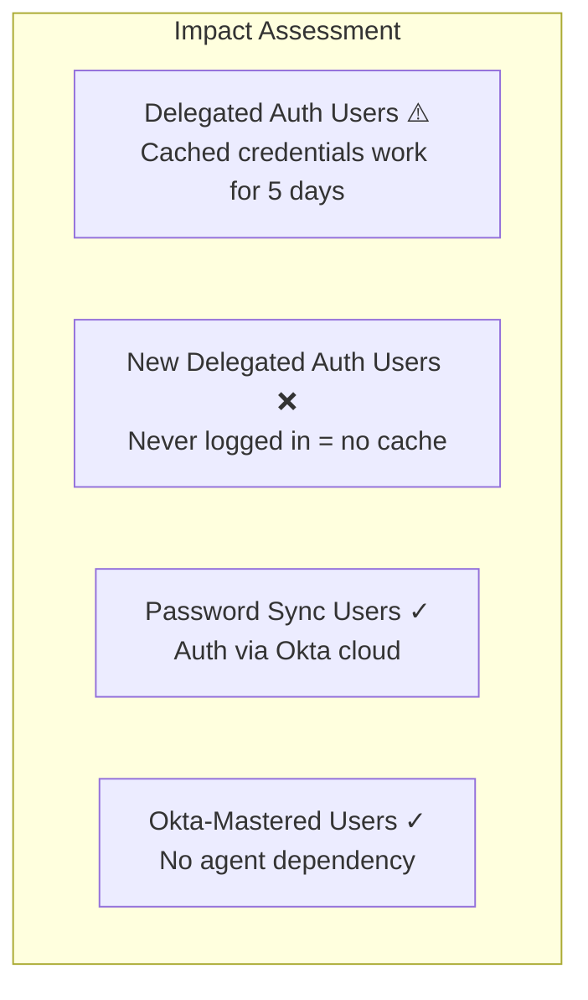

# Okta AD Agents: Security and Operations

## Security Considerations

### Agent Authentication to Okta

- Each agent has a unique API token issued during registration
- Tokens are stored encrypted in Windows credential store
- Mutual TLS authentication available for enhanced security
- Regular token rotation recommended

### Credential Handling

| Credential Type | Handling |
|-----------------|----------|
| User passwords (delegated auth) | Never persisted, validated in-memory |
| User passwords (sync) | Transmitted as salted hash, stored encrypted |
| Service account | Stored in Windows credential store |
| Agent API token | Stored in Windows credential store |

### Audit and Logging

- All authentication attempts logged in Okta System Log
- Agent local logs available for troubleshooting
- Integration with SIEM via Okta Log Streaming
- Failed auth attempts trigger configurable alerts

## SIEM/SOAR Integration

For large enterprises, centralizing Okta logs in a SIEM and enabling automated response via SOAR is critical for security operations.

### Log Sources for AD Agent Monitoring

| Log Source | Location | Contents | SIEM Value |
|------------|----------|----------|------------|
| **Okta System Log** | Okta cloud (API/streaming) | Auth events, admin actions, sync status | Primary security monitoring |
| **Agent Windows Event Log** | Local on agent server | Connection status, errors, debug | Troubleshooting, availability |
| **AD Security Log** | Domain Controllers | Service account activity, LDAP binds | Correlation, compliance |
| **Network Logs** | Firewall/Proxy | Agent-to-Okta traffic | Availability, anomaly detection |

### Okta Log Streaming Options

| Method | Latency | Best For | Limitations |
|--------|---------|----------|-------------|
| **Log Streaming (AWS EventBridge)** | Near real-time | AWS-native SIEM (Security Lake, OpenSearch) | AWS only |
| **Log Streaming (Splunk)** | Near real-time | Splunk Enterprise/Cloud | Requires Splunk HEC |
| **Log Streaming (Datadog)** | Near real-time | Datadog Security Monitoring | Datadog subscription |
| **System Log API** | Polling (1-5 min typical) | Any SIEM | Rate limits apply |

### Key Events for Security Monitoring

#### Authentication Events

| Event Type | eventType Value | Security Significance |
|------------|-----------------|----------------------|
| Successful login | `user.session.start` | Baseline for anomaly detection |
| Failed login | `user.authentication.auth_via_AD_agent` (failure) | Brute force detection |
| MFA bypass | `user.authentication.auth_via_mfa` | Policy violations |
| Session hijack | `user.session.access_admin_app` | Privilege escalation |

#### Agent-Specific Events

| Event Type | eventType Value | Action Required |
|------------|-----------------|-----------------|
| Agent connected | `system.agent.ad.connect` | Informational |
| Agent disconnected | `system.agent.ad.disconnect` | Alert if prolonged |
| Sync started | `system.import.start` | Informational |
| Sync completed | `system.import.done` | Track duration trends |
| Sync failed | `system.import.error` | Investigate immediately |

#### High-Priority Alerts

| Alert Name | Query Logic | Severity | Response |
|------------|-------------|----------|----------|
| **All Agents Down** | No `system.agent.ad.connect` from any agent in 5 min | Critical | Page on-call |
| **Brute Force** | >10 failed auths for same user in 5 min | High | Lock account, investigate |
| **Service Account Abuse** | `target.alternateId` contains service account UPN | Critical | Verify legitimacy |
| **Off-Hours Admin** | `eventType=user.session.access_admin_app` AND time NOT in business hours | Medium | Verify with user |
| **Unusual Geo** | `client.geographicalContext.country` differs from baseline | Medium | Step-up auth or block |

### SIEM Detection Rules

#### Splunk Example Queries

```spl
# All agents disconnected alert
index=okta sourcetype=OktaIM2:log eventType="system.agent.ad.*"
| stats latest(_time) as lastSeen by actor.displayName
| where lastSeen < relative_time(now(), "-5m")
| table actor.displayName, lastSeen

# Brute force detection
index=okta sourcetype=OktaIM2:log eventType="user.authentication.*" outcome.result="FAILURE"
| stats count by target.alternateId, _time span=5m
| where count > 10

# Delegated auth latency trending
index=okta sourcetype=OktaIM2:log eventType="user.authentication.auth_via_AD_agent"
| timechart avg(debugContext.debugData.requestDuration) as avg_latency by outcome.result
```

#### Datadog Example Queries

```
# Agent health check
source:okta @evt.name:system.agent.ad.*
| stats count by @actor.displayName, @evt.name

# Failed auth spike detection
source:okta @evt.name:user.authentication.* @outcome.result:FAILURE
| rollup count by @target.alternateId (5m)
```

### SOAR Playbooks

#### Playbook 1: Agent Down Response

```
Trigger: All agents for integration show disconnected > 5 min

Steps:
1. CREATE incident ticket with P1 priority
2. PAGE on-call identity engineer
3. RUN automated network connectivity check (ping agent hosts, verify 443 egress)
4. QUERY AD for service account status (locked out?)
5. IF service account locked → UNLOCK and NOTIFY
6. IF network issue → ESCALATE to network team
7. UPDATE ticket with findings
```

#### Playbook 2: Brute Force Response

```
Trigger: >10 failed logins for single user in 5 min

Steps:
1. LOCK user account in Okta (Suspend user API)
2. BLOCK source IP at WAF (if external)
3. QUERY for other users from same IP
4. IF multiple users affected → ESCALATE to security team
5. NOTIFY user via alternate channel (SMS, manager)
6. CREATE ticket for investigation
7. AFTER investigation → RESET password, UNSUSPEND user
```

#### Playbook 3: Suspicious Admin Activity

```
Trigger: Admin console access from unusual location or time

Steps:
1. QUERY user's recent auth history
2. IF VPN/known location → LOG and CLOSE
3. IF unknown location:
   a. SUSPEND admin session
   b. REVOKE admin API tokens
   c. NOTIFY security team
   d. REQUIRE video call verification before restore
4. DOCUMENT in incident ticket
```

### Log Retention Requirements

| Log Type | Retention Period | Rationale |
|----------|------------------|-----------|
| Authentication events | 2 years | Compliance (SOX, PCI) |
| Admin actions | 7 years | Audit trail |
| Agent health events | 90 days | Operational |
| Sync events | 90 days | Troubleshooting |

### Integration Architecture



### Okta APIs for SOAR Integration

| Action | API Endpoint | Use Case |
|--------|--------------|----------|
| Suspend user | `POST /api/v1/users/{userId}/lifecycle/suspend` | Account lockout |
| Unsuspend user | `POST /api/v1/users/{userId}/lifecycle/unsuspend` | Recovery |
| Reset password | `POST /api/v1/users/{userId}/lifecycle/reset_password` | Forced reset |
| Clear sessions | `DELETE /api/v1/users/{userId}/sessions` | Session termination |
| List active sessions | `GET /api/v1/users/{userId}/sessions` | Investigation |
| Get user factors | `GET /api/v1/users/{userId}/factors` | MFA audit |
| Revoke API token | `DELETE /api/v1/api-tokens/{tokenId}` | Token compromise |

## Failure Scenario Analysis

For large enterprises, understanding failure modes, blast radius, and recovery procedures is critical for operational planning.

### Component Failure Matrix

| Component | Failure Mode | Blast Radius | Detection Time | MTTR Target |
|-----------|--------------|--------------|----------------|-------------|
| Single AD Agent | Process crash/OOM | None (if HA configured) | < 30 sec (heartbeat) | Automatic |
| All AD Agents | Network outage to Okta | All delegated auth users in that integration | < 1 min | Minutes to hours |
| Single DC | Hardware/software failure | None (agents failover to other DCs) | Immediate | Automatic |
| All DCs in site | Site outage | Agents in that site (if site-aware) | < 1 min | Depends on AD |
| Okta Cloud | Regional outage | All authentication | N/A (Okta SLA) | Okta responsibility |
| Password Sync Agent | DC failure | None (PSA on each DC) | Next password change | N/A |
| Service Account | Password expiry/lockout | All sync and auth for that integration | First failed operation | Minutes |

### Detailed Failure Scenarios

#### Scenario 1: Single Agent Failure



| Aspect | Detail |
|--------|--------|
| **Blast Radius** | Zero - traffic automatically reroutes to healthy agents |
| **Detection** | Okta gateway detects within 30 seconds via heartbeat failure |
| **User Impact** | None if 2+ agents remain healthy |
| **Recovery** | Automatic restart via Windows Service Recovery; manual restart if needed |
| **Prevention** | Deploy 3+ agents for critical integrations |

#### Scenario 2: Agent Network Partition (Agent to Okta)



| Aspect | Detail |
|--------|--------|
| **Blast Radius** | Capacity reduced by 1/N agents; no auth failures if others healthy |
| **Detection** | Agent marked unhealthy in Admin Console; local Windows Event Log errors |
| **User Impact** | Increased latency if near capacity; none if sufficient headroom |
| **Recovery** | Resolve network issue; agent auto-reconnects |
| **Prevention** | Deploy agents across network failure domains; monitor egress paths |

#### Scenario 3: Agent Network Partition (Agent to AD)

| Aspect | Detail |
|--------|--------|
| **Blast Radius** | All auth requests routed to that agent fail; Okta may mark unhealthy after threshold |
| **Detection** | Auth failures spike; agent logs show LDAP connection errors |
| **User Impact** | Intermittent auth failures until agent removed from rotation |
| **Recovery** | Restore AD connectivity; agent resumes automatically |
| **Prevention** | Ensure agents can reach multiple DCs; monitor AD replication health |

#### Scenario 4: All Agents Offline



| Aspect | Detail |
|--------|--------|
| **Blast Radius** | Partial - delegated auth users with expired/no cache cannot authenticate |
| **Detection** | Critical alert: all agents disconnected in Admin Console |
| **User Impact** | Users with valid cache (< 5 days): CAN authenticate. New users or expired cache: CANNOT authenticate. |
| **Recovery** | Restore at least one agent; investigate root cause |
| **Prevention** | Geographic distribution; Password Sync as fallback for critical users |

**Delegated Auth Credential Cache Behavior:**

| User Scenario | Agent Down Impact |
|---------------|-------------------|
| Logged in within last 5 days | ✓ Can authenticate via cached credential |
| Never logged in before | ❌ Cannot authenticate (no cache exists) |
| Last login > 5 days ago | ❌ Cannot authenticate (cache expired) |
| Changed password, agent down before sync | ❌ Old cached password still works; new password fails |

**Reference:** [Cache AD Credentials using Delegated Authentication](https://support.okta.com/help/s/article/Cache-AD-Credentials-using-Delegated-Authentication)

**Mitigation Options During Total Agent Outage:**

| Option | Trade-off | Implementation Time |
|--------|-----------|---------------------|
| Rely on credential cache | Works for active users; fails for new/inactive | Immediate |
| Enable Password Sync | Requires PSA on DCs; password hashes in Okta | Hours to deploy |
| Switch to Okta-mastered | Users must reset passwords | Immediate but disruptive |
| Wait for recovery | Sustained outage | Depends on root cause |

#### Scenario 5: Service Account Compromise or Lockout

| Aspect | Detail |
|--------|--------|
| **Blast Radius** | All sync and auth operations for that integration |
| **Detection** | Sync failures; auth failures with "service account" errors |
| **User Impact** | No new syncs; auth may fail if service account required for user lookup |
| **Recovery** | Reset service account password in AD; update in Okta Admin Console |
| **Prevention** | Use managed service accounts (gMSA); monitor for lockouts; long password rotation cycles |

**Service Account Security Checklist:**

- [ ] Account set to "Password never expires" (or 1-year rotation with automation)
- [ ] Account exempted from lockout policies (or very high threshold)
- [ ] Account monitored for failed auth attempts (SIEM alert)
- [ ] Account credentials stored in secure vault with break-glass procedures
- [ ] Runbook documented for emergency credential rotation

#### Scenario 6: Domain Controller Failure

| Aspect | Detail |
|--------|--------|
| **Blast Radius** | None if agents configured for DC failover (default behavior) |
| **Detection** | Agent logs show DC connection failures then recovery to alternate DC |
| **User Impact** | Momentary latency spike during failover |
| **Recovery** | Automatic - agents retry against other DCs |
| **Prevention** | Ensure multiple DCs available; agents not hardcoded to single DC |

### Recovery Runbooks

#### Runbook: Agent Restart Procedure

```
1. VERIFY: Check Okta Admin Console for agent status
2. ASSESS: Confirm other agents are healthy (avoid restarting if single agent)
3. RESTART:
   - Remote Desktop to agent server
   - services.msc → "Okta AD Agent" → Restart
   - Or: Restart-Service "OktaADAgent" -Force
4. VERIFY: Agent shows "Connected" in Admin Console within 2 minutes
5. TEST: Perform test authentication with known user
6. MONITOR: Watch for 15 minutes for stability
```

#### Runbook: Emergency Agent Re-registration

```
⚠️ Use only if agent token is compromised or corrupted

1. REMOVE: Delete agent from Okta Admin Console (Directory > Directory Integrations)
2. UNINSTALL: Remove agent software from Windows server
3. DOWNLOAD: Get fresh installer from Admin Console (contains new token)
4. INSTALL: Run installer on same or replacement server
5. CONFIGURE: Verify OU scope, sync settings preserved
6. SYNC: Trigger manual import to verify connectivity
7. DOCUMENT: Record incident and new agent details
```

#### Runbook: Service Account Password Rotation

```
1. PRE-CHECK: Verify all agents healthy before rotation
2. PREPARE:
   - Generate new password (32+ char, no special chars that break LDAP)
   - Update in password vault
3. UPDATE AD: Change service account password in Active Directory
4. UPDATE OKTA:
   - Directory > Directory Integrations > [Integration]
   - Provisioning > Active Directory Settings
   - Update service account password
5. VERIFY: Trigger manual sync; verify success
6. TEST: Perform test authentication
7. REPEAT: For each integration using this service account
```

### Blast Radius Reduction Strategies

| Strategy | How It Reduces Blast Radius | Trade-off |
|----------|----------------------------|-----------|
| **Multiple Integrations** | Failure affects only users in that integration's scope | Management complexity |
| **Password Sync** | Auth doesn't depend on agents | Password hashes in Okta |
| **Geographic Distribution** | Regional failure only affects that region's users | Routing based on user, not location |
| **Separate Service Accounts** | Credential issue affects only one integration | More accounts to manage |
| **Okta FastPass** | Passwordless auth bypasses agents entirely | Requires device enrollment |

## Operational Considerations

### Monitoring

Key metrics to monitor:

- Agent connection status (via Okta Admin Console)
- Authentication latency
- Sync job success/failure
- Agent host health (CPU, memory, network)

### Monitoring and Alerting Requirements

#### Critical Alerts (Page Immediately)

| Condition | Threshold | Action |
|-----------|-----------|--------|
| All agents disconnected | Duration > 2 min | Page on-call; initiate incident |
| Auth success rate drop | < 95% over 5 min | Investigate agent and AD health |
| Service account lockout | Any occurrence | Immediate credential reset |
| Sync failure | 3 consecutive failures | Investigate; may indicate schema/permission issue |

#### Warning Alerts (Ticket/Dashboard)

| Condition | Threshold | Action |
|-----------|-----------|--------|
| Single agent disconnected | Duration > 5 min | Schedule investigation |
| Auth latency spike | p99 > 2 sec over 15 min | Review DC and network performance |
| Agent CPU/memory | > 80% sustained 30 min | Scale agents or reduce scope |
| Agent version mismatch | Any agents on different versions | Schedule version alignment |
| Sync duration increase | 2x baseline | Review object complexity |

#### Health Check Dashboard Metrics

```
┌─────────────────────────────────────────────────────────────────┐
│ OKTA AD INTEGRATION HEALTH                                       │
├─────────────────────────────────────────────────────────────────┤
│ Integration: corp.company.com-Engineering                        │
│ ┌──────────────────────────────────────────────────────────────┐│
│ │ Agents:  [●] eng-agent-01  [●] eng-agent-02  [○] eng-agent-03││
│ │          (connected)       (connected)       (disconnected)  ││
│ └──────────────────────────────────────────────────────────────┘│
│ ┌──────────────────────────────────────────────────────────────┐│
│ │ Auth Rate: 45 req/min   │ Latency p50: 180ms  │ p99: 450ms  ││
│ │ Success:   99.8%        │ Last Sync: 12 min ago │ Duration: 8m││
│ └──────────────────────────────────────────────────────────────┘│
└─────────────────────────────────────────────────────────────────┘
```

### Troubleshooting Common Issues

| Symptom | Likely Cause | Resolution |
|---------|--------------|------------|
| Agent shows disconnected | Network/firewall issue | Verify outbound 443 to *.okta.com |
| Auth failures | AD connectivity | Check LDAP/Kerberos connectivity |
| Slow authentication | Network latency | Check agent-to-DC latency |
| Users not syncing | Import filter/OU scope | Review import configuration |
| Password sync delay | DC not covered | Ensure PSA on all writable DCs |

### Upgrade Process

1. Download new agent version from Okta Admin Console
2. Stop agent service on one server
3. Run installer (preserves configuration)
4. Verify agent reconnects and is healthy
5. Repeat for remaining agents

## Comparison with Azure AD Connect

| Capability | Okta AD Agent | Azure AD Connect |
|------------|---------------|------------------|
| Outbound-only | Yes | Yes (with Cloud Sync) |
| Delegated auth | Yes | Pass-through Auth |
| Password hash sync | Yes | Yes |
| Seamless SSO | IWA Agent | Seamless SSO |
| Writeback | Yes | Yes |
| Multi-forest | Yes | Yes |
| Staging mode | No (HA instead) | Yes |
| Cloud-managed | Fully | Partially (Cloud Sync) |

## Summary

Okta AD agents provide a robust, secure mechanism for hybrid identity integration. The outbound-only architecture simplifies deployment while the specialized agent types address specific integration requirements. Key success factors include:

- Deploying agents for high availability
- Ensuring network connectivity to both Okta and AD
- Choosing appropriate authentication strategy (delegated vs sync)
- Implementing monitoring and alerting
- Regular agent updates and maintenance

## References

- [Okta AD Agent Prerequisites](https://help.okta.com/en-us/content/topics/directory/ad-agent-prerequisites.htm)
- [Okta Password Sync Agent Documentation](https://help.okta.com/en-us/content/topics/directory/ad-agent-password-sync.htm)
- [Okta IWA Web Agent for Desktop SSO](https://help.okta.com/en-us/content/topics/directory/ad-iwa-main.htm)
- [Okta LDAP Interface Documentation](https://help.okta.com/en-us/content/topics/directory/ldap-agent-main.htm)
- [Okta Rate Limits](https://developer.okta.com/docs/reference/rate-limits/)
- [RADIUS Throughput Benchmarks](https://help.okta.com/en-us/content/topics/integrations/radius-best-pract-thruput.htm)

## Document Navigation

- **Previous:** [06-large-enterprise.md](06-large-enterprise.md) - Large enterprise patterns
- **Index:** [README.md](../README.md)
