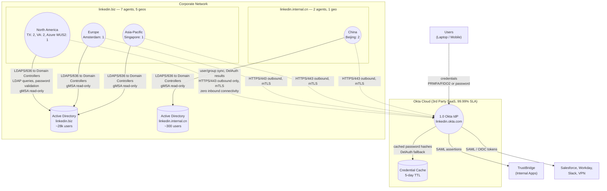
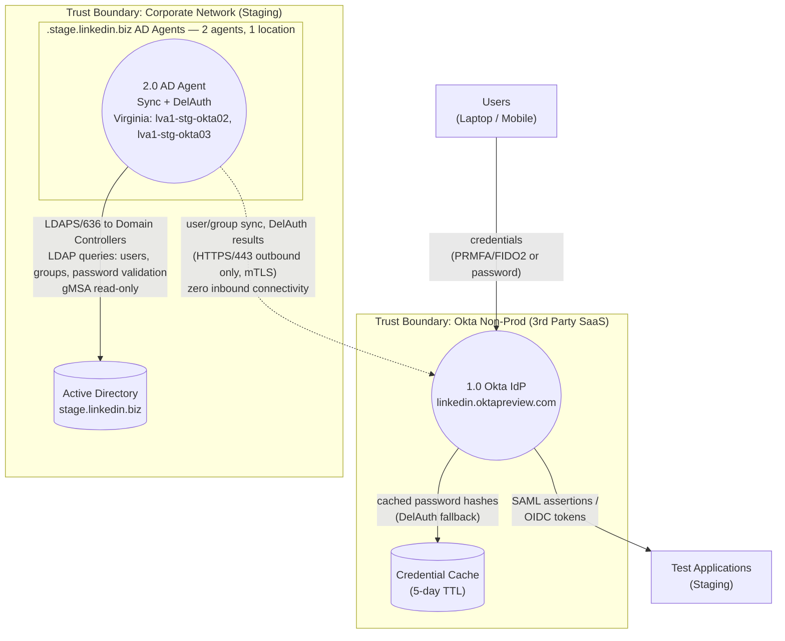

# Okta Production Readiness Review

***PLEASE MAKE THE DOCUMENT TO COMMENT instead of Restricted***
***\<Template: [go/prr/template](https://go/prr/template)\>***

***This document is guidance on how to conduct production readiness reviews for your services. This template is meant to be filled out starting from the beginning of SDLC and completed before a new system is GA'ed. A Sr Staff+ in the area or adjacent area is expected to be an approver. This template should also be used for existing systems to keep their information up to date.***

| System Name | Okta |
| ----: | :---- |
| PRR Version | 1.0 |
| PRR Template Version | 2.2.0 |
| Presenter | [Ramki Mohan](mailto:rmohan@linkedin.com) |
| Internal Reviewers | [Rick Erickson](mailto:rerickson@linkedin.com) : In review [Tim Hilliard](mailto:thilliard@linkedin.com) : In review |
| Internal Approver(s) *Who from your team will double check and validate this work?* | [Rick Erickson](mailto:rerickson@linkedin.com) : Under review  |
| External Approver(s) | Person Person |
| Last Revised Date | Nov 20 2025 |

## **Summary**

Okta is the Identity Provider (IdP) for third-party SaaS applications and internally developed applications connected to TrustBridge. Okta provides identity and access management for employees via single sign-on (SSO), supporting both passwordless (PRMFA/FIDO2) and password-based (Delegated Authentication, or "DelAuth") flows.

**Ownership Boundaries**

| Component | Operated By | Responsibility |
| :--- | :--- | :--- |
| Okta Cloud (linkedin.okta.com) | Okta (vendor) | SaaS IdP, session management, credential cache, PRMFA validation. Contractual uptime SLA (PRR states 99.99%; [Confluence architecture page](https://linkedin.atlassian.net/wiki/spaces/ENGS/pages/525301790) states 99.9%. Verify against current contract). |
| Okta AD Agents (9 agents across 6 geos) | LinkedIn | Lightweight Windows services on LinkedIn VMs. Sync AD data to Okta, handle Delegated Authentication. Stateless, no agent-to-agent communication. |
| Active Directory (.biz, .cn forests) | LinkedIn | Source of truth for user/group identity data. Separate PRR: [AD (.biz) PRR](https://docs.google.com/document/d/1R8YTfFOr6ecufcjX_aAHu1tYezRX4-Xtr9ByzeiW0tM/edit?tab=t.0) |

**Production Instance:** [https://linkedin.okta.com](https://linkedin.okta.com)

*High Level Okta Production Architecture, DFD Level 0*

AD Agents are stateless Windows services. Each agent connects:
- **Outbound to Okta Cloud:** HTTPS/443, mTLS
- **To local AD Domain Controllers:** LDAPS/636, read-only gMSA

No inbound ports, no VPN tunnels, no firewall holes. Each agent gets a unique security token at registration, revocable independently. See the operational use cases below for how these connections are used.

### Operational Use Cases

The following sections describe how LinkedIn operates and configures Okta day-to-day.

#### 1. AD Agent Management

LinkedIn runs AD Agents in two forests:
- **linkedin.biz:** 7 agents across 5 geos (TX, VA, Azure WUS2, Amsterdam, Singapore)
- **linkedin.internal.cn:** 2 agents in 1 geo (Beijing)

Each agent is a Windows service on a LinkedIn-managed VM. Agents are stateless with no agent-to-agent communication.

Operational responsibilities:
- Deploy new agents (manual install, requires Okta admin credentials to generate per-agent security tokens)
- Monitor agent health via Azure Monitor heartbeat
- Maintain geographic distribution for availability
- On agent failure, Okta auto-routes to the next healthy agent

See [Appendix C](#appendix-c-ad-agent-inventory) for the full agent inventory.

#### 2. Directory Sync

AD Agents run hourly imports from AD to Okta Cloud. Two forests sync independently:
- **linkedin.biz:** ~28k users
- **linkedin.internal.cn:** ~300 users

Each forest has configured OUs that define which users and groups are imported. See [Appendix D](#appendix-d-organizational-units-imported-to-okta) for the full OU list.

Data synced per import cycle:
- New user accounts
- Updated user attributes (name, email, telephone, etc.)
- Group membership changes (including nested groups)
- New or modified AD groups
- Account enable/disable status changes

Constraints:
- Max payload per sync request: 20 MB (Okta auto-splits larger datasets)
- Import frequency: hourly, not configurable below that
- Import matching rules prevent cross-forest collisions when users or groups exist in both .biz and .cn. Verify the specific matching fields with the IAM team.

#### 3. Application Registration

Applications connect to Okta as SAML or OIDC relying parties:
- **Third-party SaaS** (Salesforce, Workday, Slack, VPN): connect directly to Okta
- **Internal apps:** connect through TrustBridge, LinkedIn's identity federation gateway

Onboarding a new application:
1. Create an application integration in the Okta admin console
2. Configure protocol (SAML or OIDC) and attribute mappings
3. Assign the application to users or groups

Application assignments are managed through AD group membership. Adding users to the corresponding AD group grants access after the next sync cycle.

#### 4. Authentication Policies

Authentication policies control which factors are required and under what conditions. Policies are evaluated per application or globally.

Current policy types:
- **MFA requirements:** which applications require MFA and which factor types satisfy the requirement
- **Device trust rules:** whether the device must be managed or compliant
- **Network zone restrictions:** allow or block authentication from specific IP ranges, geos, or anonymizer networks
- **ThreatInsight:** auto-blocks IPs tied to credential stuffing and brute force attacks
- **Anonymizer blocking:** blocked via network block rules

Policy change process:
- Requires elevated Okta admin privileges
- Subject to change management review
- Tested in non-production (linkedin.oktapreview.com) before production

#### 5. Authenticator Enrollment

Available authenticator types:
- **FIDO2 security keys:** YubiKey
- **Platform authenticators:** Touch ID, Windows Hello
- **Okta Verify:** push notification and TOTP
- **Password:** for accounts not yet migrated to passwordless

Enrollment registers an authenticator with Okta. For FIDO2/WebAuthn, enrollment generates a public/private key pair on the device. The private key never leaves the device; the public key is stored in Okta. Users can enroll multiple authenticators (e.g., both a YubiKey and Touch ID).

Enrollment policies control:
- Which factor types users can register
- Whether self-service enrollment is allowed
- Whether enrollment is required at first login

The IAM team manages these policies centrally.

#### 6. Passwordless and Phishing-Resistant MFA

Target state for all regular accounts is passwordless using Phishing-Resistant MFA (PRMFA).

Why PRMFA is phishing-resistant: the FIDO2/WebAuthn challenge-response is bound to the origin domain. A fake login page cannot replay the signed assertion against the real Okta endpoint.

Flow:
1. User submits username only
2. Okta generates a WebAuthn challenge
3. User's authenticator (YubiKey, Touch ID, Windows Hello, or passkey) signs the challenge
4. Okta validates the signature against the stored public key

No password involved. No AD call. Passwordless users are unaffected by AD outages.

Operational benefits:
- Eliminates dependency on AD Agent availability and Domain Controller health
- Removes the credential cache TTL as a risk factor during extended outages

See [Appendix B](#appendix-b-authentication-flow-diagrams) for the sequence diagram.

#### 7. Lifecycle Management

Okta lifecycle management ties application access to the state of a user's AD account. Two propagation paths exist with different latencies:

**Real-time (via Delegated Authentication):** Password changes and account lockouts take effect immediately at the next login attempt because DelAuth performs a live LDAP bind against AD. See [section 8](#8-delegated-authentication) for the full flow.

**Hourly (via directory sync):** The following changes propagate through the hourly import cycle:
- Profile attribute changes (name, email, department, manager)
- Group membership changes
- Account enable/disable status
- New user accounts created in synced OUs

**Deprovisioning:** When an AD account is disabled or deleted, the next sync cycle deactivates the Okta profile, revokes active sessions, and removes application access. Disabling in AD cascades to all Okta-integrated applications.

- Max propagation delay: 1 hour (the import cycle frequency)
- For immediate needs (e.g., terminated employee): Okta admins can trigger an import manually or deactivate the Okta profile directly

#### 8. Delegated Authentication

DelAuth is the password-based flow. It applies to service accounts and accounts not yet migrated to passwordless.

Flow:
1. Okta receives username and password
2. Forwards credentials to an available AD Agent
3. Agent performs LDAP bind against a Domain Controller
4. Domain Controller checks password policy, account status, lockout state
5. Result (success/failure) returns through the agent to Okta Cloud

**Credential cache:**
- Okta caches the password hash in memory with a 5-day TTL
- If AD is unavailable, Okta falls back to the cached credential
- After 5 days without AD, password-based auth fails
- New users who have never authenticated cannot use the cache
- Users who changed their password during an AD outage cannot use the cache

**Service accounts** do not use credential caching. Password validation always requires a live AD connection.

See [Appendix B](#appendix-b-authentication-flow-diagrams) for the sequence diagram.

### Impact to Linkedin

If Okta goes down, users cannot log in to applications via single sign-on. Access to VPN, TrustBridge, Salesforce, Slack, and Workday becomes unavailable. linkedin.com site availability is not directly impacted, as Okta serves corporate/SaaS applications, not the production site.

### Service Dependencies

| Dependency | Is it cross-fabric? | Dependency [Ring](http://go/rings/inventory) | Why | Impact  |
| :---- | :---- | :---- | :---- | :---- |
| Active Directory (.biz, .cn) | Yes (multi-geo, not LinkedIn fabric) | 1 | Okta imports user/group data from AD. DelAuth validates passwords against AD. | Password-based auth fails if AD is down beyond 5-day credential cache TTL. Passwordless (PRMFA) users are NOT impacted. Directory sync stops; latest user/group changes become unavailable. |
| VMware (on-prem) | Yes (multi-geo, not LinkedIn fabric) | N/A | Hosts AD Agent Windows VMs on bare metal in LinkedIn data centers. Operated by a separate team. **No uptime SLA provided.** | Host outage takes out agents on that host. Other agents in same forest continue serving. No contractual availability guarantee from the host team. |
| Azure (public cloud) | No | N/A | Hosts AD Agent Windows VM (wus2iamwuprd17) in Azure West US 2. Uptime per [Azure SLA](https://www.microsoft.com/licensing/docs/view/Service-Level-Agreements-SLA-for-Online-Services). | Azure outage takes out one .biz agent. Six other .biz agents remain across on-prem sites. |

**Availability gap:** Neither infrastructure dependency provides an SLA that supports a defined AD Agent availability target.
- VMware host team: no uptime guarantee
- Azure: standard public cloud SLA only

To define and meet an AD Agent availability SLO, the team needs a plan covering:
- Sufficient agent redundancy per forest
- Geographic distribution
- Monitoring to detect and recover from host-level failures
AI: TODO - Create JIRA ticket for AD Agent infrastructure availability plan.

### Software Library Dependencies

The Okta AD Agent is vendor-provided software. It does not rely on additional third-party libraries beyond system prerequisites: Windows Server 2016/2019/2022/2025 and .NET Framework 4.6.2 or later. The installer is self-contained.

AD Agents are not currently auto-updated. Plan to enable scheduled auto-updates.
AI: [INFOSEC-127851](https://linkedin.atlassian.net/browse/INFOSEC-127851)

### Data Lineage

Not Applicable. Okta does not depend on data processing pipelines (Fedex, Flink). The data source is Active Directory, synced via AD Agents on an hourly import schedule.

### Runtime Configs

The following default parameters are set for the Okta AD Agent. No custom non-default runtime parameters are used.

| Parameter | Value | Notes |
| :--- | :--- | :--- |
| BaseOktaURI | https://linkedin.okta.com | Production Okta instance |
| PollingThreads | 2 | Default; max 10 supported |
| ConnectionLimit | 10 | Concurrent connections to Okta |
| MaxRetryLimitSleep | 480000 (ms) | Max backoff between retries |
| DelAuthPostTimeout | 100000 (ms) | Timeout for DelAuth POST |
| SendScanDataMaxRetries | 2 | Retry count for scan data |
| SslPinningEnabled | False | SSL pinning disabled |
| VerboseLogging | False | Standard logging level |
| Agent Version | 3.18.0.0 | .NET Framework 4.6.2 target |

Each agent has unique AgentKey, ClientId, AgentId, and AppId values assigned during registration.

Heap size parameters (min/max) are not applicable. AD Agents are .NET applications running on Windows VMs, not JVM-based services.

## **Observability**

### Metrics/Dashboards

**Link to Metrics Dashboard:**
[Okta Master Dashboard (Observe)](https://observe.prod.linkedin.com/g/d/fdv6960l4i4z430768/okta-master-dashboard?orgId=1&var-query0=All&from=now-12h&to=now)

Okta metrics are not in MDM. System metrics are collected via Azure Monitor and displayed in Observe/Grafana. Okta Cloud metrics (uptime, auth latency) are managed by the vendor.

**Standard System Metrics**

- [x] CPU usage (unit: %)
- [x] Memory Usage (unit: %)
- [x] Disk Usage
- [x] System Heartbeat
- [x] System Up Time
- [ ] Overall success rate (success / total) - TODO: Define and instrument DelAuth success rate and directory sync success rate.
      AI: [INFOSEC-128047](https://linkedin.atlassian.net/browse/INFOSEC-128047)
- [ ] Processing latency - TODO: Define and instrument DelAuth response latency and sync import duration.
      AI: [INFOSEC-128047](https://linkedin.atlassian.net/browse/INFOSEC-128047)

**Domain-specific metrics**

- [x] Network Availability (AD Agent to Okta Cloud, AD Agent to Domain Controllers)
- [x] vCenter Availability
- [x] Okta AD Agent connectivity status ([Okta prober monitor](https://portal.azure.com/#view/Microsoft_OperationsManagementSuite_Workspace/Logs.ReactView/source/Microsoft_Azure_Monitoring_Alerts.ViewAlertRuleDetails.ReactView/query/NWConnectionMonitorTestResult%0A%7C%20where%20ConnectionMonitorResourceId%20%3D%3D%20%27%2Fsubscriptions%2F56204fcb-3a27-4b69-ab1e-ba3dd94c9f33%2FresourceGroups%2Fnetworkwatcherrg%2Fproviders%2FMicrosoft.Network%2FnetworkWatchers%2FNetworkWatcher_westus2%2FconnectionMonitors%2Foktawus2checks%27%0A%7C%20where%20TestResult%20!%3D%20%22Pass%22%0A%7C%20project%20TimeGenerated%2C%20SourceName%2C%20DestinationName%2C%20DestinationAddress%2C%20TestResult/resourceId/%2Fsubscriptions%2F56204fcb-3a27-4b69-ab1e-ba3dd94c9f33%2FresourceGroups%2Fmonitoring%2Fproviders%2FMicrosoft.OperationalInsights%2Fworkspaces%2Fadcse-prd-logan-6bvkdxqeqzbuu))
- [x] Okta AD Agent status (online/offline per agent)
- [ ] Directory sync freshness (time since last successful import) - TODO
      AI: [INFOSEC-128047](https://linkedin.atlassian.net/browse/INFOSEC-128047)

**Dependency-specific metrics**

- [x] Network Availability
- [x] vCenter Availability
- [ ] AD Domain Controller response latency - TODO
      AI: [INFOSEC-128047](https://linkedin.atlassian.net/browse/INFOSEC-128047)

### Events and Informed

No. Okta does not push events into the [inEvents](http://go/inevents) change capture system.

### Distributed Traces

No. Okta is not part of the LinkedIn online stack. It operates on the corporate network as a SaaS IdP. Distributed tracing via [go/trace-explorer](http://go/trace-explorer) is not applicable.

### SLOs

**Vendor SLO:** Okta provides a contractual 99.99% uptime SLA for the cloud service.
[Okta Status Page](https://status.okta.com/)

**Internal SLOs (LinkedIn-operated components):** TODO - Define internal SLOs for:

- AD Agent availability (% of time at least N agents are healthy per forest)
- DelAuth success rate (% of password auth attempts that succeed when AD is reachable)
- Directory sync freshness (max age of last successful hourly import)

AI: [INFOSEC-128047](https://linkedin.atlassian.net/browse/INFOSEC-128047)

### Alerts

Alerts are defined in Azure Monitor, not Observe. Okta AD agents run on Windows VMs outside the LinkedIn standard monitoring stack.

[Azure Alert Rules](https://ms.portal.azure.com/#view/Microsoft_Azure_Monitoring_Alerts/AlertRulesBlade/resourceId/%2Fsubscriptions%2F56204fcb-3a27-4b69-ab1e-ba3dd94c9f33%2FresourceGroups%2Fmonitoring%2Fproviders%2FMicrosoft.OperationalInsights%2Fworkspaces%2Fadcse-prd-logan-6bvkdxqeqzbuu)

- [ ] Does each alert listed above have a linked runbook in the alert?
      No.
      AI: [HSECIAM-11415](https://linkedin.atlassian.net/browse/HSECIAM-11415)

- [x] Do the alerts fire even if all instances go down and stop sending any metrics?
      Metrics are not in MDM. We monitor the last heartbeat timestamp from Azure Monitor. If heartbeat stops, the "Data collection stopped" alert fires.
      [Data collection stopped alert](https://portal.azure.com/#@lnkdprod.onmicrosoft.com/resource/subscriptions/56204fcb-3a27-4b69-ab1e-ba3dd94c9f33/resourceGroups/monitoring/providers/Microsoft.Insights/scheduledqueryrules/%255Bapp-iam-adcse%255D%255Benv-prd%255D%2520Data%2520collection%2520stopped/overview)

- [ ] Does your system have critical indicators of service health onboarded to the Site Health Zone?
      No.
      AI: [HSECIAM-11470](https://linkedin.atlassian.net/browse/HSECIAM-11470)

### Logs

Okta AD Agent logs are in Azure Log Analytics Workspace, not InLogs/Observe. The agents run on Windows VMs outside the standard LinkedIn logging stack.

* System Metrics and Agent Logs: [Azure Log Analytics](https://portal.azure.com/#@lnkdprod.onmicrosoft.com/resource/subscriptions/56204fcb-3a27-4b69-ab1e-ba3dd94c9f33/resourceGroups/monitoring/providers/Microsoft.OperationalInsights/workspaces/adcse-prd-logan-6bvkdxqeqzbuu/logs)
* System Metrics Overview: [Azure Workspace Overview](https://portal.azure.com/#@lnkdprod.onmicrosoft.com/resource/subscriptions/56204fcb-3a27-4b69-ab1e-ba3dd94c9f33/resourceGroups/monitoring/providers/Microsoft.OperationalInsights/workspaces/adcse-prd-logan-6bvkdxqeqzbuu/Overview)
* Security Events: [Azure Insight Workspace](https://portal.azure.com/#@lnkdprod.onmicrosoft.com/resource/subscriptions/0e3f21be-644d-44a2-8fee-cefb5db2e48d/resourceGroups/azure-insight/providers/Microsoft.OperationalInsights/workspaces/wus2-insight-workspace/Overview)

AI: [INFOSEC-127827](https://linkedin.atlassian.net/browse/INFOSEC-127827)

### Healthchecks

Okta AD Agents do not expose /admin endpoints or register with d2/disco. They run as Windows services on corporate network VMs.

Health is determined by:
- **Agent heartbeat:** Each agent polls Okta Cloud over HTTPS/443. Azure Monitor tracks the last heartbeat timestamp. If heartbeat stops, the "Data collection stopped" alert fires.
- **Okta Cloud status:** Monitored via [Okta Status Page](https://status.okta.com/) and Okta prober (Azure Network Connection Monitor).
- **Windows Service status:** AD Agent runs as a Windows service. Service restart is automatic on failure.

## **Failure Modes**

###

### Service Failure

Does this system introduce new failure modes to LinkedIn.com that did not exist previously?

No. Okta serves corporate SaaS applications and internal apps behind TrustBridge. It does not directly impact linkedin.com site availability.

For systems with multiple components, what happens when an individual component in the system fails?

| Component | Failure Mode | Impact |
| :---- | :---- | :---- |
| Okta Cloud | Full outage | All SSO authentication stops. No access to VPN, TrustBridge, Salesforce, Slack, Workday. |
| Single AD Agent | Agent crash or VM failure | No user impact. Okta routes tasks to other healthy agents in the same forest. |
| VMware host (on-prem) | Host outage in a LinkedIn DC | Takes out all agents on that host. Could affect multiple agents if co-located. Other agents in the forest continue. No uptime SLA from host team. |
| Azure region (WUS2) | Azure West US 2 outage | Takes out one .biz agent (wus2iamwuprd17). Six other .biz agents remain on-prem. |
| All AD Agents (.biz) | All 7 agents down | Passwordless (PRMFA) users unaffected. Password-based auth falls back to credential cache (5-day TTL). Directory sync stops. |
| All AD Agents (.cn) | Both Beijing agents down | Same as .biz but higher risk: both agents are in a single geo (ABE2). No geographic redundancy. |
| Active Directory (.biz) | AD forest unavailable | Password-based auth falls back to credential cache. Passwordless unaffected. Directory sync stops. |
| Active Directory (.cn) | AD forest unavailable | Same as .biz but affects ~300 users. |

### Dependency Failure

**Does this system tolerate failure of a single node/single instance?**

Yes. Okta AD Agents operate in active/active mode. If one agent fails, remaining agents continue serving. Agents are deployed across multiple data centers.

**Does the system tolerate an entire fabric restarting?**

For .biz: Yes. Agents are distributed across TX, VA, Azure WUS2, Amsterdam, and Singapore. Losing one data center leaves agents in other locations operational.

For .cn: **No.**
- Both agents (abe2-cokta02, abe2-cokta03) are in ABE2 (Beijing)
- Losing ABE2 eliminates all .cn AD agent capacity
- The [Confluence architecture page](https://linkedin.atlassian.net/wiki/spaces/ENGS/pages/525301790) (v45, May 2023) shows .cn previously had an agent in Singapore (NSG7-CI-OKTA01). The current single-geo posture is a regression.
AI: [HSECIAM-11416](https://linkedin.atlassian.net/browse/HSECIAM-11416)

**How does the system handle its declared service dependencies failing?**

Okta AD agents are active/active. Alerting monitors agent availability. If AD is hard down, password-based accounts stop functioning after the 5-day credential cache expires. Passwordless users are not impacted.

### Protection From Users

**Standard client / graceful failure handling:**
Not applicable in the traditional sense. Okta handles abuse prevention:
- AWS WAF for traffic filtering
- Rate limiting on APIs
- ThreatInsight for blocking malicious IPs (credential stuffing, brute force, password spray)
- Bot management and CAPTCHAs
- Anonymizer access blocked via network block rules

By default, Okta API tokens and OAuth 2.0 apps are configured to use 50% of an API endpoint's rate limit.
[Okta Rate Limits](https://developer.okta.com/docs/reference/rate-limits/)

**Noisy caller protection:**
Not applicable. LinkedIn does not operate the Okta API layer.

**Overload protection (Hodor):**
Not applicable. Okta AD agents are not RPC services on the LinkedIn stack.

**Quota management (Liminal):**
Not applicable. Okta AD agents are not on the LinkedIn stack.

### Protecting Your Users

**Control plane input testing:**
Users need PRMFA to access Okta administration. Any configuration changes require elevated privileges governed by change management and audit processes. Changes are first implemented and tested in Okta non-production ([linkedin.oktapreview.com](https://linkedin.oktapreview.com)) before production.
AI: [HSECIAM-11471](https://linkedin.atlassian.net/browse/HSECIAM-11471)

**Ramped rollout:**
Okta application assignments are done via AD groups. Service owners can deploy an app to a subset of users for testing, then expand to the full target set by adding users to the AD group(s).

### Misc

None.

| Failure Mode | Impact | Blast Radius and Max Severity | Detection Plan | Mitigation Plan |
| :---- | :---- | :---- | :---- | :---- |
| Okta Cloud full outage | All SSO authentication stops | All LinkedIn employees; SEV1 | [Okta Status Page](https://status.okta.com/), Okta prober alerts | Vendor SLA (verify: 99.9% or 99.99%); credential cache provides 5-day grace for password users; passwordless users blocked |
| Single AD Agent failure | None; traffic rerouted | No user impact | Azure Monitor heartbeat alert | Active/active; Okta auto-routes to healthy agents |
| VMware host outage (on-prem DC) | Agents on that host go down | Agents on affected host; SEV3 if single agent, higher if co-located | Azure Monitor heartbeat alerts | Other agents in forest continue. **Gap:** No uptime SLA from host team. AI: TODO |
| Azure region outage (WUS2) | One .biz agent (wus2iamwuprd17) goes down | No user impact; 6 on-prem agents remain; SEV4 | Azure status page, heartbeat alert | On-prem agents continue serving |
| All .biz AD Agents down | Password-based auth degrades to cache; sync stops | All .biz password users after 5-day cache expiry; SEV2 | Azure Monitor heartbeat alerts per agent | Geographic distribution across 5 geos; PRMFA users unaffected |
| All .cn AD Agents down | Password-based auth degrades to cache; sync stops | ~300 .cn users; SEV2 | Azure Monitor heartbeat alerts | **Gap:** Both agents in single geo (ABE2). Regression from prior state (Singapore agent was decommissioned). AI: [HSECIAM-11416](https://linkedin.atlassian.net/browse/HSECIAM-11416) |
| AD forest (.biz) unavailable | Password auth falls back to cache; sync stops | All .biz password users after 5-day cache expiry; SEV1 | AD monitoring (separate PRR) | Credential cache 5-day TTL; PRMFA users unaffected |
| AD forest (.cn) unavailable | Password auth falls back to cache; sync stops | ~300 .cn users; SEV2 | AD monitoring | Credential cache 5-day TTL; PRMFA users unaffected |
| Credential cache expiry during extended AD outage (>5 days) | All password-based auth fails | All password users in affected forest; SEV1 | Monitor AD outage duration against 5-day TTL | Restore AD; promote PRMFA adoption to reduce password dependency |
| Network partition (agent to Okta) | Affected geo loses sync and DelAuth | Users in affected geo using password auth; SEV3 | Okta prober, Azure Network Connection Monitor | Other geos continue serving; credential cache fallback |

## **Scalability**

### Known Hard Limitations

| Dimension | Limit | Description |
| :---- | :---- | :---- |
| Agents per forest | Okta recommends minimum 3 per 30k users | .biz has 7 agents for ~28k users (above minimum). .cn has 2 agents for ~300 users (sufficient by ratio but lacks geo redundancy). |
| Import payload size | 20 MB per request | Okta splits datasets larger than 20 MB into smaller units automatically. |
| Polling threads per agent | Max 10 (default 2) | Can increase if import/DelAuth throughput requires it. |
| Credential cache TTL | 5 days | Hard limit set by Okta. Password-based auth fails after 5 days without AD connectivity. |
| Import frequency | Hourly | AD changes propagate to Okta within 1 hour. Not configurable below hourly. |

### Known Eventual Scaling Constraints

| Dimension | Impact to Throughput/Latency |
| :---- | :---- |
| User count growth | If linkedin.biz exceeds ~30k users significantly, Okta recommends adding agents. Current 7 agents provide headroom. |
| Sync object count | Each hourly import syncs users, groups, nested group memberships, and attributes. Growth in total object count increases import payload size, agent memory consumption during sync, and import duration. Current sizing has not been validated against object count projections. |
| Concurrent DelAuth requests | Each agent supports 10 connections with 2 polling threads. High concurrent password auth at login time could queue if all agents are saturated. Mitigated by PRMFA adoption reducing password auth volume. |

## **Operational Response**

- [x] Is the on-call rotation setup and tested?
      Yes. Team: "infosec-sso" on [https://go/oncall](https://go/oncall)
      [https://oncall.prod.linkedin.com/team/team/infosec-sso](https://oncall.prod.linkedin.com/team/team/infosec-sso)

- [ ] Do the on-calls know how to escalate and is the procedure standard when progress is stuck during an incident? Please include a link to the escalation process.
      AI: [HSECIAM-11417](https://linkedin.atlassian.net/browse/HSECIAM-11417)

- [ ] Do the on-calls know how to find the health of all of the downstream dependencies and the escalation path for each of them?
      AI: [HSECIAM-11417](https://linkedin.atlassian.net/browse/HSECIAM-11417)

- [ ] Is every member of your on-call rotation knowledgeable enough (or taken enough training) to be for on-call?
      Yes.

- [x] Are your assets mapped with crew id?
      Yes. Okta product is owned by Corporate Identity Crew.

- [ ] Do you have a website (github pages, wiki, or readme markdown) containing the following information:
      - [x] Design and Architecture: [Okta Design and Architecture Overview](https://linkedin.atlassian.net/wiki/spaces/ENGS/pages/525301790/Okta+Design+and+Architecture+Overview#OktaDesignandArchitectureOverview-SystemArchitectureDiagram)
      - [x] Runbooks: [IAM Runbook](https://linkedin.atlassian.net/wiki/spaces/ENGS/pages/525266432/Identity+and+Access+Management+IAM+Runbook)
      - [x] Metrics Dashboards: [Okta Master Dashboard](https://observe.prod.linkedin.com/g/d/fdv6960l4i4z430768/okta-master-dashboard?orgId=1&var-query0=All&from=now-12h&to=now)
      - [ ] Viewing Logs: AI: [HSECIAM-11419](https://linkedin.atlassian.net/browse/HSECIAM-11419)
      - [ ] Audit Logs: AI: [HSECIAM-11419](https://linkedin.atlassian.net/browse/HSECIAM-11419)
      - [ ] GitHub repository: Not Applicable
      - [x] Your go/oncall team: "infosec-sso"
      - [x] Alert slack channel: No separate alert channel. Issues are addressed in "ask_iam" channel.
            AI: [HSECIAM-11418](https://linkedin.atlassian.net/browse/HSECIAM-11418)

- [ ] Are there human-driven operations that are not listed in the runbooks?
      Not Applicable

## **Capacity**

### Capacity Management

**Does your system have enough capacity to serve the initial demand?**

Yes. Capacity planning ensures agents handle expected peak load while maintaining performance. Target: CPU at ~40% during peak periods, leaving room for growth and failover.

**Does your system have a capacity management strategy in place?**

Yes. The strategy includes:

- Baseline targets: CPU utilization ~40% during peak periods
- Alert thresholds: 90% utilization for 5 minutes triggers scaling/failover actions
- Redundancy: Multiple agents per forest across data centers
- Failover testing: Periodic drills to validate cross-DC failover

Agents are deployed across multiple data centers for .biz. For .cn, both agents are in ABE2 (single geo, see [HSECIAM-11416](https://linkedin.atlassian.net/browse/HSECIAM-11416)).

**What metrics do you examine to understand if your capacity has reached saturation?**

CPU utilization, memory usage, disk I/O, and replication latency. Monitored via [Okta Master Dashboard](https://observe.prod.linkedin.com/g/d/fdv6960l4i4z430768/okta-master-dashboard?orgId=1&var-query0=All&from=now-12h&to=now).

**Do your downstream dependencies have enough capacity to serve the new load?**

Not applicable. Okta AD agents are on the corporate network, not production. Fabric failovers do not apply. The service can run as long as one healthy agent per forest exists.

**Processing throughput vs steady state:**

Not applicable. No delayed data processing (Samza, cross-colo replication).

**Is there auto-scaling enabled?**

Not applicable. AD agents are statically provisioned Windows VMs. Scaling is done by deploying additional agents.

**Have you performed load or performance testing?**

No. Performance is monitored through operational alerts. ForgeFire is not applicable to Windows VM workloads.

**Have you notified the capacity forecast and management team?**

Not applicable.

### Resource allocation

* How much memory/CPU does each instance consume during peak traffic: Metrics are collected. Peak traffic numbers to be provided.
  AI: [INFOSEC-128014](https://linkedin.atlassian.net/browse/INFOSEC-128014)

* Was this system accounted for in the current year's forecast: Not applicable.

## **Deployments**

**How frequently do you deploy?**

Okta changes fall into three categories:

1. **AD Agent upgrades:** Typically yearly. Rolled out staged: non-prod, then a few prod agents, then remaining agents.
2. **Okta Cloud changes:** Managed by vendor. Release notes: [Okta Identity Engine release notes](https://help.okta.com/oie/en-us/content/topics/releasenotes/production.htm).
3. **Feature enablement:** Rare. Always validated in staging before production.

AI: [INFOSEC-127851](https://linkedin.atlassian.net/browse/INFOSEC-127851)

**How do you validate changes?**

- Peer review for all operational changes via Change Management process
- Staging environment validation (linkedin.oktapreview.com)

No code coverage enforcement (vendor-provided binary).

**Do you use EKG?**
Not applicable.

**First set of users for new releases:**
The IAM team.

**Do you use CRT or LCD?**
No. Okta AD agents run on Windows VMs outside LinkedIn's deployment stack.

**Configuration management system:**
Not applicable. Configuration is entered into the UI during AD Agent installation. No puppet/config2/dyco/lix.
[Okta AD Agent installation reference](https://support.okta.com/help/s/question/0D54z00007FhDulCAF/automate-installation-of-the-active-directory-ad-agent?language=en_US)

AI: [INFOSEC-127851](https://linkedin.atlassian.net/browse/INFOSEC-127851)

**Deployed to all fabrics? Tolerate one fabric offline?**
Okta AD agents are deployed across several data centers. Losing one data center does not impact global authentication for .biz. For .cn, losing ABE2 eliminates all agent capacity (see [HSECIAM-11416](https://linkedin.atlassian.net/browse/HSECIAM-11416)).

**Serial or parallel deployment?**
Serial. One agent per data center per geo. Multi-datacenter parallel deployment is not required.
AI: [INFOSEC-127851](https://linkedin.atlassian.net/browse/INFOSEC-127851)

**Bake time between steps:**
1 week. After installing/upgrading one agent, we wait 1 week to observe before proceeding to the next.
AI: [INFOSEC-127851](https://linkedin.atlassian.net/browse/INFOSEC-127851)

**Standard Mon-Fri deployment window:**
No. Deployments are designed to be seamless with no disruption to the Okta service.
AI: [INFOSEC-127851](https://linkedin.atlassian.net/browse/INFOSEC-127851)

**Emergency deployment procedure link:**
Not applicable. Agents are not deployed via EngX, LCD, or CRT.

### Auto-rollouts

**Does deployment require human intervention?**
Yes. Deployments are manual. There is no current way to automate AD Agent installation.
AI: [INFOSEC-127851](https://linkedin.atlassian.net/browse/INFOSEC-127851)

**What stops a buggy deployment?**
Not applicable. Deployments are manual, serial, and monitored per-agent.

### Rollbacks

**Rollback strategy:**

- AD Agent upgrades: Roll back to previous version and restart the agent.
- Feature enablement: Disable the feature and communicate to affected users.

AI: [HSECIAM-11473](https://linkedin.atlassian.net/browse/HSECIAM-11473)

**Have you exercised rollbacks?**
Rollback procedures are tested in staging, through DR exercises, and via incident postmortems.

**Preventing non-rollbackable changes from being rolled back:**
Non-rollbackable items (e.g., Okta tenant upgrades):
- Tracked via project plans with detailed tasks
- Logged in change management systems with peer review
- Executed only after staging validation
AI: [HSECIAM-11474](https://linkedin.atlassian.net/browse/HSECIAM-11474)

## **Migration**

Not applicable. This system does not require a migration.

## **Disaster Recovery**

**Data backup and restores:**
Okta is a cloud service with "Standard Disaster Recovery" included contractually. Time to restore service during DR: 60 minutes.

| Metric | Standard DR | Enhanced DR |
| :--- | :--- | :--- |
| RTO (read-only) | Up to 1 hour | Up to 5 minutes |
| RTO (read-write) | 24 hours | 24 hours |
| RPO | Up to 1 hour | Up to 1 hour |

Enhanced DR is a separate Okta offering requiring additional commercial agreement and investigation.

**Restore procedure:**
Not applicable. State is managed by Okta (vendor) and Active Directory (separate PRR).

**Full datacenter reboot scenario:**
Not applicable to Okta Cloud (vendor-managed). For AD Agents, see Dependency Failure section. Agents in surviving data centers continue serving.

**Cold start self-recovery:**
Yes. Okta AD agents start automatically when the VM reboots.

**Recovery when blocking dependency recovers:**
Yes. Okta AD agents reconnect automatically when the VM and network become available.

## **Security**

Does the system need to go through a TDR? See [go/tdr](http://go/tdr) for criteria.

No. Okta product and features have been vetted through Information Security's third-party security assessment.

## **Known Issues**

Are there any overdue action items from past incidents for your system?

No overdue action items from past incidents. Open action items from this PRR are tracked via JIRA tickets linked throughout this document.

**Open AI Summary:**

| JIRA | JIRA Summary | Status |
| :--- | :--- | :--- |
| [INFOSEC-127851](https://linkedin.atlassian.net/browse/INFOSEC-127851) | AD agent deployment strategy | Open |
| [INFOSEC-128047](https://linkedin.atlassian.net/browse/INFOSEC-128047) | Availability metrics for Network and vCenter | Open |
| [INFOSEC-128014](https://linkedin.atlassian.net/browse/INFOSEC-128014) | Provide peak traffic usage numbers for AD agents | Open |
| [INFOSEC-127827](https://linkedin.atlassian.net/browse/INFOSEC-127827) | Fix errors related to the errors on Log Analytics space | Open |
| [HSECIAM-11414](https://linkedin.atlassian.net/browse/HSECIAM-11414) | Observability - SLO | In Progress |
| [HSECIAM-11415](https://linkedin.atlassian.net/browse/HSECIAM-11415) | Observability - Alert runbooks | In Progress |
| [HSECIAM-11416](https://linkedin.atlassian.net/browse/HSECIAM-11416) | Failure Modes (.cn geo redundancy) | Open |
| [HSECIAM-11417](https://linkedin.atlassian.net/browse/HSECIAM-11417) | Operational Response (escalation procedure) | In Progress |
| [HSECIAM-11418](https://linkedin.atlassian.net/browse/HSECIAM-11418) | Operational - Alert channel | Open |
| [HSECIAM-11419](https://linkedin.atlassian.net/browse/HSECIAM-11419) | Operational Response (metrics) | Open |
| [HSECIAM-11470](https://linkedin.atlassian.net/browse/HSECIAM-11470) | Site Health Zone alerting | Open |
| [HSECIAM-11471](https://linkedin.atlassian.net/browse/HSECIAM-11471) | Run book for managing privileged users | Open |
| [HSECIAM-11473](https://linkedin.atlassian.net/browse/HSECIAM-11473) | Roll back strategy Run Book | Open |
| [HSECIAM-11474](https://linkedin.atlassian.net/browse/HSECIAM-11474) | Non-rollbackable items Runbook | Open |

---

## Appendix A: Non-Production Architecture

**Non-Production Instance:** [https://linkedin.oktapreview.com](https://linkedin.oktapreview.com)

*Non-Production Architecture, DFD Level 0*

Current staging AD Agents in .stage.linkedin.biz:

| Virginia Data Center |
| :---- |
| lva1-stg-okta02,  lva1-stg-okta03 |

## Appendix B: Authentication Flow Diagrams

### Passwordless Flow (All Regular Users)

This diagram shows the authentication flow only. It assumes WebAuthn registration is already complete:
- User enrolled their authenticator (YubiKey, Touch ID, Windows Hello, etc.) with Okta
- Registration generated a public/private key pair: private key stays on the device, public key stored in Okta
- During authentication, Okta validates the signed challenge against the stored public key

```mermaid
sequenceDiagram
    autonumber
    participant U as User (Browser)
    participant App as Application
    participant Okta as Okta Identity Cloud
    participant PRMFA as Okta PRMFA Validation
    participant Key as Authenticator (Passkey/YubiKey/Platform)
    participant Sess as Okta Session/Token

    rect rgb(40, 40, 60)
    Note over U,Sess: Delegated Authentication Password-Less Flow
    end

    rect rgb(50, 50, 70)
    Note over U,App: Step 1: Initial Authentication Request
    U->>App: Access protected resource
    App->>Okta: Redirect to Okta login (OIDC/SAML request)
    Okta->>Okta: Receives auth request, DelAuth enabled
    Okta->>U: Present login page
    end

    rect rgb(50, 50, 70)
    Note over U,Okta: Step 2: Username Submission
    U->>Okta: Enter username (jsmith)
    Okta->>Okta: Apply domain suffix policy (jsmith -> jsmith@linkedin.biz)
    Okta->>Okta: Check auth policy: DelAuth ENABLED, Password-less ENABLED
    end

    rect rgb(50, 50, 70)
    Note over Okta,PRMFA: Step 3: PRMFA Challenge (No AD Call)
    Note over Okta,PRMFA: Delegated Authentication is NOT invoked in password-less flow
    Okta->>PRMFA: Initiate PRMFA validation
    PRMFA->>PRMFA: Generate WebAuthn challenge (Passkey, YubiKey, WebAuthn)
    PRMFA->>U: Send PRMFA challenge (WebAuthn credential request)
    end

    rect rgb(50, 50, 70)
    Note over U,Key: Step 4: Phishing-Resistant MFA Authentication
    U->>Key: Initiate passkey/hardware key auth (Passkey, YubiKey, Platform authenticator)
    Key->>Key: User verification (Biometric/PIN/Touch)
    Key->>Key: Sign challenge (FIDO2/WebAuthn)
    Key->>U: Return signed assertion
    U->>PRMFA: Submit WebAuthn response (signature + credential ID)
    end

    rect rgb(50, 50, 70)
    Note over PRMFA,Sess: Step 5: PRMFA Validation and Result
    PRMFA->>PRMFA: Validate signature, verify credential, check counter
    PRMFA->>Okta: Authentication Result: SUCCESS, user verified flag confirmed
    Note over Okta,Sess: No AD call - Delegated Auth bypassed for password-less
    end

    rect rgb(50, 50, 70)
    Note over Okta,Sess: Step 6: Session and Token Issuance
    Okta->>Sess: Create Okta session, generate session cookie
    Sess->>Sess: Issue OAuth token or SAML assertion
    Sess->>Okta: Session created, token generated
    Okta->>U: Redirect with auth code/token (session cookie or OAuth token)
    end

    rect rgb(50, 50, 70)
    Note over U,App: Step 7: Access Granted
    U->>App: Validate token/assertion
    App->>U: Access Granted, user authenticated as jsmith
    end

    rect rgb(40, 40, 60)
    Note over U,Sess: KEY DISTINCTION: Delegated Authentication is NOT invoked in password-less flow, only PRMFA validation
    end
```

### Password Flow (Service Accounts)

```mermaid
sequenceDiagram
    autonumber
    participant U as User (Browser)
    participant App as Application
    participant Okta as Okta Identity Cloud
    participant Agent as Okta AD Agent
    participant AD as AD Domain Controllers
    participant Sess as Okta Session/Token

    rect rgb(40, 40, 60)
    Note over U,Sess: Delegated Authentication Password Flow (Without Credential Caching)
    end

    rect rgb(50, 50, 70)
    Note over U,App: Step 1: Initial Authentication Request
    U->>App: Access protected resource
    App->>Okta: Redirect to Okta login (OIDC/SAML request)
    Okta->>Okta: Receives auth request, DelAuth enabled
    Okta->>U: Present login page
    end

    rect rgb(50, 50, 70)
    Note over U,Okta: Step 2: Credentials Submission
    U->>Okta: Enter username + password (jsmith + password)
    Okta->>Okta: Apply domain suffix policy (jsmith -> jsmith@linkedin.biz)
    Okta->>Okta: Check auth policy: DelAuth ENABLED, Password validation Required
    end

    rect rgb(50, 50, 70)
    Note over Okta,Agent: Step 3: Delegated Authentication Initiated
    Note over Okta,Agent: Delegated Authentication IS invoked for password validation
    Okta->>Agent: Forward credentials for validation (username: jsmith@linkedin.biz, password: ********)
    end

    rect rgb(50, 50, 70)
    Note over Agent,AD: Step 4: AD Agent Password Validation
    Agent->>Agent: Runs on VM (on-prem / Azure)
    Agent->>AD: LDAP Bind request, validate credentials against AD
    AD->>AD: Authenticate user, check password policy, verify account status
    end

    rect rgb(50, 50, 70)
    Note over AD,Sess: Step 5: AD Authentication Result
    AD->>Agent: Authentication Result: SUCCESS/FAILURE, user attributes + groups
    Agent->>Okta: Return validation result (user: jsmith@linkedin.biz, status: SUCCESS)
    Note over Okta,Sess: AD validates SVC account credentials - NO credential caching
    end

    rect rgb(50, 50, 70)
    Note over Okta,Sess: Step 6: Session and Token Issuance
    Okta->>Sess: Create Okta session, generate session cookie
    Sess->>Sess: Issue OAuth token or SAML assertion
    Sess->>Okta: Session created, token generated
    Okta->>U: Redirect with auth code/token (session cookie or OAuth token)
    end

    rect rgb(50, 50, 70)
    Note over U,App: Step 7: Access Granted
    U->>App: Validate token/assertion
    App->>U: Access Granted, user authenticated as jsmith
    end

    rect rgb(40, 40, 60)
    Note over U,Sess: KEY DISTINCTION: Delegated Authentication IS invoked. Password validated against AD - No credential caching
    end
```

## Appendix C: AD Agent Inventory

### Production AD Agents (.biz)

| Texas Data Center | Virginia Data Center | Azure | Amsterdam | Singapore |
| :---- | :---- | :---- | :---- | :---- |
| ltx1-okta01, ltx1-okta08 | lva1-okta05, lva1-okta06 | wus2iamwuprd17 | eam1-okta01 | esg3-okta01 |

### Production AD Agents (.cn)

| Beijing Data Center |
| :---- |
| abe2-cokta02, abe2-cokta03 |

## Appendix D: Organizational Units Imported to Okta

### User OUs, dc=linkedin,dc=biz

| OU Path | Imported |
| :--- | :---: |
| dc=linkedin,dc=biz / service accounts | Yes |
| dc=linkedin,dc=biz / staff ist users | Yes |
| dc=linkedin,dc=biz / staff users | Yes |
| dc=linkedin,dc=biz / tier0 / t0-admins / aadmins | Yes |
| dc=linkedin,dc=biz / tier0 / t0-admins / wadmins | Yes |
| dc=linkedin,dc=biz / tier1 / t1-admins / aadmins | Yes |

### Group OUs, dc=linkedin,dc=biz

| OU Path | Imported |
| :--- | :---: |
| dc=linkedin,dc=biz / crew-groups | Yes |
| dc=linkedin,dc=biz / dv-ina-groups | Yes |
| dc=linkedin,dc=biz / staff ist users | Yes |
| dc=linkedin,dc=biz / staff users | Yes |
| dc=linkedin,dc=biz / tier1 / t1-admins / aadmins | Yes |

### User OUs, dc=internal,dc=linkedin,dc=cn

| OU Path | Imported |
| :--- | :---: |
| dc=internal,dc=linkedin,dc=cn / staff gts users | Yes |
| dc=internal,dc=linkedin,dc=cn / staff users | Yes |

### Group OUs, dc=internal,dc=linkedin,dc=cn

| OU Path | Imported |
| :--- | :---: |
| dc=internal,dc=linkedin,dc=cn / staff gts users | Yes |
| dc=internal,dc=linkedin,dc=cn / staff users | Yes |

## Appendix E: Glossary

| Term | Definition |
| :--- | :--- |
| **Active Directory (AD)** | Microsoft's directory service that stores information about network objects (users, computers, groups) and provides authentication and authorization services. |
| **AD Agent** | Okta Active Directory Agent, a lightweight Windows service that connects on-premises Active Directory to Okta cloud via outbound HTTPS/443. |
| **AD Forest** | The top-level logical container in Active Directory that contains one or more domains. LinkedIn operates two forests: `linkedin.biz` (~28k users) and `linkedin.internal.cn` (~300 users). |
| **Credential Cache** | Okta's in-memory storage of password hashes with a 5-day TTL, used as a fallback when Active Directory is unavailable during delegated authentication. |
| **DelAuth (Delegated Authentication)** | Okta feature where password validation is delegated to on-premises Active Directory via AD Agents instead of storing passwords in Okta cloud. |
| **Domain Controller (DC)** | A server that hosts Active Directory Domain Services, authenticates users, and responds to LDAP queries. AD Agents connect to domain controllers via LDAPS/636. |
| **FIDO2** | Fast Identity Online 2, an open authentication standard that enables passwordless authentication using public key cryptography. |
| **gMSA (Group Managed Service Account)** | A domain account with automatic password management used by AD Agents to authenticate to domain controllers. Configured with read-only permissions. |
| **LDAP** | Lightweight Directory Access Protocol, used to query and modify directory services. |
| **LDAPS** | LDAP over SSL/TLS. AD Agents use LDAPS on port 636 to communicate with domain controllers. |
| **mTLS (Mutual TLS)** | Two-way authentication where both client and server verify each other's certificates. AD Agents use mTLS for outbound connections to Okta cloud. |
| **OIDC (OpenID Connect)** | Identity layer built on OAuth 2.0 for verifying user identity. Okta issues OIDC tokens to integrated applications. |
| **OU (Organizational Unit)** | A container in Active Directory used to organize users, groups, and other objects. |
| **PRMFA** | Phishing-Resistant Multi-Factor Authentication using FIDO2/WebAuthn standards. Includes hardware keys (YubiKey) and platform authenticators (Touch ID, Windows Hello). |
| **SAML** | Security Assertion Markup Language, an XML-based standard for exchanging authentication and authorization data. |
| **TrustBridge** | LinkedIn's internal identity federation gateway connecting internal applications to Okta for SSO. |
| **WebAuthn** | Web Authentication API, a W3C standard enabling passwordless authentication in browsers using public key cryptography. |
