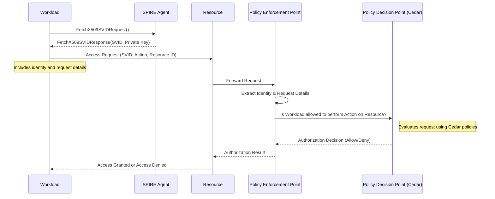
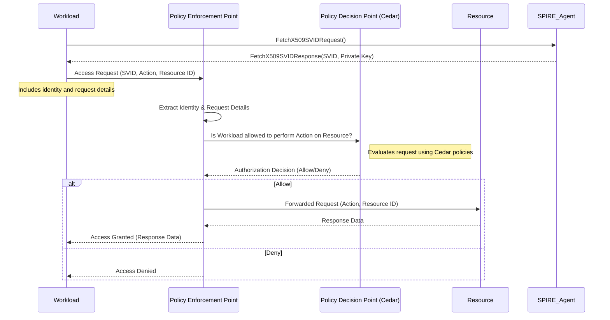
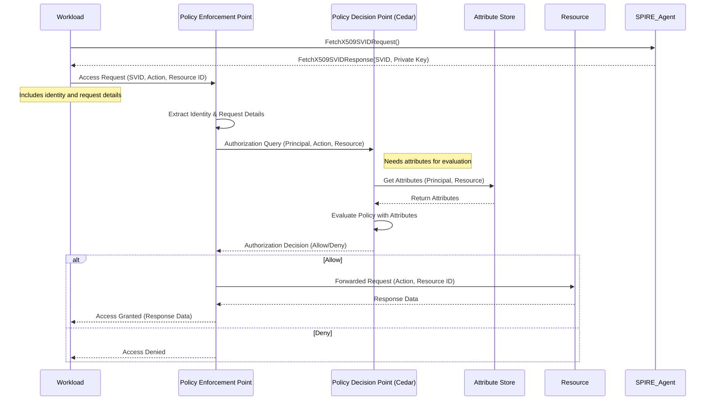

# Workload Authorization Flow with Cedar

## Resource queries PEP directly

## Resource request is intercepted by proxy or sidecar and queries the PEP

## Using Attribute Based Access Control with Cedar Policies

