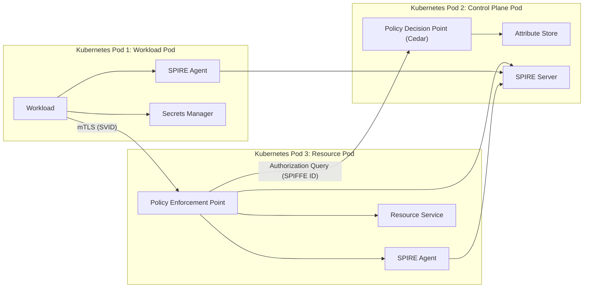

## Cross-Pod Authentication and Authorization

```mermaid
graph LR
    %% Define the first pod with SPIRE Agent, Secrets Manager, and Workload
    subgraph Pod1["Kubernetes Pod 1: Workload Pod"]
        direction TB
        SPIRE_Agent1["SPIRE Agent"]
        Secrets_Manager["Secrets Manager"]
        Workload["Workload"]
    end

    %% Define the second pod with PDP, Attribute Store, and SPIRE Server
    subgraph Pod2["Kubernetes Pod 2: Control Plane Pod"]
        direction TB
        PDP["Policy Decision Point (Cedar)"]
        Attribute_Store["Attribute Store"]
        SPIRE_Server["SPIRE Server"]
    end

    %% Define the third pod with SPIRE Agent, PEP, and Resource
    subgraph Pod3["Kubernetes Pod 3: Resource Pod"]
        direction TB
        SPIRE_Agent2["SPIRE Agent"]
        PEP["Policy Enforcement Point"]
        Resource["Resource Service"]
    end

    %% Interactions within Pod1
    Workload --> SPIRE_Agent1
    Workload --> Secrets_Manager

    %% Workload initiates mTLS connection to PEP in Resource Pod
    Workload -- mTLS (SVID) --> PEP

    %% PEP in Pod3 verifies Workload's identity using SPIRE Agent or Trust Bundle
    PEP --> SPIRE_Agent2
    PEP --> SPIRE_Server

    %% PEP sends authorization query to PDP in Pod2
    PEP -- Authorization Query (SPIFFE ID) --> PDP
    PDP --> Attribute_Store

    %% PEP forwards request to Resource within Pod3
    PEP --> Resource

    %% SPIRE Agents communicate with SPIRE Server
    SPIRE_Agent1 --> SPIRE_Server
    SPIRE_Agent2 --> SPIRE_Server
```