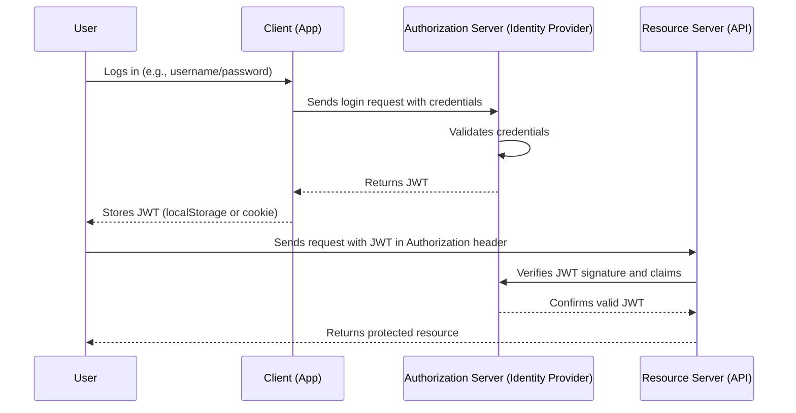
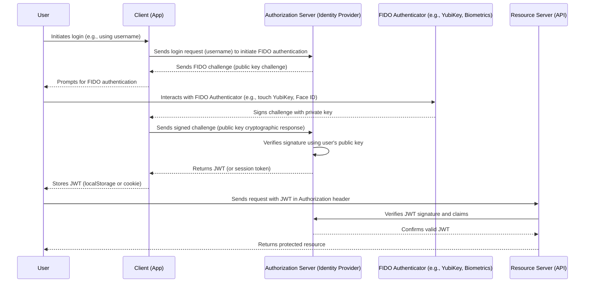

## JSON Web Token (JWT) Issuance Flow

```mermaid
sequenceDiagram
    participant User as User
    participant Client as Client (App)
    participant AuthServer as Authorization Server (Identity Provider)
    participant Resource as Resource Server (API)

    User->>Client: Logs in (e.g., username/password)
    Client->>AuthServer: Sends login request with credentials
    AuthServer->>AuthServer: Validates credentials
    AuthServer-->>Client: Returns JWT
    Client-->>User: Stores JWT (localStorage or cookie)
    User->>Resource: Sends request with JWT in Authorization header
    Resource->>AuthServer: Verifies JWT signature and claims
    AuthServer-->>Resource: Confirms valid JWT
    Resource-->>User: Returns protected resource
```

## FIDO2 Compliant JWT Issuance

```mermaid
sequenceDiagram
    participant User as User
    participant Client as Client (App)
    participant AuthServer as Authorization Server (Identity Provider)
    participant FIDODevice as FIDO Authenticator (e.g., YubiKey, Biometrics)
    participant Resource as Resource Server (API)

    User->>Client: Initiates login (e.g., using username)
    Client->>AuthServer: Sends login request (username) to initiate FIDO authentication
    AuthServer-->>Client: Sends FIDO challenge (public key challenge)
    Client-->>User: Prompts for FIDO authentication
    User->>FIDODevice: Interacts with FIDO Authenticator (e.g., touch YubiKey, Face ID)
    FIDODevice-->>Client: Signs challenge with private key
    Client->>AuthServer: Sends signed challenge (public key cryptographic response)
    AuthServer->>AuthServer: Verifies signature using user's public key
    AuthServer-->>Client: Returns JWT (or session token)
    Client-->>User: Stores JWT (localStorage or cookie)
    User->>Resource: Sends request with JWT in Authorization header
    Resource->>AuthServer: Verifies JWT signature and claims
    AuthServer-->>Resource: Confirms valid JWT
    Resource-->>User: Returns protected resource
```