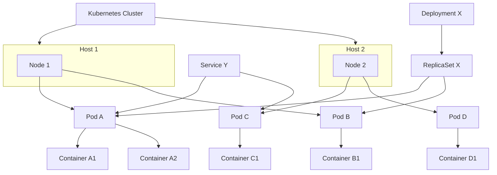
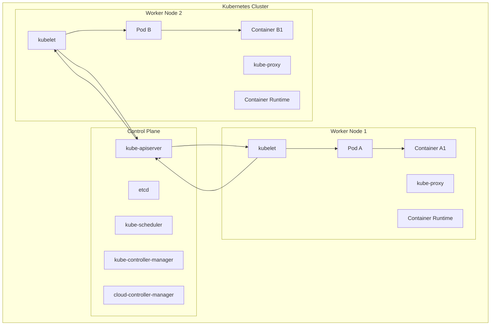
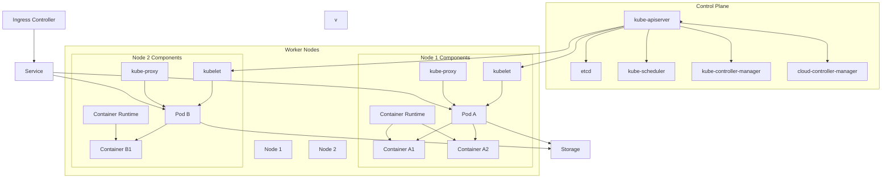

## Kubernetes Logical Design



## Kubernetes Cluster


```
+---------------------------------+
|      Kubernetes Cluster         |
|                                 |
|  +---------------------------+  |
|  |      Control Plane        |  |
|  |                           |  |
|  |     kube-apiserver        |  |
|  |           etcd            |  |
|  |     kube-scheduler        |  |
|  | kube-controller-manager   |  |
|  | cloud-controller-manager  |  |
|  +-----------+---------------+  |
|               |                 |
|               |                 |
|  +-----------v---------------+  |
|  |        Worker Node 1      |  |
|  |                           |  |
|  |          kubelet          |  |
|  |         kube-proxy        |  |
|  |    Container Runtime      |  |
|  |    +-----------------+    |  |
|  |    |      Pod A      |    |  |
|  |    |  Container A1   |    |  |
|  |    |  Container A2   |    |  |
|  |    +-----------------+    |  |
|  +-----------+---------------+  |
|               |                 |
|  +-----------v---------------+  |
|  |        Worker Node 2      |  |
|  |                           |  |
|  |          kubelet          |  |
|  |         kube-proxy        |  |
|  |    Container Runtime      |  |
|  |    +-----------------+    |  |
|  |    |      Pod B      |    |  |
|  |    |  Container B1   |    |  |
|  |    +-----------------+    |  |
|  +---------------------------+  |
|                                 |
+---------------------------------+
```

# Kubernetes Architecture


## Control Plane vs Worker Nodes
---
| Aspect                  | Control Plane                                               | Worker Nodes                                          |
|-------------------------|-------------------------------------------------------------|-------------------------------------------------------|
| **Purpose**             | Manages and orchestrates the cluster                        | Runs containerized applications                       |
| **Components**          | kube-apiserver, etcd, scheduler, etc.                       | kubelet, kube-proxy, container runtime                |
| **Deployment**          | Often on dedicated machines or managed by cloud services    | Deployed across multiple machines/VMs                 |
| **State Management**    | Maintains cluster state via etcd                            | Manages Pod and container states                      |
| **Communication**       | Interfaces with Worker Nodes via API Server                 | Communicates with Control Plane via kube-apiserver    |
| **Scalability**         | Scales independently, often highly available                | Scales based on application needs                     |
| **Security**            | Highly secured, access controlled                           | Secured through node-level policies                   |
| **Resource Allocation** | Cluster-wide resources                                      | Node-specific resources                               |
---
