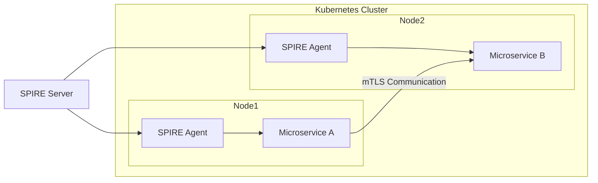
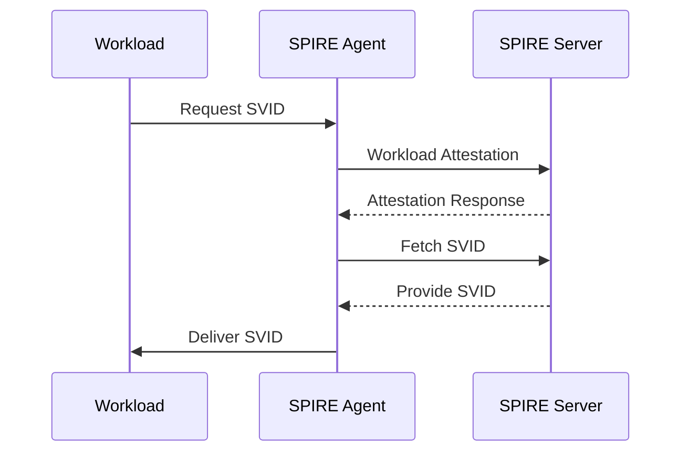
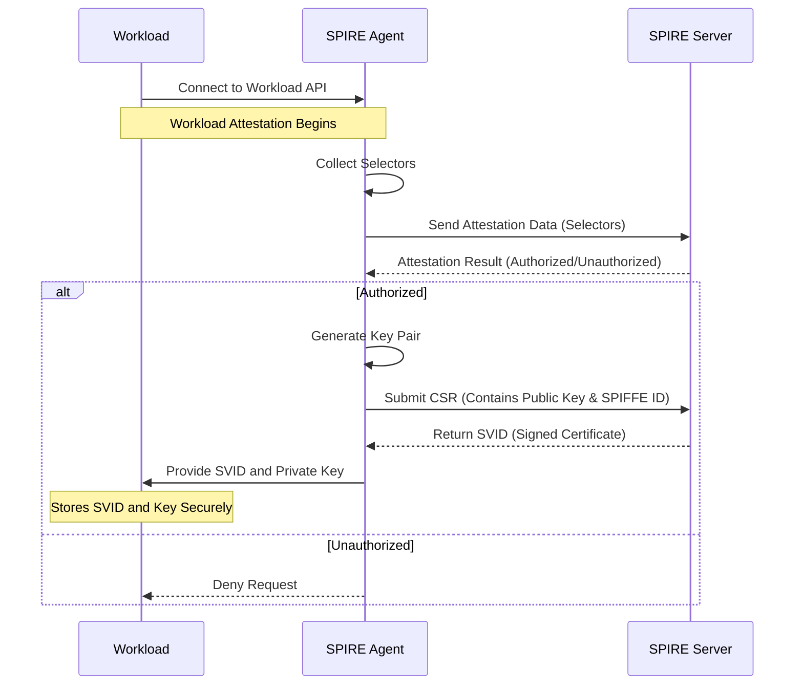
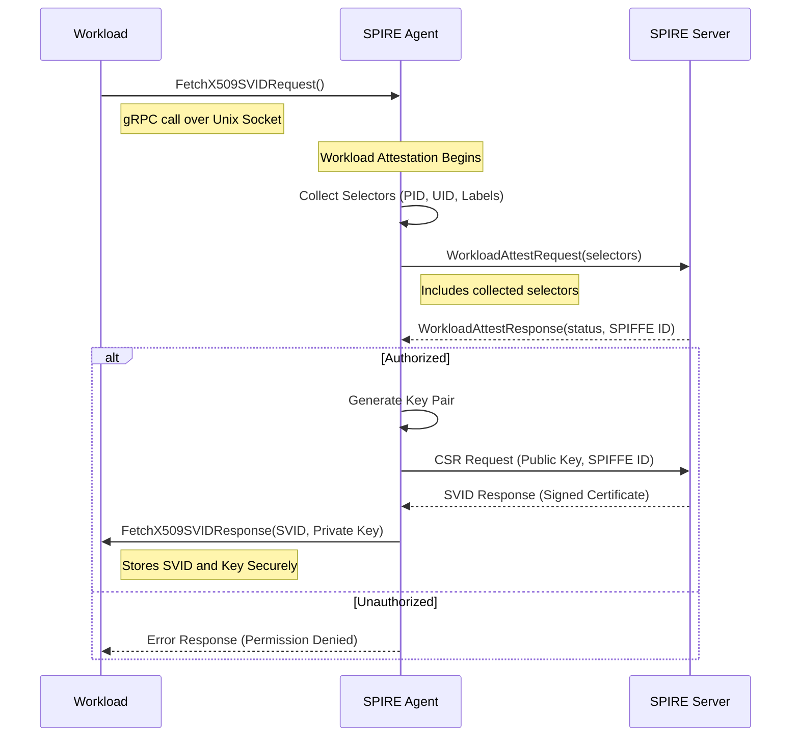

# SPIRE Identity Overview

## High-Level System Diagram for SPIRE with Kubernetes Microservices

## High-Level UML Sequence Diagram for Establishing a SPIRE Identity

## Detailed UML Sequence Diagram for Establishing a SPIRE Identity

## Workload to SPIRE Agent Payload

