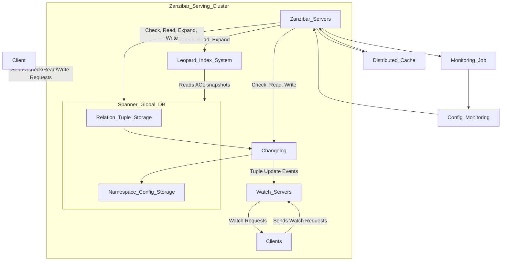

```mermaid
graph TD
  Client -->|Sends Check/Read/Write Requests| Zanzibar_Serving_Cluster

  subgraph Zanzibar_Serving_Cluster
    Zanzibar_Servers -->|Check, Read, Expand, Write| Spanner_Global_DB
    Zanzibar_Servers -->|Check, Read, Write| Changelog
    Zanzibar_Servers -->|Check, Read, Expand| Leopard_Index_System
    Leopard_Index_System -->|Reads ACL snapshots| Spanner_Global_DB

    Changelog -->|Tuple Update Events| Watch_Servers
    Watch_Servers -->|Watch Requests| Clients
  end

  subgraph Spanner_Global_DB
    Relation_Tuple_Storage --> Changelog
    Changelog --> Namespace_Config_Storage
  end

  Zanzibar_Servers --> Distributed_Cache
  Zanzibar_Servers --> Monitoring_Job
  Distributed_Cache --> Zanzibar_Servers
  Monitoring_Job --> Config_Monitoring --> Zanzibar_Servers

  Clients -->|Sends Watch Requests| Watch_Servers
```