# Kubernetes Communication Patterns and Lifecycles

## Table of Contents

1. [Overview](#overview)
2. [Communication Architecture](#communication-architecture)
3. [Component Interactions](#component-interactions)
4. [Complete Lifecycles](#complete-lifecycles)
5. [Security Flows](#security-flows)
6. [Network Traffic Patterns](#network-traffic-patterns)
7. [State Synchronization](#state-synchronization)
8. [Failure Scenarios](#failure-scenarios)

## Overview

This document provides end-to-end views of how Kubernetes components communicate and how various resources flow through the system from creation to deletion, with emphasis on security boundaries and authentication/authorization checkpoints.

**Key Principles:**
- **Hub and Spoke**: All components communicate through kube-apiserver
- **Watch-based**: Efficient event streaming instead of polling
- **Declarative**: Users declare desired state, controllers reconcile
- **Eventually Consistent**: System converges toward desired state
- **Zero-trust**: Every request authenticated and authorized

## Communication Architecture

### Complete System View

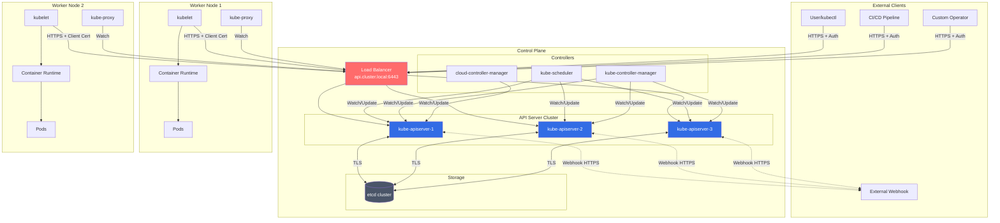
```mermaid
graph TB
    subgraph "External Clients"
        USER[User/kubectl]
        CI[CI/CD Pipeline]
        OPERATOR[Custom Operator]
        WEBHOOK[External Webhook]
    end

    subgraph "Control Plane"
        LB[Load Balancer<br/>api.cluster.local:6443]

        subgraph "API Server Cluster"
            API1[kube-apiserver-1]
            API2[kube-apiserver-2]
            API3[kube-apiserver-3]
        end

        subgraph "Controllers"
            SCHED[kube-scheduler]
            CM[kube-controller-manager]
            CCM[cloud-controller-manager]
        end

        subgraph "Storage"
            ETCD[(etcd cluster)]
        end
    end

    subgraph "Worker Node 1"
        KUBELET1[kubelet]
        PROXY1[kube-proxy]
        RUNTIME1[Container Runtime]
        POD1[Pods]
    end

    subgraph "Worker Node 2"
        KUBELET2[kubelet]
        PROXY2[kube-proxy]
        RUNTIME2[Container Runtime]
        POD2[Pods]
    end

    USER -->|HTTPS + Auth| LB
    CI -->|HTTPS + Auth| LB
    OPERATOR -->|HTTPS + Auth| LB

    LB --> API1
    LB --> API2
    LB --> API3

    API1 <-->|TLS| ETCD
    API2 <-->|TLS| ETCD
    API3 <-->|TLS| ETCD

    API1 <-.->|Webhook HTTPS| WEBHOOK
    API2 <-.->|Webhook HTTPS| WEBHOOK
    API3 <-.->|Webhook HTTPS| WEBHOOK

    SCHED -->|Watch/Update| API1
    SCHED -->|Watch/Update| API2
    SCHED -->|Watch/Update| API3

    CM -->|Watch/Update| API1
    CM -->|Watch/Update| API2
    CM -->|Watch/Update| API3

    CCM -->|Watch/Update| API1

    KUBELET1 -->|HTTPS + Client Cert| LB
    KUBELET2 -->|HTTPS + Client Cert| LB

    PROXY1 -->|Watch| LB
    PROXY2 -->|Watch| LB

    KUBELET1 --> RUNTIME1
    KUBELET2 --> RUNTIME2
    RUNTIME1 --> POD1
    RUNTIME2 --> POD2

    style API1 fill:#326CE5,color:#fff
    style API2 fill:#326CE5,color:#fff
    style API3 fill:#326CE5,color:#fff
    style ETCD fill:#4A5568,color:#fff
    style LB fill:#FF6B6B,color:#fff
```

### Authentication Boundaries

```mermaid
graph LR
    subgraph "External"
        EXT[External Client]
    end

    subgraph "API Server"
        TLS[TLS Termination]
        AUTH[Authentication]
        AUTHZ[Authorization]
        ADM[Admission]
        HANDLER[Request Handler]
    end

    subgraph "Backend"
        ETCD[(etcd)]
    end

    EXT -->|"1. HTTPS Request<br/>+ Credentials"| TLS
    TLS -->|"2. Verified TLS"| AUTH
    AUTH -->|"3. Authenticated<br/>User/SA"| AUTHZ
    AUTHZ -->|"4. Authorized<br/>Request"| ADM
    ADM -->|"5. Validated<br/>Request"| HANDLER
    HANDLER -->|"6. Store/Retrieve"| ETCD

    style AUTH fill:#FFD93D,color:#000
    style AUTHZ fill:#6BCB77,color:#000
    style ADM fill:#4D96FF,color:#fff
```

### Component Authentication Methods

| Component | Authentication Method | Authorization |
|-----------|----------------------|---------------|
| **kubectl** | Kubeconfig (client cert, token, OIDC) | RBAC |
| **kubelet** | Client certificate (TLS bootstrap) | Node authorization + RBAC |
| **kube-scheduler** | Client certificate | RBAC (system:kube-scheduler) |
| **kube-controller-manager** | Client certificate | RBAC (system:kube-controller-manager) |
| **kube-proxy** | Client certificate or ServiceAccount | RBAC (system:kube-proxy) |
| **Custom Controllers** | ServiceAccount token (JWT) | RBAC |
| **Pods** | ServiceAccount token (projected volume) | RBAC |
| **API Server → etcd** | Client certificate (mTLS) | No RBAC (direct access) |
| **Webhooks** | API server client cert | N/A (external system) |

## Component Interactions

### API Server as Central Hub

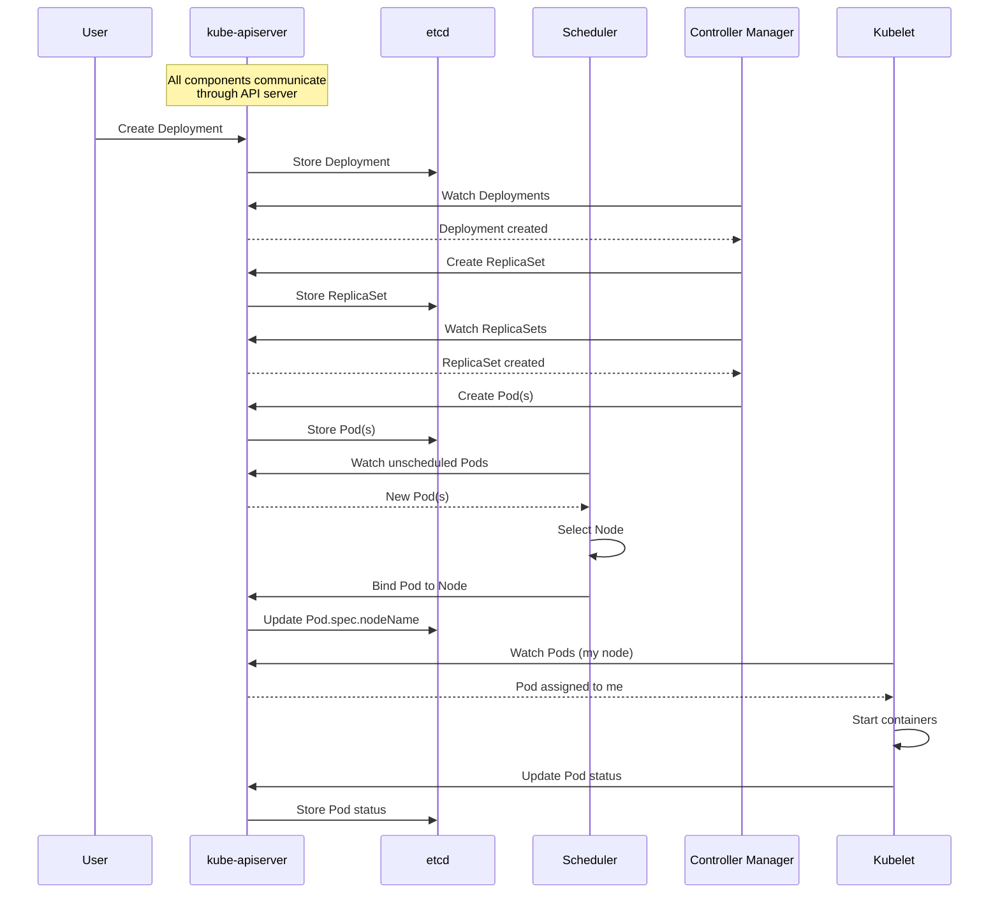
```mermaid
sequenceDiagram
    participant User
    participant API as kube-apiserver
    participant ETCD as etcd
    participant Sched as Scheduler
    participant CM as Controller Manager
    participant Kubelet

    Note over API: All components communicate<br/>through API server

    User->>API: Create Deployment
    API->>ETCD: Store Deployment

    CM->>API: Watch Deployments
    API-->>CM: Deployment created
    CM->>API: Create ReplicaSet
    API->>ETCD: Store ReplicaSet

    CM->>API: Watch ReplicaSets
    API-->>CM: ReplicaSet created
    CM->>API: Create Pod(s)
    API->>ETCD: Store Pod(s)

    Sched->>API: Watch unscheduled Pods
    API-->>Sched: New Pod(s)
    Sched->>Sched: Select Node
    Sched->>API: Bind Pod to Node
    API->>ETCD: Update Pod.spec.nodeName

    Kubelet->>API: Watch Pods (my node)
    API-->>Kubelet: Pod assigned to me
    Kubelet->>Kubelet: Start containers
    Kubelet->>API: Update Pod status
    API->>ETCD: Store Pod status
```

### Watch Mechanism Deep Dive

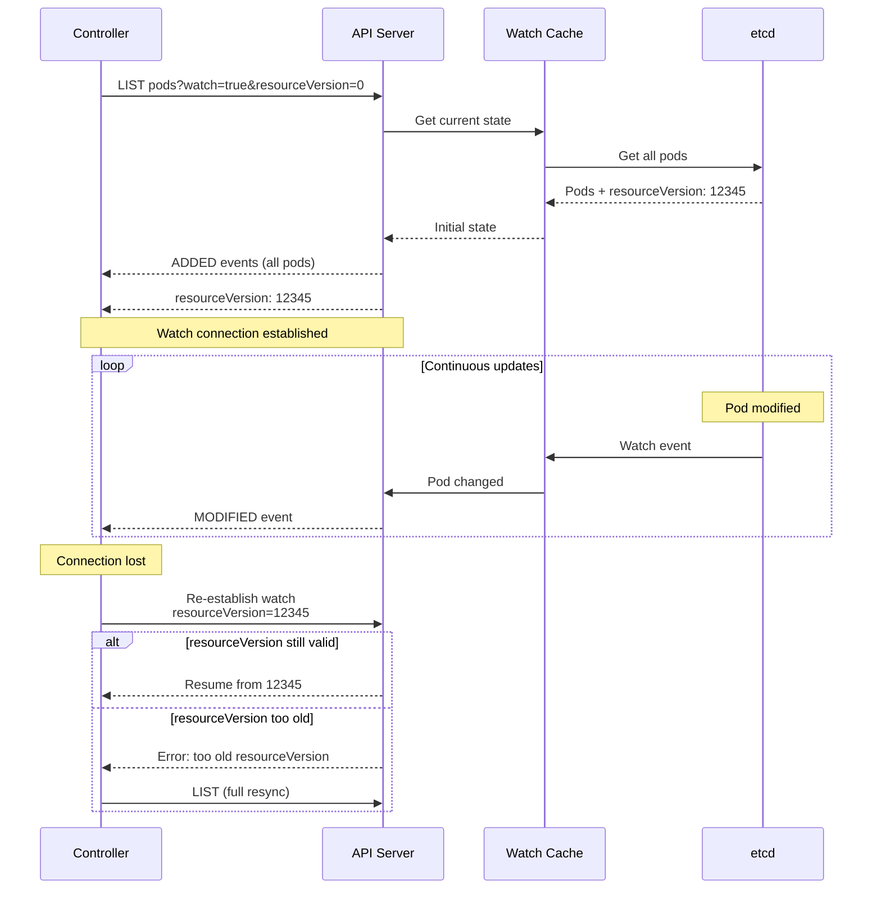
```mermaid
sequenceDiagram
    participant Controller
    participant APIServer as API Server
    participant WatchCache as Watch Cache
    participant ETCD as etcd

    Controller->>APIServer: LIST pods?watch=true&resourceVersion=0
    APIServer->>WatchCache: Get current state
    WatchCache->>ETCD: Get all pods
    ETCD-->>WatchCache: Pods + resourceVersion: 12345
    WatchCache-->>APIServer: Initial state
    APIServer-->>Controller: ADDED events (all pods)
    APIServer-->>Controller: resourceVersion: 12345

    Note over Controller,APIServer: Watch connection established

    loop Continuous updates
        Note over ETCD: Pod modified
        ETCD->>WatchCache: Watch event
        WatchCache->>APIServer: Pod changed
        APIServer-->>Controller: MODIFIED event
    end

    Note over Controller: Connection lost
    Controller->>APIServer: Re-establish watch<br/>resourceVersion=12345

    alt resourceVersion still valid
        APIServer-->>Controller: Resume from 12345
    else resourceVersion too old
        APIServer-->>Controller: Error: too old resourceVersion
        Controller->>APIServer: LIST (full resync)
    end
```

**Watch Event Types:**
- `ADDED`: Resource created
- `MODIFIED`: Resource updated
- `DELETED`: Resource deleted
- `BOOKMARK`: Periodic checkpoint (resourceVersion update)
- `ERROR`: Watch stream error

### Controller Reconciliation Pattern

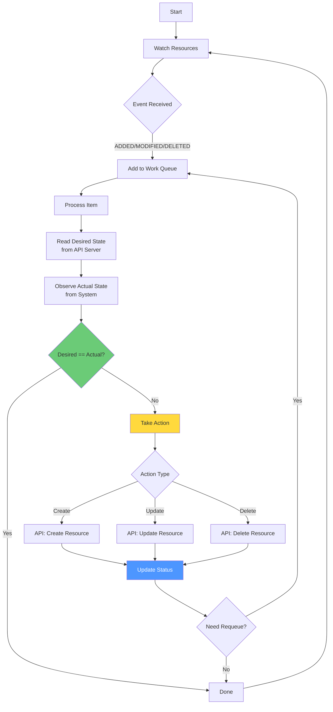
```mermaid
graph TB
    START[Start] --> WATCH[Watch Resources]
    WATCH --> EVENT{Event Received}
    EVENT -->|ADDED/MODIFIED/DELETED| ENQUEUE[Add to Work Queue]
    ENQUEUE --> PROCESS[Process Item]

    PROCESS --> READ[Read Desired State<br/>from API Server]
    READ --> OBSERVE[Observe Actual State<br/>from System]
    OBSERVE --> COMPARE{Desired == Actual?}

    COMPARE -->|Yes| DONE[Done]
    COMPARE -->|No| ACTION[Take Action]

    ACTION --> CREATE{Action Type}
    CREATE -->|Create| APICREATE[API: Create Resource]
    CREATE -->|Update| APIUPDATE[API: Update Resource]
    CREATE -->|Delete| APIDELETE[API: Delete Resource]

    APICREATE --> UPDATESTATUS[Update Status]
    APIUPDATE --> UPDATESTATUS
    APIDELETE --> UPDATESTATUS

    UPDATESTATUS --> REQUEUE{Need Requeue?}
    REQUEUE -->|Yes| ENQUEUE
    REQUEUE -->|No| DONE

    DONE --> WATCH

    style ACTION fill:#FFD93D
    style COMPARE fill:#6BCB77
    style UPDATESTATUS fill:#4D96FF,color:#fff
```

## Complete Lifecycles

### Pod Lifecycle: Complete End-to-End Flow

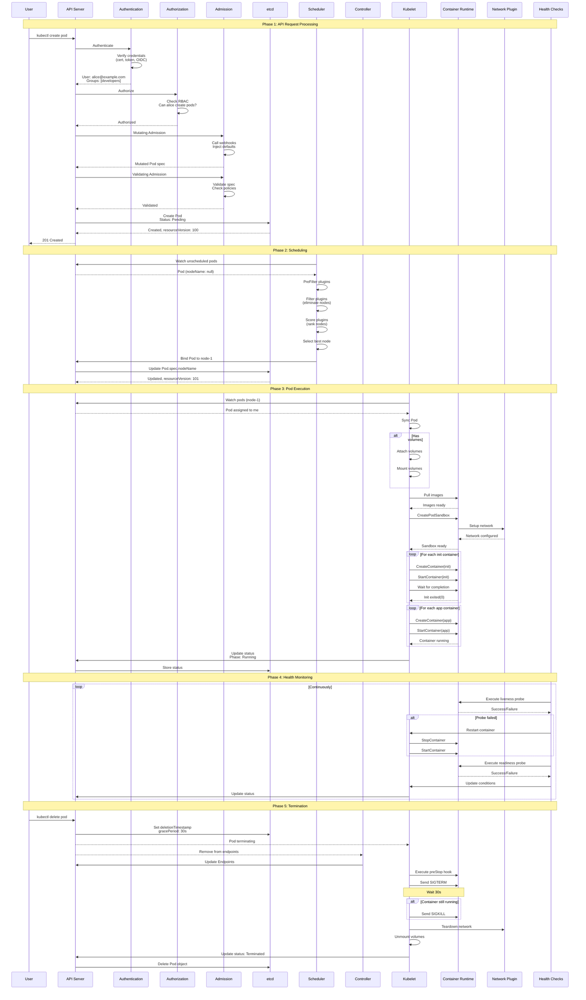
```mermaid
sequenceDiagram
    participant User
    participant API as API Server
    participant Auth as Authentication
    participant Authz as Authorization
    participant Admit as Admission
    participant ETCD as etcd
    participant Sched as Scheduler
    participant CM as Controller
    participant Kubelet
    participant CRI as Container Runtime
    participant CNI as Network Plugin
    participant Probe as Health Checks

    Note over User,Probe: Phase 1: API Request Processing

    User->>API: kubectl create pod
    API->>Auth: Authenticate
    Auth->>Auth: Verify credentials<br/>(cert, token, OIDC)
    Auth-->>API: User: alice@example.com<br/>Groups: [developers]

    API->>Authz: Authorize
    Authz->>Authz: Check RBAC<br/>Can alice create pods?
    Authz-->>API: Authorized

    API->>Admit: Mutating Admission
    Admit->>Admit: Call webhooks<br/>Inject defaults
    Admit-->>API: Mutated Pod spec

    API->>Admit: Validating Admission
    Admit->>Admit: Validate spec<br/>Check policies
    Admit-->>API: Validated

    API->>ETCD: Create Pod<br/>Status: Pending
    ETCD-->>API: Created, resourceVersion: 100
    API-->>User: 201 Created

    Note over User,Probe: Phase 2: Scheduling

    Sched->>API: Watch unscheduled pods
    API-->>Sched: Pod (nodeName: null)

    Sched->>Sched: PreFilter plugins
    Sched->>Sched: Filter plugins<br/>(eliminate nodes)
    Sched->>Sched: Score plugins<br/>(rank nodes)
    Sched->>Sched: Select best node

    Sched->>API: Bind Pod to node-1
    API->>ETCD: Update Pod.spec.nodeName
    ETCD-->>API: Updated, resourceVersion: 101

    Note over User,Probe: Phase 3: Pod Execution

    Kubelet->>API: Watch pods (node-1)
    API-->>Kubelet: Pod assigned to me

    Kubelet->>Kubelet: Sync Pod

    alt Has volumes
        Kubelet->>Kubelet: Attach volumes
        Kubelet->>Kubelet: Mount volumes
    end

    Kubelet->>CRI: Pull images
    CRI-->>Kubelet: Images ready

    Kubelet->>CRI: CreatePodSandbox
    CRI->>CNI: Setup network
    CNI-->>CRI: Network configured
    CRI-->>Kubelet: Sandbox ready

    loop For each init container
        Kubelet->>CRI: CreateContainer(init)
        Kubelet->>CRI: StartContainer(init)
        Kubelet->>CRI: Wait for completion
        CRI-->>Kubelet: Init exited(0)
    end

    loop For each app container
        Kubelet->>CRI: CreateContainer(app)
        Kubelet->>CRI: StartContainer(app)
        CRI-->>Kubelet: Container running
    end

    Kubelet->>API: Update status<br/>Phase: Running
    API->>ETCD: Store status

    Note over User,Probe: Phase 4: Health Monitoring

    loop Continuously
        Probe->>CRI: Execute liveness probe
        CRI-->>Probe: Success/Failure

        alt Probe failed
            Probe->>Kubelet: Restart container
            Kubelet->>CRI: StopContainer
            Kubelet->>CRI: StartContainer
        end

        Probe->>CRI: Execute readiness probe
        CRI-->>Probe: Success/Failure

        Probe->>Kubelet: Update conditions
        Kubelet->>API: Update status
    end

    Note over User,Probe: Phase 5: Termination

    User->>API: kubectl delete pod
    API->>ETCD: Set deletionTimestamp<br/>gracePeriod: 30s

    API-->>Kubelet: Pod terminating
    API-->>CM: Remove from endpoints
    CM->>API: Update Endpoints

    Kubelet->>CRI: Execute preStop hook
    Kubelet->>CRI: Send SIGTERM

    Note over Kubelet,CRI: Wait 30s

    alt Container still running
        Kubelet->>CRI: Send SIGKILL
    end

    Kubelet->>CNI: Teardown network
    Kubelet->>Kubelet: Unmount volumes

    Kubelet->>API: Update status: Terminated
    API->>ETCD: Delete Pod object
```

### Service Lifecycle and Traffic Flow

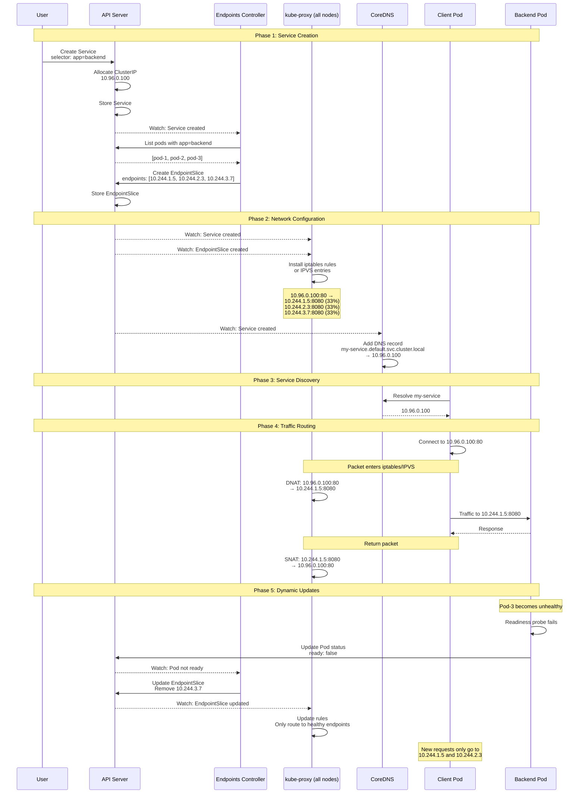
```mermaid
sequenceDiagram
    participant User
    participant API as API Server
    participant EPController as Endpoints Controller
    participant Proxy as kube-proxy (all nodes)
    participant DNS as CoreDNS
    participant Client as Client Pod
    participant Backend as Backend Pod

    Note over User,Backend: Phase 1: Service Creation

    User->>API: Create Service<br/>selector: app=backend
    API->>API: Allocate ClusterIP<br/>10.96.0.100
    API->>API: Store Service

    API-->>EPController: Watch: Service created
    EPController->>API: List pods with app=backend
    API-->>EPController: [pod-1, pod-2, pod-3]

    EPController->>API: Create EndpointSlice<br/>endpoints: [10.244.1.5, 10.244.2.3, 10.244.3.7]
    API->>API: Store EndpointSlice

    Note over User,Backend: Phase 2: Network Configuration

    API-->>Proxy: Watch: Service created
    API-->>Proxy: Watch: EndpointSlice created

    Proxy->>Proxy: Install iptables rules<br/>or IPVS entries
    Note over Proxy: 10.96.0.100:80 →<br/>10.244.1.5:8080 (33%)<br/>10.244.2.3:8080 (33%)<br/>10.244.3.7:8080 (33%)

    API-->>DNS: Watch: Service created
    DNS->>DNS: Add DNS record<br/>my-service.default.svc.cluster.local<br/>→ 10.96.0.100

    Note over User,Backend: Phase 3: Service Discovery

    Client->>DNS: Resolve my-service
    DNS-->>Client: 10.96.0.100

    Note over User,Backend: Phase 4: Traffic Routing

    Client->>Client: Connect to 10.96.0.100:80

    Note over Client,Proxy: Packet enters iptables/IPVS

    Proxy->>Proxy: DNAT: 10.96.0.100:80<br/>→ 10.244.1.5:8080

    Client->>Backend: Traffic to 10.244.1.5:8080
    Backend-->>Client: Response

    Note over Client,Proxy: Return packet

    Proxy->>Proxy: SNAT: 10.244.1.5:8080<br/>→ 10.96.0.100:80

    Note over User,Backend: Phase 5: Dynamic Updates

    Note over Backend: Pod-3 becomes unhealthy

    Backend->>Backend: Readiness probe fails
    Backend->>API: Update Pod status<br/>ready: false

    API-->>EPController: Watch: Pod not ready
    EPController->>API: Update EndpointSlice<br/>Remove 10.244.3.7

    API-->>Proxy: Watch: EndpointSlice updated
    Proxy->>Proxy: Update rules<br/>Only route to healthy endpoints

    Note over Client: New requests only go to<br/>10.244.1.5 and 10.244.2.3
```

### Deployment Rollout Lifecycle

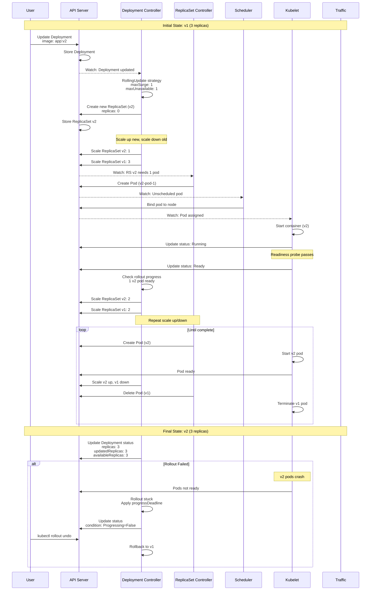
```mermaid
sequenceDiagram
    participant User
    participant API as API Server
    participant DC as Deployment Controller
    participant RSC as ReplicaSet Controller
    participant Sched as Scheduler
    participant Kubelet
    participant Client as Traffic

    Note over User,Client: Initial State: v1 (3 replicas)

    User->>API: Update Deployment<br/>image: app:v2
    API->>API: Store Deployment

    API-->>DC: Watch: Deployment updated
    DC->>DC: RollingUpdate strategy<br/>maxSurge: 1<br/>maxUnavailable: 1

    DC->>API: Create new ReplicaSet (v2)<br/>replicas: 0
    API->>API: Store ReplicaSet v2

    Note over DC: Scale up new, scale down old

    DC->>API: Scale ReplicaSet v2: 1
    DC->>API: Scale ReplicaSet v1: 3

    API-->>RSC: Watch: RS v2 needs 1 pod
    RSC->>API: Create Pod (v2-pod-1)

    API-->>Sched: Watch: Unscheduled pod
    Sched->>API: Bind pod to node

    API-->>Kubelet: Watch: Pod assigned
    Kubelet->>Kubelet: Start container (v2)
    Kubelet->>API: Update status: Running

    Note over Kubelet: Readiness probe passes

    Kubelet->>API: Update status: Ready

    DC->>DC: Check rollout progress<br/>1 v2 pod ready

    DC->>API: Scale ReplicaSet v2: 2
    DC->>API: Scale ReplicaSet v1: 2

    Note over DC,RSC: Repeat scale up/down

    loop Until complete
        RSC->>API: Create Pod (v2)
        Kubelet->>Kubelet: Start v2 pod
        Kubelet->>API: Pod ready

        DC->>API: Scale v2 up, v1 down

        RSC->>API: Delete Pod (v1)
        Kubelet->>Kubelet: Terminate v1 pod
    end

    Note over User,Client: Final State: v2 (3 replicas)

    DC->>API: Update Deployment status<br/>replicas: 3<br/>updatedReplicas: 3<br/>availableReplicas: 3

    alt Rollout Failed
        Note over Kubelet: v2 pods crash
        Kubelet->>API: Pods not ready
        DC->>DC: Rollout stuck<br/>Apply progressDeadline
        DC->>API: Update status<br/>condition: Progressing=False
        User->>API: kubectl rollout undo
        DC->>DC: Rollback to v1
    end
```

### Volume Provisioning and Attachment

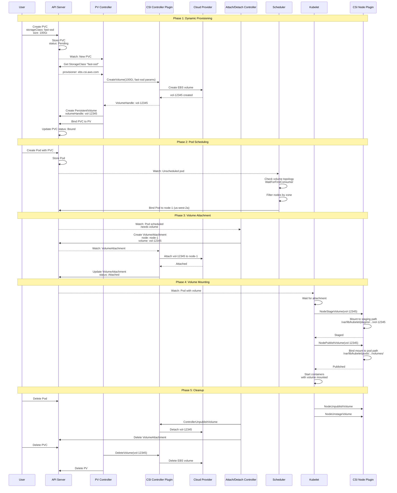
```mermaid
sequenceDiagram
    participant User
    participant API as API Server
    participant PVC as PV Controller
    participant CSIController as CSI Controller Plugin
    participant Cloud as Cloud Provider
    participant AttachDetach as Attach/Detach Controller
    participant Sched as Scheduler
    participant Kubelet
    participant CSINode as CSI Node Plugin

    Note over User,CSINode: Phase 1: Dynamic Provisioning

    User->>API: Create PVC<br/>storageClass: fast-ssd<br/>size: 100Gi
    API->>API: Store PVC<br/>status: Pending

    API-->>PVC: Watch: New PVC
    PVC->>API: Get StorageClass "fast-ssd"
    API-->>PVC: provisioner: ebs.csi.aws.com

    PVC->>CSIController: CreateVolume(100Gi, fast-ssd params)
    CSIController->>Cloud: Create EBS volume
    Cloud-->>CSIController: vol-12345 created
    CSIController-->>PVC: VolumeHandle: vol-12345

    PVC->>API: Create PersistentVolume<br/>volumeHandle: vol-12345
    PVC->>API: Bind PVC to PV
    API->>API: Update PVC status: Bound

    Note over User,CSINode: Phase 2: Pod Scheduling

    User->>API: Create Pod with PVC
    API->>API: Store Pod

    API-->>Sched: Watch: Unscheduled pod
    Sched->>Sched: Check volume topology<br/>WaitForFirstConsumer
    Sched->>Sched: Filter nodes by zone
    Sched->>API: Bind Pod to node-1 (us-west-2a)

    Note over User,CSINode: Phase 3: Volume Attachment

    API-->>AttachDetach: Watch: Pod scheduled<br/>needs volume
    AttachDetach->>API: Create VolumeAttachment<br/>node: node-1<br/>volume: vol-12345

    API-->>CSIController: Watch: VolumeAttachment
    CSIController->>Cloud: Attach vol-12345 to node-1
    Cloud-->>CSIController: Attached
    CSIController->>API: Update VolumeAttachment<br/>status: Attached

    Note over User,CSINode: Phase 4: Volume Mounting

    API-->>Kubelet: Watch: Pod with volume
    Kubelet->>Kubelet: Wait for attachment

    Kubelet->>CSINode: NodeStageVolume(vol-12345)
    CSINode->>CSINode: Mount to staging path<br/>/var/lib/kubelet/plugins/.../vol-12345
    CSINode-->>Kubelet: Staged

    Kubelet->>CSINode: NodePublishVolume(vol-12345)
    CSINode->>CSINode: Bind mount to pod path<br/>/var/lib/kubelet/pods/.../volumes/
    CSINode-->>Kubelet: Published

    Kubelet->>Kubelet: Start containers<br/>with volume mounted

    Note over User,CSINode: Phase 5: Cleanup

    User->>API: Delete Pod

    Kubelet->>CSINode: NodeUnpublishVolume
    Kubelet->>CSINode: NodeUnstageVolume

    AttachDetach->>CSIController: ControllerUnpublishVolume
    CSIController->>Cloud: Detach vol-12345

    AttachDetach->>API: Delete VolumeAttachment

    User->>API: Delete PVC
    PVC->>CSIController: DeleteVolume(vol-12345)
    CSIController->>Cloud: Delete EBS volume
    PVC->>API: Delete PV
```

## Security Flows

### Authentication Flow (Multiple Methods)

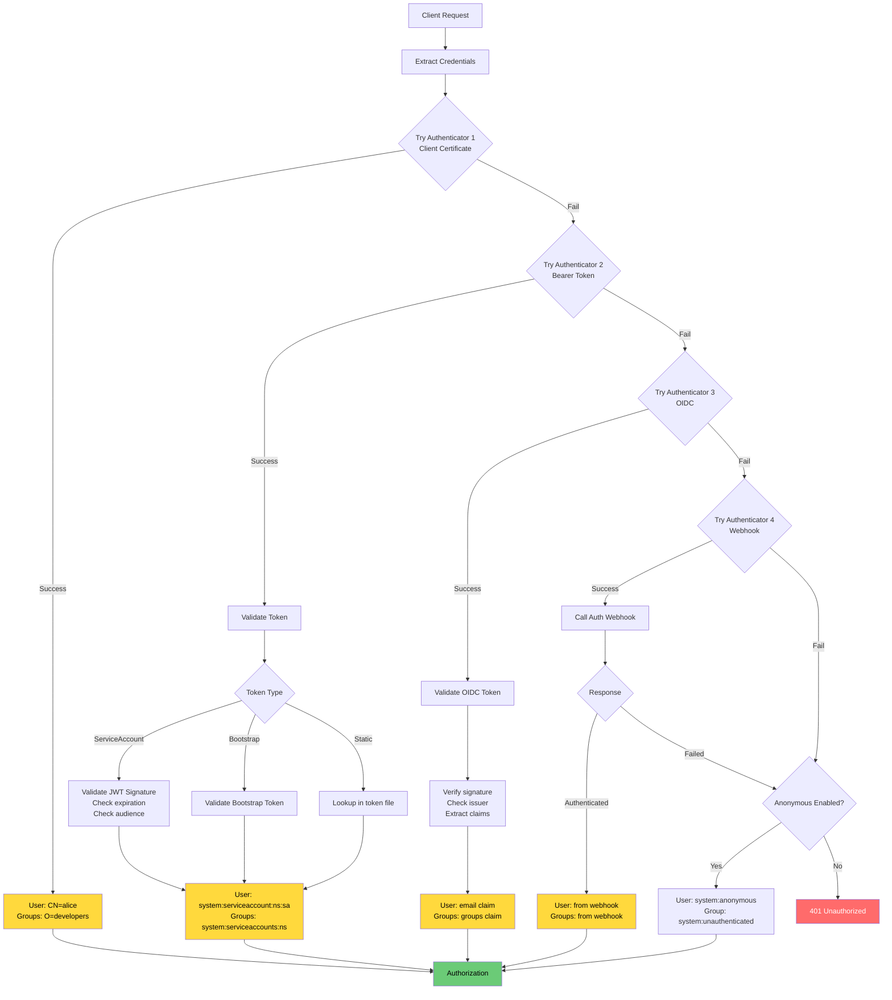
```mermaid
graph TB
    START[Client Request] --> EXTRACT[Extract Credentials]

    EXTRACT --> TRY1{Try Authenticator 1<br/>Client Certificate}
    TRY1 -->|Success| USER1[User: CN=alice<br/>Groups: O=developers]
    TRY1 -->|Fail| TRY2{Try Authenticator 2<br/>Bearer Token}

    TRY2 -->|Success| TOKEN[Validate Token]
    TRY2 -->|Fail| TRY3{Try Authenticator 3<br/>OIDC}

    TOKEN --> SATOKEN{Token Type}
    SATOKEN -->|ServiceAccount| VALIDATESA[Validate JWT Signature<br/>Check expiration<br/>Check audience]
    SATOKEN -->|Bootstrap| VALIDATEBOOT[Validate Bootstrap Token]
    SATOKEN -->|Static| VALIDATESTATIC[Lookup in token file]

    VALIDATESA --> USER2[User: system:serviceaccount:ns:sa<br/>Groups: system:serviceaccounts:ns]
    VALIDATEBOOT --> USER2
    VALIDATESTATIC --> USER2

    TRY3 -->|Success| OIDC[Validate OIDC Token]
    TRY3 -->|Fail| TRY4{Try Authenticator 4<br/>Webhook}

    OIDC --> OIDCVAL[Verify signature<br/>Check issuer<br/>Extract claims]
    OIDCVAL --> USER3[User: email claim<br/>Groups: groups claim]

    TRY4 -->|Success| WEBHOOK[Call Auth Webhook]
    TRY4 -->|Fail| ANONYMOUS{Anonymous Enabled?}

    WEBHOOK --> WEBHOOKRESP{Response}
    WEBHOOKRESP -->|Authenticated| USER4[User: from webhook<br/>Groups: from webhook]
    WEBHOOKRESP -->|Failed| ANONYMOUS

    ANONYMOUS -->|Yes| ANONUSER[User: system:anonymous<br/>Group: system:unauthenticated]
    ANONYMOUS -->|No| REJECT[401 Unauthorized]

    USER1 --> AUTHZ[Authorization]
    USER2 --> AUTHZ
    USER3 --> AUTHZ
    USER4 --> AUTHZ
    ANONUSER --> AUTHZ

    style REJECT fill:#FF6B6B,color:#fff
    style AUTHZ fill:#6BCB77,color:#000
    style USER1 fill:#FFD93D,color:#000
    style USER2 fill:#FFD93D,color:#000
    style USER3 fill:#FFD93D,color:#000
    style USER4 fill:#FFD93D,color:#000
```

### Authorization Flow (RBAC Deep Dive)

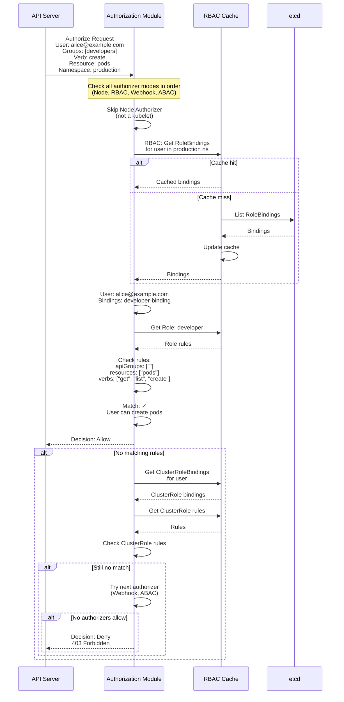
```mermaid
sequenceDiagram
    participant API as API Server
    participant AuthZ as Authorization Module
    participant Cache as RBAC Cache
    participant ETCD as etcd

    API->>AuthZ: Authorize Request<br/>User: alice@example.com<br/>Groups: [developers]<br/>Verb: create<br/>Resource: pods<br/>Namespace: production

    Note over AuthZ: Check all authorizer modes in order<br/>(Node, RBAC, Webhook, ABAC)

    AuthZ->>AuthZ: Skip Node Authorizer<br/>(not a kubelet)

    AuthZ->>Cache: RBAC: Get RoleBindings<br/>for user in production ns

    alt Cache hit
        Cache-->>AuthZ: Cached bindings
    else Cache miss
        Cache->>ETCD: List RoleBindings
        ETCD-->>Cache: Bindings
        Cache->>Cache: Update cache
        Cache-->>AuthZ: Bindings
    end

    AuthZ->>AuthZ: User: alice@example.com<br/>Bindings: developer-binding

    AuthZ->>Cache: Get Role: developer
    Cache-->>AuthZ: Role rules

    AuthZ->>AuthZ: Check rules:<br/>apiGroups: [""]<br/>resources: ["pods"]<br/>verbs: ["get", "list", "create"]

    AuthZ->>AuthZ: Match: ✓<br/>User can create pods

    AuthZ-->>API: Decision: Allow

    alt No matching rules
        AuthZ->>Cache: Get ClusterRoleBindings<br/>for user
        Cache-->>AuthZ: ClusterRole bindings

        AuthZ->>Cache: Get ClusterRole rules
        Cache-->>AuthZ: Rules

        AuthZ->>AuthZ: Check ClusterRole rules

        alt Still no match
            AuthZ->>AuthZ: Try next authorizer<br/>(Webhook, ABAC)

            alt No authorizers allow
                AuthZ-->>API: Decision: Deny<br/>403 Forbidden
            end
        end
    end
```

### Complete Request Flow with Security

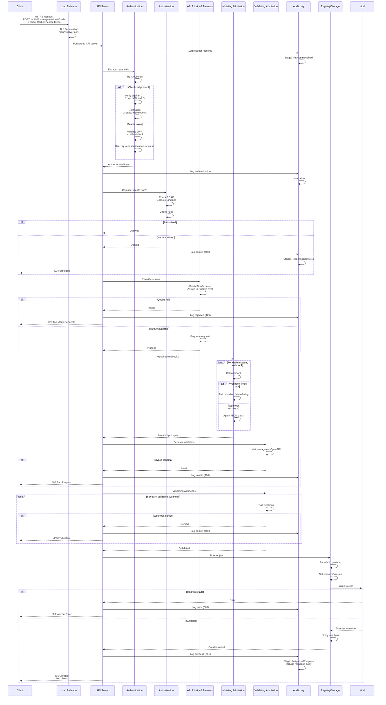
```mermaid
sequenceDiagram
    participant Client
    participant LB as Load Balancer
    participant API as API Server
    participant Auth as Authentication
    participant Authz as Authorization
    participant APF as API Priority & Fairness
    participant Mut as Mutating Admission
    participant Val as Validating Admission
    participant Audit as Audit Log
    participant Registry as Registry/Storage
    participant ETCD as etcd

    Client->>LB: HTTPS Request<br/>POST /api/v1/namespaces/prod/pods<br/>+ Client Cert or Bearer Token

    LB->>LB: TLS Termination<br/>Verify server cert

    LB->>API: Forward to API server

    API->>Audit: Log request received
    Audit->>Audit: Stage: RequestReceived

    API->>Auth: Extract credentials

    Auth->>Auth: Try X.509 cert
    alt Client cert present
        Auth->>Auth: Verify against CA<br/>Extract CN and O
        Auth->>Auth: User: alice<br/>Groups: [developers]
    else Bearer token
        Auth->>Auth: Validate JWT<br/>or call webhook
        Auth->>Auth: User: system:serviceaccount:ns:sa
    end

    Auth-->>API: Authenticated User

    API->>Audit: Log authentication
    Audit->>Audit: User: alice

    API->>Authz: Can user create pod?

    Authz->>Authz: Check RBAC<br/>Get RoleBindings
    Authz->>Authz: Check rules

    alt Authorized
        Authz-->>API: Allowed
    else Not authorized
        Authz-->>API: Denied
        API->>Audit: Log denied (403)
        Audit->>Audit: Stage: ResponseComplete
        API-->>Client: 403 Forbidden
    end

    API->>APF: Classify request
    APF->>APF: Match FlowSchema<br/>Assign to PriorityLevel

    alt Queue full
        APF-->>API: Reject
        API->>Audit: Log rejected (429)
        API-->>Client: 429 Too Many Requests
    else Queue available
        APF->>APF: Enqueue request
        APF-->>API: Process
    end

    API->>Mut: Mutating webhooks

    loop For each mutating webhook
        Mut->>Mut: Call webhook
        alt Webhook times out
            Mut->>Mut: Fail based on failurePolicy
        else Webhook responds
            Mut->>Mut: Apply JSON patch
        end
    end

    Mut-->>API: Mutated pod spec

    API->>Val: Schema validation
    Val->>Val: Validate against OpenAPI

    alt Invalid schema
        Val-->>API: Invalid
        API->>Audit: Log invalid (400)
        API-->>Client: 400 Bad Request
    end

    API->>Val: Validating webhooks

    loop For each validating webhook
        Val->>Val: Call webhook
        alt Webhook denies
            Val-->>API: Denied
            API->>Audit: Log denied (403)
            API-->>Client: 403 Forbidden
        end
    end

    Val-->>API: Validated

    API->>Registry: Store object
    Registry->>Registry: Encode to protobuf
    Registry->>Registry: Set resourceVersion
    Registry->>ETCD: Write to etcd

    alt etcd write fails
        ETCD-->>API: Error
        API->>Audit: Log error (500)
        API-->>Client: 500 Internal Error
    else Success
        ETCD-->>Registry: Success + revision
        Registry->>Registry: Notify watchers
        Registry-->>API: Created object

        API->>Audit: Log success (201)
        Audit->>Audit: Stage: ResponseComplete<br/>Include response body

        API-->>Client: 201 Created<br/>Pod object
    end
```

### ServiceAccount Token Flow

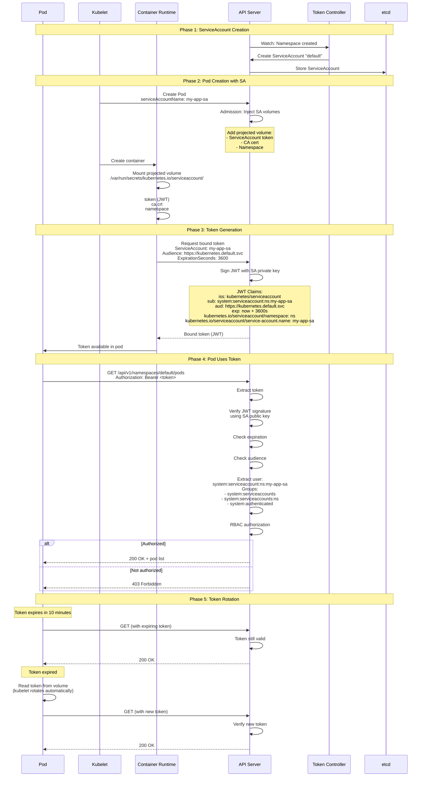
```mermaid
sequenceDiagram
    participant Pod
    participant Kubelet
    participant CRI as Container Runtime
    participant API as API Server
    participant TokenController as Token Controller
    participant ETCD as etcd

    Note over Pod,ETCD: Phase 1: ServiceAccount Creation

    API->>TokenController: Watch: Namespace created
    TokenController->>API: Create ServiceAccount "default"
    API->>ETCD: Store ServiceAccount

    Note over Pod,ETCD: Phase 2: Pod Creation with SA

    Kubelet->>API: Create Pod<br/>serviceAccountName: my-app-sa
    API->>API: Admission: Inject SA volumes

    Note over API: Add projected volume:<br/>- ServiceAccount token<br/>- CA cert<br/>- Namespace

    Kubelet->>CRI: Create container
    CRI->>CRI: Mount projected volume<br/>/var/run/secrets/kubernetes.io/serviceaccount/

    CRI->>CRI: token (JWT)<br/>ca.crt<br/>namespace

    Note over Pod,ETCD: Phase 3: Token Generation

    CRI->>API: Request bound token<br/>ServiceAccount: my-app-sa<br/>Audience: https://kubernetes.default.svc<br/>ExpirationSeconds: 3600

    API->>API: Sign JWT with SA private key

    Note over API: JWT Claims:<br/>iss: kubernetes/serviceaccount<br/>sub: system:serviceaccount:ns:my-app-sa<br/>aud: https://kubernetes.default.svc<br/>exp: now + 3600s<br/>kubernetes.io/serviceaccount/namespace: ns<br/>kubernetes.io/serviceaccount/service-account.name: my-app-sa

    API-->>CRI: Bound token (JWT)
    CRI->>Pod: Token available in pod

    Note over Pod,ETCD: Phase 4: Pod Uses Token

    Pod->>API: GET /api/v1/namespaces/default/pods<br/>Authorization: Bearer <token>

    API->>API: Extract token
    API->>API: Verify JWT signature<br/>using SA public key
    API->>API: Check expiration
    API->>API: Check audience

    API->>API: Extract user:<br/>system:serviceaccount:ns:my-app-sa<br/>Groups:<br/>- system:serviceaccounts<br/>- system:serviceaccounts:ns<br/>- system:authenticated

    API->>API: RBAC authorization

    alt Authorized
        API-->>Pod: 200 OK + pod list
    else Not authorized
        API-->>Pod: 403 Forbidden
    end

    Note over Pod,ETCD: Phase 5: Token Rotation

    Note over Pod: Token expires in 10 minutes

    Pod->>API: GET (with expiring token)
    API->>API: Token still valid
    API-->>Pod: 200 OK

    Note over Pod: Token expired

    Pod->>Pod: Read token from volume<br/>(kubelet rotates automatically)
    Pod->>API: GET (with new token)
    API->>API: Verify new token
    API-->>Pod: 200 OK
```

### Network Policy Enforcement

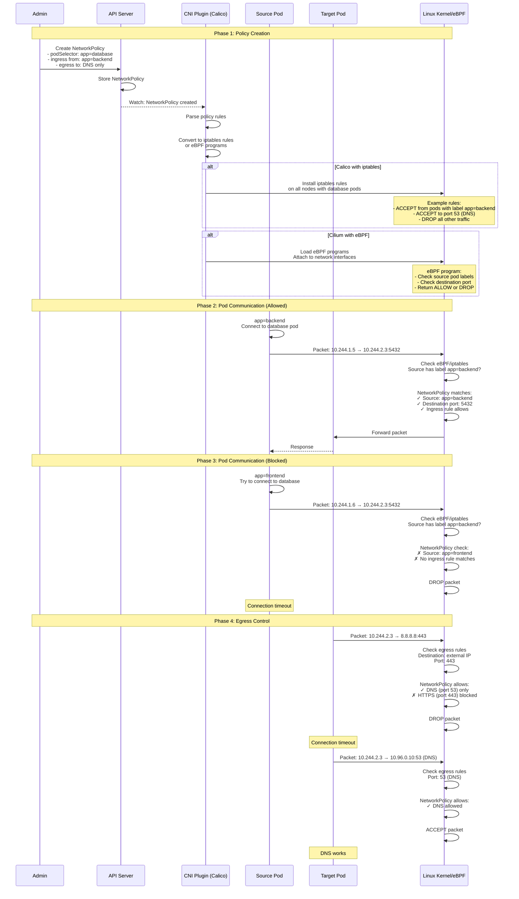
```mermaid
sequenceDiagram
    participant Admin
    participant API as API Server
    participant CNI as CNI Plugin (Calico)
    participant Pod1 as Source Pod
    participant Pod2 as Target Pod
    participant Kernel as Linux Kernel/eBPF

    Note over Admin,Kernel: Phase 1: Policy Creation

    Admin->>API: Create NetworkPolicy<br/>- podSelector: app=database<br/>- ingress from: app=backend<br/>- egress to: DNS only

    API->>API: Store NetworkPolicy

    API-->>CNI: Watch: NetworkPolicy created

    CNI->>CNI: Parse policy rules
    CNI->>CNI: Convert to iptables rules<br/>or eBPF programs

    alt Calico with iptables
        CNI->>Kernel: Install iptables rules<br/>on all nodes with database pods

        Note over Kernel: Example rules:<br/>- ACCEPT from pods with label app=backend<br/>- ACCEPT to port 53 (DNS)<br/>- DROP all other traffic
    end

    alt Cilium with eBPF
        CNI->>Kernel: Load eBPF programs<br/>Attach to network interfaces

        Note over Kernel: eBPF program:<br/>- Check source pod labels<br/>- Check destination port<br/>- Return ALLOW or DROP
    end

    Note over Admin,Kernel: Phase 2: Pod Communication (Allowed)

    Pod1->>Pod1: app=backend<br/>Connect to database pod

    Pod1->>Kernel: Packet: 10.244.1.5 → 10.244.2.3:5432

    Kernel->>Kernel: Check eBPF/iptables<br/>Source has label app=backend?

    Kernel->>Kernel: NetworkPolicy matches:<br/>✓ Source: app=backend<br/>✓ Destination port: 5432<br/>✓ Ingress rule allows

    Kernel->>Pod2: Forward packet

    Pod2-->>Pod1: Response

    Note over Admin,Kernel: Phase 3: Pod Communication (Blocked)

    Pod1->>Pod1: app=frontend<br/>Try to connect to database

    Pod1->>Kernel: Packet: 10.244.1.6 → 10.244.2.3:5432

    Kernel->>Kernel: Check eBPF/iptables<br/>Source has label app=backend?

    Kernel->>Kernel: NetworkPolicy check:<br/>✗ Source: app=frontend<br/>✗ No ingress rule matches

    Kernel->>Kernel: DROP packet

    Note over Pod1: Connection timeout

    Note over Admin,Kernel: Phase 4: Egress Control

    Pod2->>Kernel: Packet: 10.244.2.3 → 8.8.8.8:443

    Kernel->>Kernel: Check egress rules<br/>Destination: external IP<br/>Port: 443

    Kernel->>Kernel: NetworkPolicy allows:<br/>✓ DNS (port 53) only<br/>✗ HTTPS (port 443) blocked

    Kernel->>Kernel: DROP packet

    Note over Pod2: Connection timeout

    Pod2->>Kernel: Packet: 10.244.2.3 → 10.96.0.10:53 (DNS)

    Kernel->>Kernel: Check egress rules<br/>Port: 53 (DNS)

    Kernel->>Kernel: NetworkPolicy allows:<br/>✓ DNS allowed

    Kernel->>Kernel: ACCEPT packet

    Note over Pod2: DNS works
```

## Network Traffic Patterns

### Pod-to-Pod Communication

```mermaid
graph LR
    subgraph "Node 1 - 10.0.1.10"
        POD1[Pod A<br/>10.244.1.5]
        VETH1[veth pair]
        BRIDGE1[cni0 bridge<br/>10.244.1.1]
        ETH1[eth0]
    end

    subgraph "Node 2 - 10.0.1.11"
        POD2[Pod B<br/>10.244.2.3]
        VETH2[veth pair]
        BRIDGE2[cni0 bridge<br/>10.244.2.1]
        ETH2[eth0]
    end

    subgraph "Network Fabric"
        NETWORK[Overlay Network<br/>VXLAN/BGP/Direct Routing]
    end

    POD1 -->|1. Send to 10.244.2.3| VETH1
    VETH1 --> BRIDGE1
    BRIDGE1 -->|2. Route to 10.244.2.0/24| ETH1
    ETH1 -->|3. Encapsulate if overlay| NETWORK
    NETWORK -->|4. Deliver| ETH2
    ETH2 -->|5. Decapsulate| BRIDGE2
    BRIDGE2 --> VETH2
    VETH2 -->|6. Deliver| POD2

    style POD1 fill:#4D96FF,color:#fff
    style POD2 fill:#6BCB77,color:#000
    style NETWORK fill:#FFD93D,color:#000
```

### Service ClusterIP Traffic Flow

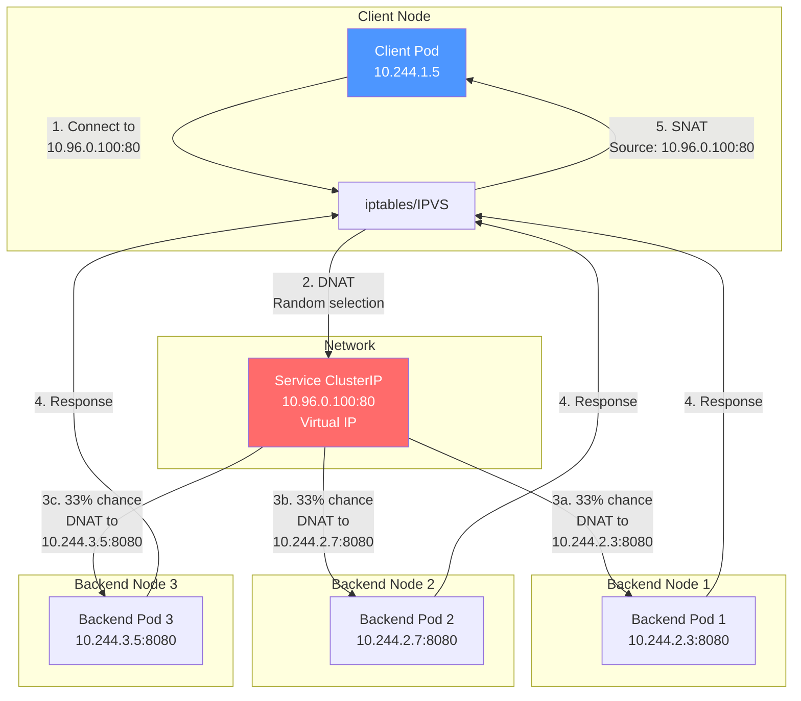
```mermaid
graph TB
    subgraph "Client Node"
        CLIENT[Client Pod<br/>10.244.1.5]
        IPTABLES1[iptables/IPVS]
    end

    subgraph "Network"
        SERVICEVIP[Service ClusterIP<br/>10.96.0.100:80<br/>Virtual IP]
    end

    subgraph "Backend Node 1"
        BACKEND1[Backend Pod 1<br/>10.244.2.3:8080]
    end

    subgraph "Backend Node 2"
        BACKEND2[Backend Pod 2<br/>10.244.2.7:8080]
    end

    subgraph "Backend Node 3"
        BACKEND3[Backend Pod 3<br/>10.244.3.5:8080]
    end

    CLIENT -->|"1. Connect to<br/>10.96.0.100:80"| IPTABLES1
    IPTABLES1 -->|"2. DNAT<br/>Random selection"| SERVICEVIP

    SERVICEVIP -->|"3a. 33% chance<br/>DNAT to<br/>10.244.2.3:8080"| BACKEND1
    SERVICEVIP -->|"3b. 33% chance<br/>DNAT to<br/>10.244.2.7:8080"| BACKEND2
    SERVICEVIP -->|"3c. 33% chance<br/>DNAT to<br/>10.244.3.5:8080"| BACKEND3

    BACKEND1 -->|"4. Response"| IPTABLES1
    BACKEND2 -->|"4. Response"| IPTABLES1
    BACKEND3 -->|"4. Response"| IPTABLES1

    IPTABLES1 -->|"5. SNAT<br/>Source: 10.96.0.100:80"| CLIENT

    style SERVICEVIP fill:#FF6B6B,color:#fff
    style CLIENT fill:#4D96FF,color:#fff
```

### Ingress Traffic Flow

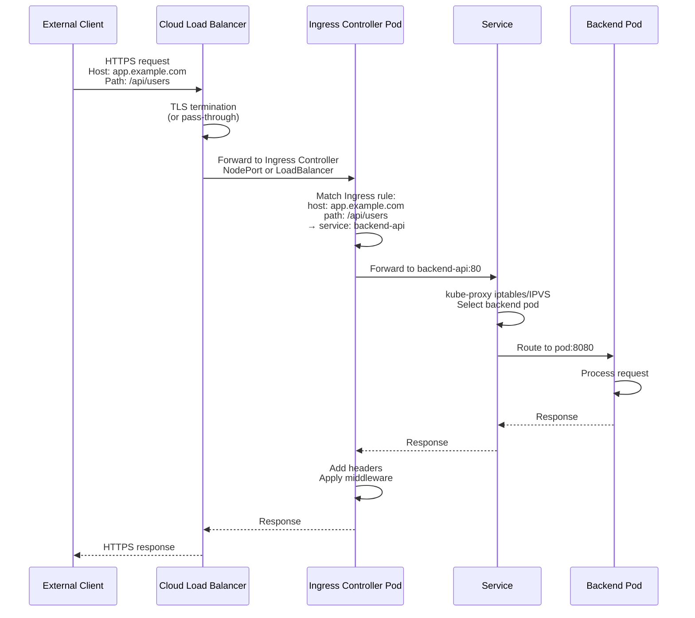
```mermaid
sequenceDiagram
    participant Client as External Client
    participant LB as Cloud Load Balancer
    participant Ingress as Ingress Controller Pod
    participant Service as Service
    participant Pod as Backend Pod

    Client->>LB: HTTPS request<br/>Host: app.example.com<br/>Path: /api/users

    LB->>LB: TLS termination<br/>(or pass-through)

    LB->>Ingress: Forward to Ingress Controller<br/>NodePort or LoadBalancer

    Ingress->>Ingress: Match Ingress rule:<br/>host: app.example.com<br/>path: /api/users<br/>→ service: backend-api

    Ingress->>Service: Forward to backend-api:80

    Service->>Service: kube-proxy iptables/IPVS<br/>Select backend pod

    Service->>Pod: Route to pod:8080

    Pod->>Pod: Process request

    Pod-->>Service: Response

    Service-->>Ingress: Response

    Ingress->>Ingress: Add headers<br/>Apply middleware

    Ingress-->>LB: Response

    LB-->>Client: HTTPS response
```

## State Synchronization

### etcd Watch and API Server Watch Cache

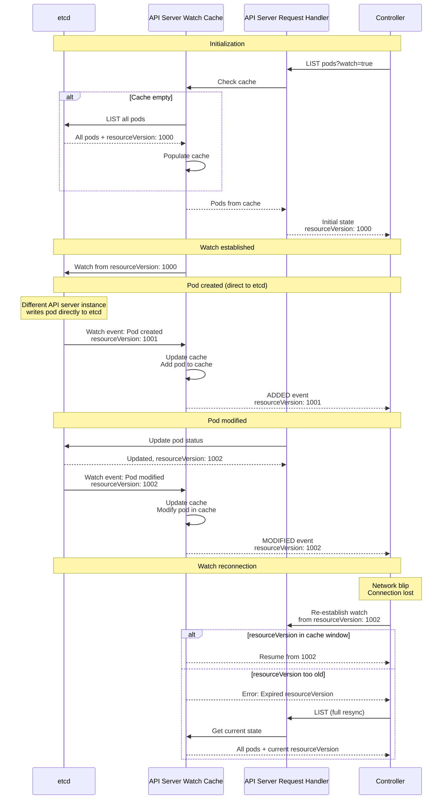
```mermaid
sequenceDiagram
    participant ETCD as etcd
    participant WatchCache as API Server Watch Cache
    participant APIServer as API Server Request Handler
    participant Controller as Controller

    Note over ETCD,Controller: Initialization

    Controller->>APIServer: LIST pods?watch=true
    APIServer->>WatchCache: Check cache

    alt Cache empty
        WatchCache->>ETCD: LIST all pods
        ETCD-->>WatchCache: All pods + resourceVersion: 1000
        WatchCache->>WatchCache: Populate cache
    end

    WatchCache-->>APIServer: Pods from cache
    APIServer-->>Controller: Initial state<br/>resourceVersion: 1000

    Note over ETCD,Controller: Watch established

    WatchCache->>ETCD: Watch from resourceVersion: 1000

    Note over ETCD,Controller: Pod created (direct to etcd)

    Note over ETCD: Different API server instance<br/>writes pod directly to etcd

    ETCD->>WatchCache: Watch event: Pod created<br/>resourceVersion: 1001

    WatchCache->>WatchCache: Update cache<br/>Add pod to cache

    WatchCache-->>Controller: ADDED event<br/>resourceVersion: 1001

    Note over ETCD,Controller: Pod modified

    APIServer->>ETCD: Update pod status
    ETCD-->>APIServer: Updated, resourceVersion: 1002

    ETCD->>WatchCache: Watch event: Pod modified<br/>resourceVersion: 1002

    WatchCache->>WatchCache: Update cache<br/>Modify pod in cache

    WatchCache-->>Controller: MODIFIED event<br/>resourceVersion: 1002

    Note over ETCD,Controller: Watch reconnection

    Note over Controller: Network blip<br/>Connection lost

    Controller->>APIServer: Re-establish watch<br/>from resourceVersion: 1002

    alt resourceVersion in cache window
        WatchCache-->>Controller: Resume from 1002
    else resourceVersion too old
        WatchCache-->>Controller: Error: Expired resourceVersion
        Controller->>APIServer: LIST (full resync)
        APIServer->>WatchCache: Get current state
        WatchCache-->>Controller: All pods + current resourceVersion
    end
```

### Eventual Consistency Example

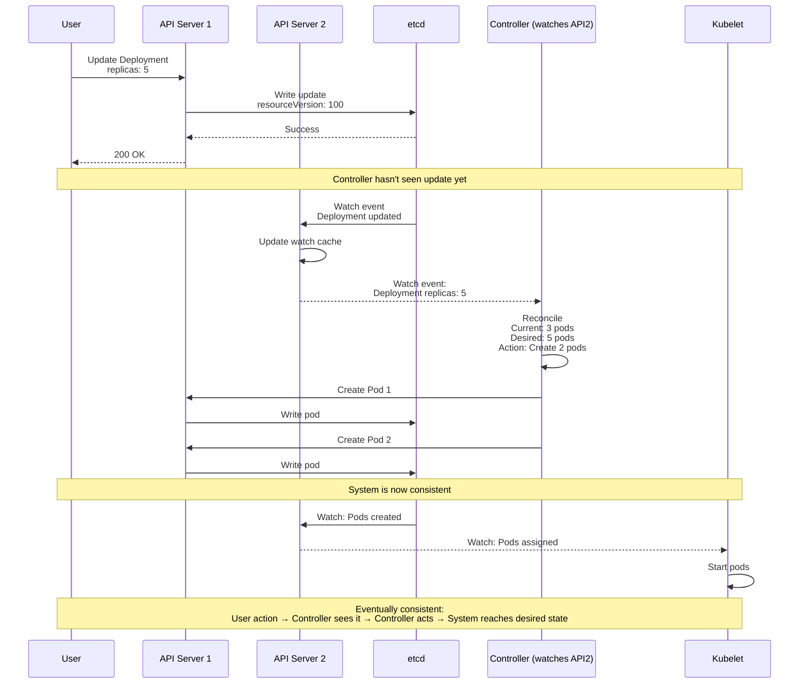
```mermaid
sequenceDiagram
    participant User
    participant API1 as API Server 1
    participant API2 as API Server 2
    participant ETCD as etcd
    participant Controller as Controller (watches API2)
    participant Kubelet as Kubelet

    User->>API1: Update Deployment<br/>replicas: 5

    API1->>ETCD: Write update<br/>resourceVersion: 100

    ETCD-->>API1: Success

    API1-->>User: 200 OK

    Note over User,Kubelet: Controller hasn't seen update yet

    ETCD->>API2: Watch event<br/>Deployment updated

    API2->>API2: Update watch cache

    API2-->>Controller: Watch event:<br/>Deployment replicas: 5

    Controller->>Controller: Reconcile<br/>Current: 3 pods<br/>Desired: 5 pods<br/>Action: Create 2 pods

    Controller->>API1: Create Pod 1
    API1->>ETCD: Write pod
    Controller->>API1: Create Pod 2
    API1->>ETCD: Write pod

    Note over User,Kubelet: System is now consistent

    ETCD->>API2: Watch: Pods created
    API2-->>Kubelet: Watch: Pods assigned
    Kubelet->>Kubelet: Start pods

    Note over User,Kubelet: Eventually consistent:<br/>User action → Controller sees it → Controller acts → System reaches desired state
```

## Failure Scenarios

### API Server Failure (HA Setup)

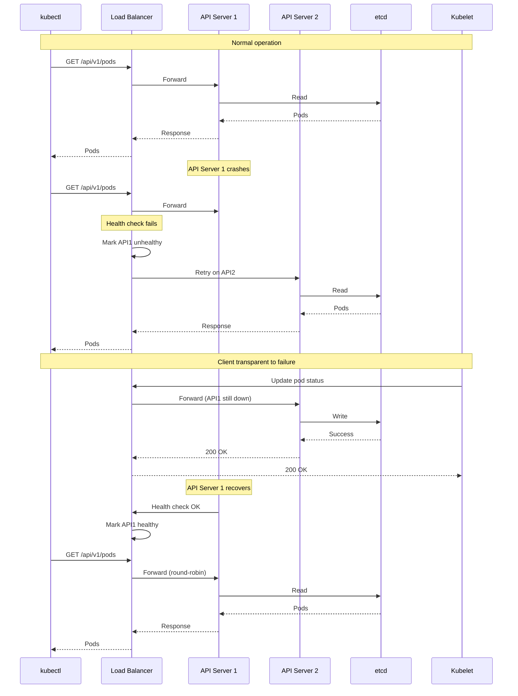
```mermaid
sequenceDiagram
    participant Client as kubectl
    participant LB as Load Balancer
    participant API1 as API Server 1
    participant API2 as API Server 2
    participant ETCD as etcd
    participant Kubelet

    Note over Client,Kubelet: Normal operation

    Client->>LB: GET /api/v1/pods
    LB->>API1: Forward
    API1->>ETCD: Read
    ETCD-->>API1: Pods
    API1-->>LB: Response
    LB-->>Client: Pods

    Note over API1: API Server 1 crashes

    Client->>LB: GET /api/v1/pods
    LB->>API1: Forward

    Note over LB: Health check fails

    LB->>LB: Mark API1 unhealthy

    LB->>API2: Retry on API2
    API2->>ETCD: Read
    ETCD-->>API2: Pods
    API2-->>LB: Response
    LB-->>Client: Pods

    Note over Client,Kubelet: Client transparent to failure

    Kubelet->>LB: Update pod status
    LB->>API2: Forward (API1 still down)
    API2->>ETCD: Write
    ETCD-->>API2: Success
    API2-->>LB: 200 OK
    LB-->>Kubelet: 200 OK

    Note over API1: API Server 1 recovers

    API1->>LB: Health check OK
    LB->>LB: Mark API1 healthy

    Client->>LB: GET /api/v1/pods
    LB->>API1: Forward (round-robin)
    API1->>ETCD: Read
    ETCD-->>API1: Pods
    API1-->>LB: Response
    LB-->>Client: Pods
```

### etcd Quorum Loss and Recovery

```mermaid
sequenceDiagram
    participant API as API Server
    participant ETCD1 as etcd-1 (Leader)
    participant ETCD2 as etcd-2 (Follower)
    participant ETCD3 as etcd-3 (Follower)

    Note over API,ETCD3: Normal: 3 members, quorum=2

    API->>ETCD1: Write pod
    ETCD1->>ETCD2: Replicate
    ETCD1->>ETCD3: Replicate
    ETCD2-->>ETCD1: ACK
    ETCD3-->>ETCD1: ACK
    ETCD1-->>API: Committed

    Note over ETCD2: etcd-2 fails (disk failure)

    Note over API,ETCD3: 2 members remain, quorum=2

    API->>ETCD1: Write pod
    ETCD1->>ETCD2: Replicate (timeout)
    ETCD1->>ETCD3: Replicate
    ETCD3-->>ETCD1: ACK

    Note over ETCD1: Only 1 ACK, but quorum=2<br/>Still have majority

    ETCD1-->>API: Committed

    Note over ETCD3: etcd-3 also fails

    Note over API,ETCD3: 1 member remains, quorum=2<br/>NO QUORUM

    API->>ETCD1: Write pod
    ETCD1->>ETCD1: No quorum available
    ETCD1-->>API: Error: no quorum

    API-->>API: Return 500 to clients<br/>Cluster read-only

    Note over ETCD1,ETCD3: Controllers can't write<br/>Can still read from etcd-1

    Note over ETCD3: etcd-3 recovers

    ETCD3->>ETCD1: Rejoin cluster
    ETCD1->>ETCD3: Sync state

    Note over API,ETCD3: 2 members, quorum=2<br/>QUORUM RESTORED

    API->>ETCD1: Write pod
    ETCD1->>ETCD3: Replicate
    ETCD3-->>ETCD1: ACK
    ETCD1-->>API: Committed

    Note over API,ETCD3: Cluster writable again
```

### Node Failure and Pod Eviction

```mermaid
sequenceDiagram
    participant Node as Node (kubelet)
    participant API as API Server
    participant NodeCtrl as Node Controller
    participant EPCtrl as Endpoints Controller
    participant Scheduler as Scheduler
    participant Service as Service/kube-proxy

    Note over Node,Service: Normal operation

    Node->>API: Lease renewal (every 10s)
    API->>API: Update Lease.renewTime

    Note over Node: Node loses network

    Node->>Node: Try to renew lease<br/>Cannot reach API

    Note over API,Service: 40 seconds pass (leaseDuration)

    NodeCtrl->>API: Watch leases
    NodeCtrl->>NodeCtrl: Lease expired!
    NodeCtrl->>API: Update Node condition:<br/>Ready: Unknown

    Note over API,Service: 40 more seconds (gracePeriod)

    NodeCtrl->>NodeCtrl: Grace period expired
    NodeCtrl->>API: Update Node condition:<br/>Ready: False<br/>Add taint: node.kubernetes.io/unreachable

    NodeCtrl->>API: List pods on failed node
    API-->>NodeCtrl: [pod-1, pod-2, pod-3]

    NodeCtrl->>API: Set deletionTimestamp on pods<br/>gracePeriod: 0 (force delete)

    API-->>EPCtrl: Watch: Pods terminating
    EPCtrl->>API: Remove pods from Endpoints
    API-->>Service: Watch: Endpoints updated
    Service->>Service: Stop routing to these pods

    Note over Scheduler,Service: New pods scheduled

    NodeCtrl->>NodeCtrl: Check pod owner (ReplicaSet)

    Note over NodeCtrl: ReplicaSet controller<br/>creates replacement pods

    Scheduler->>API: Watch: Unscheduled pods
    Scheduler->>Scheduler: Select healthy node
    Scheduler->>API: Bind pods to new node

    Note over Node: Node recovers

    Node->>API: Lease renewal
    API->>API: Update Lease

    NodeCtrl->>API: Update Node:<br/>Remove taint<br/>Ready: True

    Node->>API: List pods assigned to me
    API-->>Node: [pod-1, pod-2, pod-3]<br/>(marked for deletion)

    Node->>Node: Pods have deletionTimestamp
    Node->>Node: Terminate containers
    Node->>API: Delete pods

    Note over Node,Service: Old pods cleaned up<br/>New pods running elsewhere
```

### Controller Crash and Recovery

```mermaid
sequenceDiagram
    participant API as API Server
    participant CM1 as Controller Manager 1 (Leader)
    participant CM2 as Controller Manager 2 (Standby)
    participant Lease as Lease Object
    participant Deploy as Deployment

    Note over API,Deploy: Normal operation: CM1 is leader

    CM1->>API: Acquire lease
    API->>Lease: Create/update<br/>holderIdentity: cm-1

    CM1->>CM1: Run controllers<br/>Reconcile deployments

    CM2->>API: Try to acquire lease
    API-->>CM2: Lease held by cm-1
    CM2->>CM2: Standby mode<br/>Wait for lease

    loop Every 2s (renewDeadline)
        CM1->>API: Renew lease
        API->>Lease: Update renewTime
    end

    Note over CM1: Controller Manager 1 crashes

    CM2->>API: Try to acquire lease
    API-->>CM2: Lease still held by cm-1<br/>But not renewed

    Note over CM2: Wait for leaseDuration (15s)

    CM2->>API: Try to acquire lease
    API->>Lease: Lease expired<br/>Update: holderIdentity: cm-2

    API-->>CM2: Lease acquired

    CM2->>CM2: Become leader<br/>Start controllers

    Note over API,Deploy: Check for missed reconciliations

    CM2->>API: List all deployments
    API-->>CM2: [deploy-1, deploy-2, ...]

    CM2->>CM2: Sync state<br/>Check for drift

    Note over Deploy: Deployment scaled during outage<br/>but not reconciled

    CM2->>CM2: Deployment replicas: 5<br/>ReplicaSet replicas: 3<br/>Need to create 2 pods

    CM2->>API: Update ReplicaSet replicas: 5

    Note over CM1: Controller Manager 1 recovers

    CM1->>API: Try to acquire lease
    API-->>CM1: Lease held by cm-2

    CM1->>CM1: Standby mode

    Note over API,Deploy: System resilient to controller failure
```

## Summary

### Key Takeaways

**Communication:**
- All components communicate through API server (hub-and-spoke)
- Watch-based synchronization for efficiency
- Multiple authentication methods support different clients
- Every request goes through authentication, authorization, and admission

**Security:**
- Defense in depth: authentication → authorization → admission → validation
- Zero-trust: every component authenticates
- Fine-grained RBAC controls access
- Network policies control pod-to-pod traffic

**Lifecycle Management:**
- Declarative model: specify desired state
- Controllers continuously reconcile
- Eventually consistent
- Graceful handling of failures

**Failure Resilience:**
- HA control plane tolerates component failures
- etcd quorum ensures consistency
- Failed nodes detected and pods rescheduled
- Leader election for controllers

### Component Interaction Summary

| Source | Target | Protocol | Auth | Purpose |
|--------|--------|----------|------|---------|
| kubectl | API Server | HTTPS | Client cert/OIDC/Token | User operations |
| kubelet | API Server | HTTPS | Client cert | Pod status, lease renewal |
| kube-scheduler | API Server | HTTPS | Client cert | Watch pods, bind to nodes |
| controller-manager | API Server | HTTPS | Client cert | Watch resources, reconcile |
| kube-proxy | API Server | HTTPS | Client cert/SA token | Watch services/endpoints |
| Pod | API Server | HTTPS | SA token (JWT) | Access cluster resources |
| API Server | etcd | gRPC/HTTPS | Client cert (mTLS) | Store/retrieve cluster state |
| API Server | Webhook | HTTPS | API server cert | Admission/auth callbacks |
| kubelet | Container Runtime | Unix socket/gRPC | None (local) | CRI operations |
| kubelet | CSI Driver | gRPC | None (local) | Volume operations |
| Pod | Pod | Overlay/Direct | None | Application traffic |
| Pod | Service | iptables/IPVS | None | Load balanced traffic |

## References

- [Kubernetes Architecture](https://kubernetes.io/docs/concepts/architecture/)
- [API Concepts](https://kubernetes.io/docs/reference/using-api/api-concepts/)
- [Authentication](https://kubernetes.io/docs/reference/access-authn-authz/authentication/)
- [Authorization](https://kubernetes.io/docs/reference/access-authn-authz/authorization/)
- [Admission Controllers](https://kubernetes.io/docs/reference/access-authn-authz/admission-controllers/)
- [Pod Lifecycle](https://kubernetes.io/docs/concepts/workloads/pods/pod-lifecycle/)
- [Service Networking](https://kubernetes.io/docs/concepts/services-networking/)
