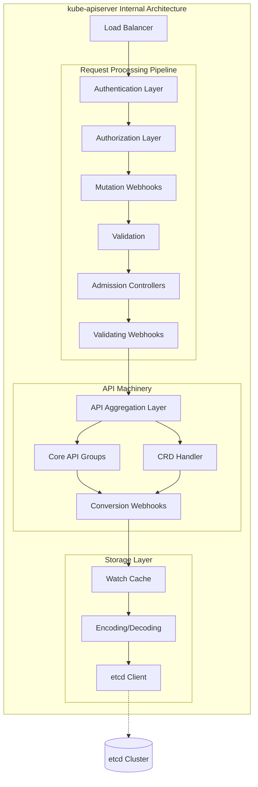
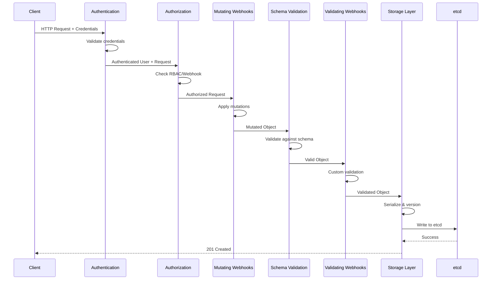
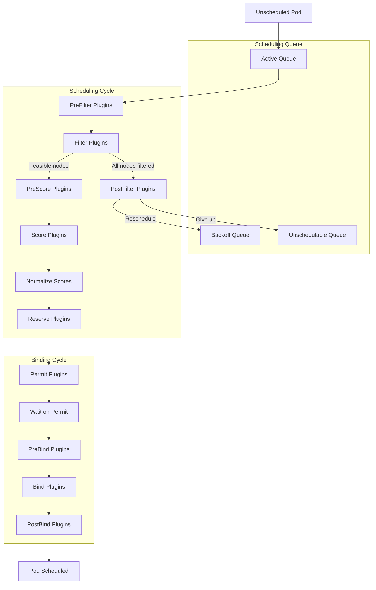
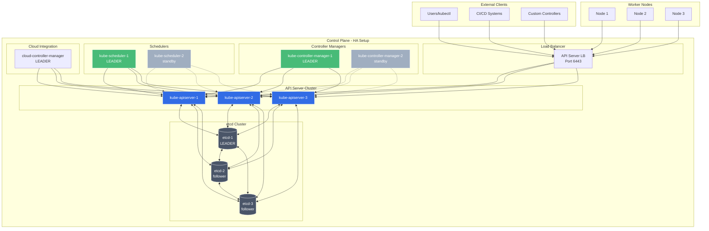
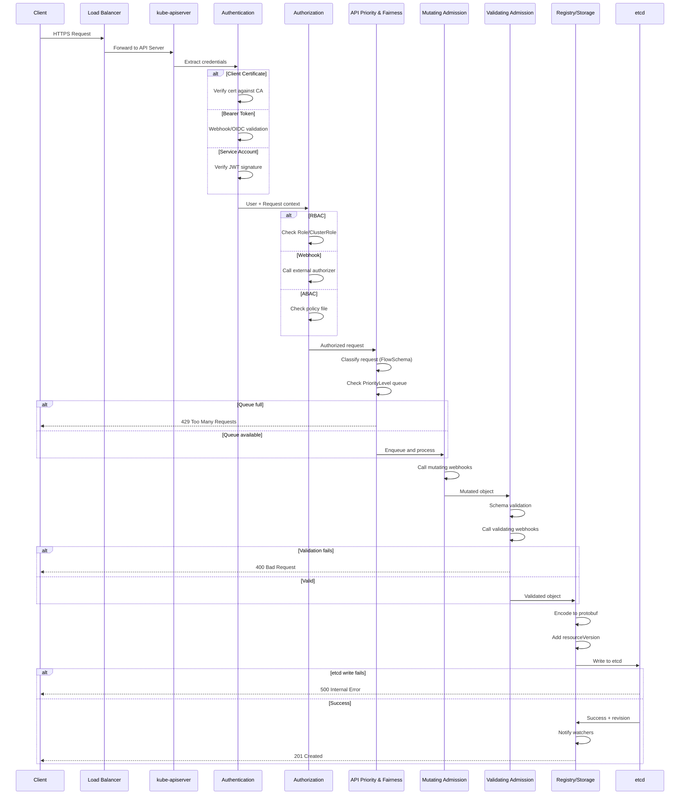
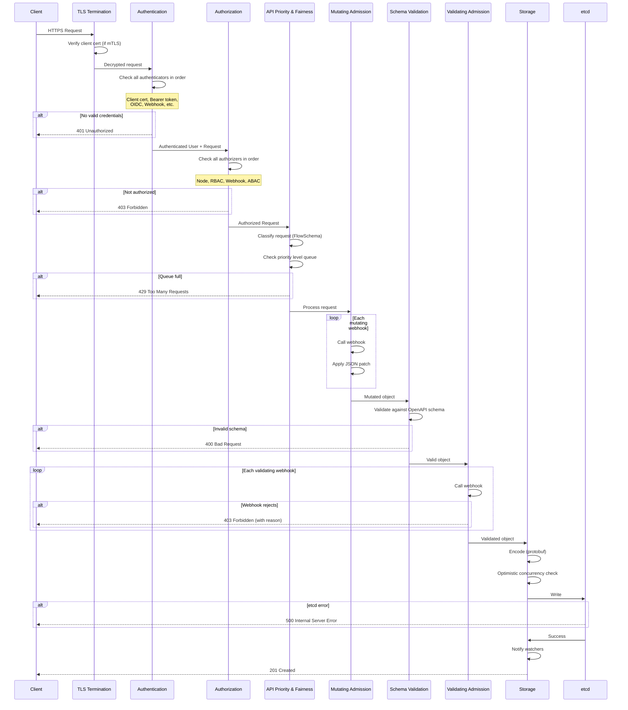
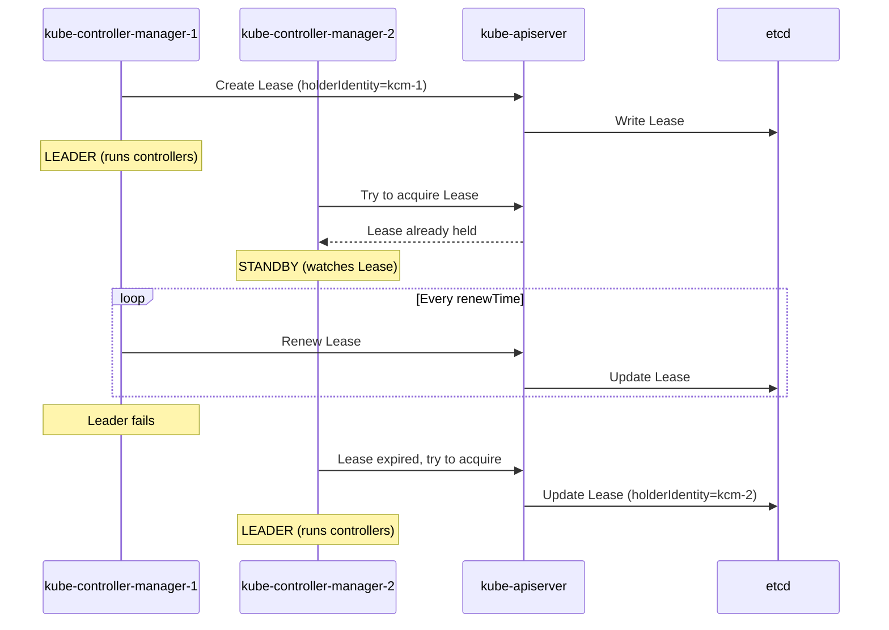
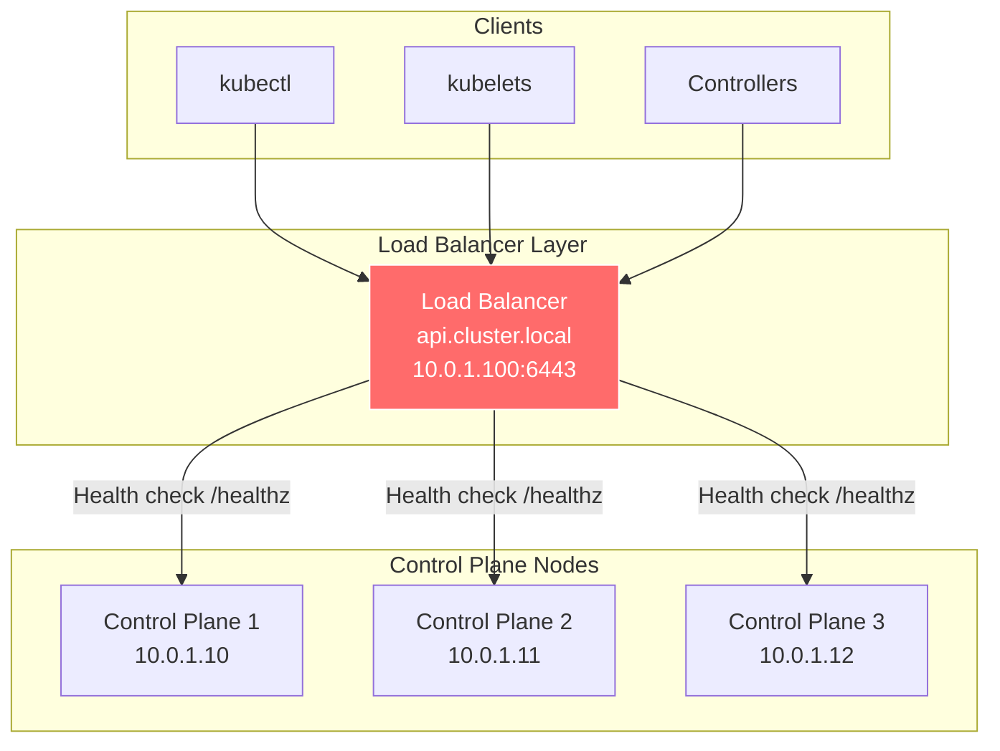

# Kubernetes Control Plane Architecture - Exhaustive Reference

## Table of Contents

1. [Overview](#overview)
2. [Core Control Plane Components](#core-control-plane-components)
3. [Architecture Diagrams](#architecture-diagrams)
4. [Extensibility Points](#extensibility-points-exhaustive)
5. [API Server Deep Dive](#api-server-deep-dive)
6. [Security Architecture](#security-architecture)
7. [High Availability](#high-availability)
8. [Performance and Scalability](#performance-and-scalability)

## Overview

The Kubernetes control plane is the set of components responsible for maintaining cluster state and making global decisions about scheduling, scaling, and responding to cluster events. All control plane components communicate exclusively through the kube-apiserver using the hub-and-spoke pattern.

**Design Principles:**
- **Declarative API**: Users specify desired state, controllers reconcile actual state
- **Level-triggered reconciliation**: Controllers continuously sync state (not event-driven)
- **Eventual consistency**: System converges toward desired state over time
- **Component independence**: Failure of one component doesn't cascade
- **Watch-based coordination**: Components use efficient watch API instead of polling

## Core Control Plane Components

### kube-apiserver

The API server is the central control plane component and the only component with direct access to etcd.

#### Architecture



#### Responsibilities

**1. API Management**
- Serves RESTful CRUD operations for all Kubernetes resources
- Manages API groups, versions, and deprecation
- Handles API discovery (OpenAPI/Swagger specs)
- Provides API extensions via aggregation and CRDs

**2. Request Processing**
- Authentication: Validates client identity
- Authorization: Checks if authenticated user can perform action
- Admission Control: Validates and mutates requests before persistence
- Validation: Ensures resource specs meet schema requirements
- Conversion: Translates between API versions

**3. Storage Management**
- Serializes objects to etcd (protobuf or JSON)
- Maintains watch cache for efficient list/watch operations
- Implements optimistic concurrency via resourceVersion
- Handles etcd connection pooling and health checks

**4. Coordination**
- Publishes resource change events to watchers
- Provides leader election primitives (Lease objects)
- Supports distributed coordination (ConfigMaps, Secrets as coordination)

#### API Groups and Versions

Kubernetes organizes APIs into groups with independent versioning:

**Core API Group** (`/api/v1`):
- Pods, Services, Nodes, PersistentVolumes, ConfigMaps, Secrets, Namespaces

**Named API Groups** (`/apis/<group>/<version>`):
- `apps/v1`: Deployments, StatefulSets, DaemonSets, ReplicaSets
- `batch/v1`: Jobs, CronJobs
- `networking.k8s.io/v1`: NetworkPolicies, Ingress, IngressClass
- `storage.k8s.io/v1`: StorageClasses, VolumeAttachments, CSIDrivers
- `rbac.authorization.k8s.io/v1`: Roles, RoleBindings, ClusterRoles, ClusterRoleBindings
- `autoscaling/v2`: HorizontalPodAutoscaler
- `policy/v1`: PodDisruptionBudget
- `scheduling.k8s.io/v1`: PriorityClasses
- `node.k8s.io/v1`: RuntimeClasses
- `discovery.k8s.io/v1`: EndpointSlices
- `certificates.k8s.io/v1`: CertificateSigningRequests
- `coordination.k8s.io/v1`: Leases
- `events.k8s.io/v1`: Events
- `flowcontrol.apiserver.k8s.io/v1beta3`: FlowSchemas, PriorityLevelConfigurations

#### Configuration Options

**Authentication:**
```yaml
--client-ca-file=/etc/kubernetes/pki/ca.crt
--oidc-issuer-url=https://issuer.example.com
--oidc-client-id=kubernetes
--oidc-username-claim=email
--oidc-groups-claim=groups
--authentication-token-webhook-config-file=/etc/kubernetes/webhook-config.yaml
--service-account-key-file=/etc/kubernetes/pki/sa.pub
--service-account-issuer=https://kubernetes.default.svc
--service-account-signing-key-file=/etc/kubernetes/pki/sa.key
```

**Authorization:**
```yaml
--authorization-mode=Node,RBAC,Webhook
--authorization-webhook-config-file=/etc/kubernetes/authz-webhook.yaml
```

**Admission Control:**
```yaml
--enable-admission-plugins=\
  NamespaceLifecycle,\
  LimitRanger,\
  ServiceAccount,\
  DefaultStorageClass,\
  DefaultTolerationSeconds,\
  MutatingAdmissionWebhook,\
  ValidatingAdmissionWebhook,\
  ResourceQuota,\
  PodSecurity,\
  Priority,\
  StorageObjectInUseProtection,\
  PersistentVolumeClaimResize,\
  RuntimeClass
```

**API Priority and Fairness:**
```yaml
--enable-priority-and-fairness=true
--max-requests-inflight=400
--max-mutating-requests-inflight=200
```

**Audit Logging:**
```yaml
--audit-log-path=/var/log/kubernetes/audit.log
--audit-log-maxage=30
--audit-log-maxbackup=10
--audit-log-maxsize=100
--audit-policy-file=/etc/kubernetes/audit-policy.yaml
```

**Storage:**
```yaml
--etcd-servers=https://etcd-0:2379,https://etcd-1:2379,https://etcd-2:2379
--etcd-cafile=/etc/kubernetes/pki/etcd/ca.crt
--etcd-certfile=/etc/kubernetes/pki/apiserver-etcd-client.crt
--etcd-keyfile=/etc/kubernetes/pki/apiserver-etcd-client.key
--storage-media-type=application/vnd.kubernetes.protobuf
```

**Request Processing:**
```yaml
--request-timeout=1m0s
--min-request-timeout=1800  # For watch requests
--watch-cache-sizes=persistentvolumes#1000,services#5000
```

#### API Request Flow



### etcd

Distributed, strongly consistent key-value store serving as Kubernetes' database.

#### Architecture

**Raft Consensus:**
- Leader election ensures single source of truth
- Quorum required for writes (majority of members)
- Linearizable reads (default) or serializable reads (faster but potentially stale)

**Storage Structure:**
```
/registry/
├── pods/
│   ├── default/
│   │   ├── nginx-abc123
│   │   └── redis-def456
│   └── kube-system/
├── services/
├── deployments/
├── configmaps/
├── secrets/
└── ...
```

#### Operational Characteristics

**Performance Limits:**
- Max database size: 8GB (default, configurable)
- Recommended request rate: <10,000 requests/sec
- Network latency: <10ms between members (critical for Raft)
- Disk: SSD strongly recommended (fsync performance critical)

**Cluster Sizing:**
- **3 members**: Tolerates 1 failure, suitable for most clusters
- **5 members**: Tolerates 2 failures, for critical production clusters
- **7 members**: Tolerates 3 failures, rarely needed (more members = slower writes)
- **Even numbers**: Never use (no benefit, increases quorum requirements)

**Configuration:**
```yaml
# Member configuration
--name=etcd-0
--listen-client-urls=https://0.0.0.0:2379
--advertise-client-urls=https://10.0.1.10:2379
--listen-peer-urls=https://0.0.0.0:2380
--initial-advertise-peer-urls=https://10.0.1.10:2380
--initial-cluster=etcd-0=https://10.0.1.10:2380,etcd-1=https://10.0.1.11:2380,etcd-2=https://10.0.1.12:2380
--initial-cluster-state=new

# Security
--client-cert-auth=true
--trusted-ca-file=/etc/kubernetes/pki/etcd/ca.crt
--cert-file=/etc/kubernetes/pki/etcd/server.crt
--key-file=/etc/kubernetes/pki/etcd/server.key
--peer-client-cert-auth=true
--peer-trusted-ca-file=/etc/kubernetes/pki/etcd/ca.crt
--peer-cert-file=/etc/kubernetes/pki/etcd/peer.crt
--peer-key-file=/etc/kubernetes/pki/etcd/peer.key

# Performance
--snapshot-count=10000
--heartbeat-interval=100
--election-timeout=1000
--max-request-bytes=1572864
--quota-backend-bytes=8589934592  # 8GB
```

**Compaction and Defragmentation:**
- Historical revisions accumulate over time
- Automatic compaction: `--auto-compaction-mode=revision --auto-compaction-retention=1000`
- Manual compaction: `etcdctl compact <revision>`
- Defragmentation: `etcdctl defrag` (releases disk space after compaction)

**Backup and Restore:**
```bash
# Backup
etcdctl snapshot save /backup/etcd-snapshot.db \
  --endpoints=https://127.0.0.1:2379 \
  --cacert=/etc/kubernetes/pki/etcd/ca.crt \
  --cert=/etc/kubernetes/pki/etcd/server.crt \
  --key=/etc/kubernetes/pki/etcd/server.key

# Restore
etcdctl snapshot restore /backup/etcd-snapshot.db \
  --name=etcd-0 \
  --initial-cluster=etcd-0=https://10.0.1.10:2380,... \
  --initial-advertise-peer-urls=https://10.0.1.10:2380 \
  --data-dir=/var/lib/etcd-restored
```

### kube-scheduler

Assigns pods to nodes based on constraints, resource availability, and policies.

#### Scheduling Framework



#### Scheduling Plugin Extension Points

**1. QueueSort**
- Determines pod ordering in scheduling queue
- Default: Priority-based sorting

**2. PreFilter**
- Process pod info before filtering nodes
- Can reject pod immediately if unsatisfiable
- Examples: NodeAffinity, PodTopologySpread

**3. Filter**
- Eliminate nodes that cannot run the pod
- Must pass ALL filter plugins
- Built-in filters:
  - `NodeUnschedulable`: Filter out nodes marked unschedulable
  - `NodeName`: Filter nodes that don't match pod.spec.nodeName
  - `TaintToleration`: Filter based on taints/tolerations
  - `NodeAffinity`: Filter based on node selectors and affinity
  - `NodePorts`: Filter nodes with conflicting port usage
  - `NodeResourcesFit`: Filter nodes with insufficient resources
  - `VolumeBinding`: Filter based on volume availability and topology
  - `VolumeRestrictions`: Filter based on volume type restrictions
  - `VolumeZone`: Filter based on volume zone requirements
  - `PodTopologySpread`: Filter for pod topology spread constraints
  - `InterPodAffinity`: Filter based on pod affinity/anti-affinity

**4. PostFilter**
- Called when no nodes passed filtering
- Used for preemption (evict lower priority pods)
- Can mark pod as unschedulable

**5. PreScore**
- Pre-compute information for scoring
- Shared data for all Score plugins

**6. Score**
- Rank remaining nodes (0-100 scale)
- Built-in scoring:
  - `NodeResourcesBalancedAllocation`: Prefer nodes with balanced resource usage
  - `NodeResourcesLeastAllocated`: Prefer nodes with most available resources
  - `ImageLocality`: Prefer nodes that already have container images
  - `InterPodAffinity`: Score based on pod affinity preferences
  - `PodTopologySpread`: Score to spread pods across topology
  - `TaintToleration`: Score based on tolerated taints
  - `NodeAffinity`: Score based on preferred node affinity

**7. NormalizeScore**
- Normalize scores to 0-100 range
- Apply plugin weights

**8. Reserve**
- Maintain plugin state before binding
- Reserve resources (volume snapshots, etc.)
- Can be reversed if binding fails

**9. Permit**
- Approve, reject, or wait for binding
- Used for gang scheduling (wait for all pods in group)
- Can implement quotas, rate limiting

**10. PreBind**
- Perform pre-binding operations
- Example: Provision network volumes

**11. Bind**
- Bind pod to node
- Default: Create Binding object
- Can implement custom binding logic

**12. PostBind**
- Informational, runs after successful bind
- Cannot fail the binding
- Example: Clean up cache, send notifications

#### Scheduler Configuration

```yaml
apiVersion: kubescheduler.config.k8s.io/v1
kind: KubeSchedulerConfiguration
clientConnection:
  kubeconfig: /etc/kubernetes/scheduler.conf
profiles:
- schedulerName: default-scheduler
  plugins:
    queueSort:
      enabled:
      - name: PrioritySort
    preFilter:
      enabled:
      - name: NodeResourcesFit
      - name: NodePorts
      - name: VolumeBinding
      - name: PodTopologySpread
      - name: InterPodAffinity
      - name: NodeAffinity
    filter:
      enabled:
      - name: NodeUnschedulable
      - name: NodeName
      - name: TaintToleration
      - name: NodeAffinity
      - name: NodePorts
      - name: NodeResourcesFit
      - name: VolumeBinding
      - name: VolumeRestrictions
      - name: VolumeZone
      - name: PodTopologySpread
      - name: InterPodAffinity
    postFilter:
      enabled:
      - name: DefaultPreemption
    preScore:
      enabled:
      - name: InterPodAffinity
      - name: PodTopologySpread
      - name: TaintToleration
      - name: NodeAffinity
    score:
      enabled:
      - name: NodeResourcesBalancedAllocation
        weight: 1
      - name: ImageLocality
        weight: 1
      - name: InterPodAffinity
        weight: 1
      - name: NodeResourcesLeastAllocated
        weight: 1
      - name: NodeAffinity
        weight: 1
      - name: PodTopologySpread
        weight: 2
      - name: TaintToleration
        weight: 1
    reserve:
      enabled:
      - name: VolumeBinding
    permit:
      enabled:
      - name: VolumeBinding
    preBind:
      enabled:
      - name: VolumeBinding
    bind:
      enabled:
      - name: DefaultBinder

- schedulerName: custom-scheduler
  plugins:
    # Custom scheduler configuration
```

#### Scheduler Extenders

External HTTP/HTTPS webhooks for custom scheduling logic:

```yaml
apiVersion: kubescheduler.config.k8s.io/v1
kind: KubeSchedulerConfiguration
extenders:
- urlPrefix: "https://scheduler-extender.example.com"
  filterVerb: "filter"
  prioritizeVerb: "prioritize"
  preemptVerb: "preempt"
  bindVerb: "bind"
  weight: 1
  enableHTTPS: true
  tlsConfig:
    insecure: false
    certFile: "/path/to/cert"
    keyFile: "/path/to/key"
  httpTimeout: 5s
  nodeCacheCapable: true
  managedResources:
  - name: "example.com/gpu"
    ignoredByScheduler: true
```

### kube-controller-manager

Runs all core controllers that maintain cluster state.

#### Complete Controller List

**1. Node Controller**
- Monitors node health via heartbeats
- Marks nodes NotReady after grace period
- Evicts pods from unreachable nodes
- Registers new nodes with the cluster

**2. ReplicaSet Controller**
- Ensures correct number of pod replicas
- Creates/deletes pods to match desired count
- Updates ReplicaSet status

**3. Endpoints Controller**
- Populates Endpoints objects for Services
- Watches Services and Pods
- Updates endpoints when pods become ready/not ready

**4. EndpointSlice Controller**
- Modern replacement for Endpoints (scalable to large clusters)
- Distributes endpoints across multiple objects
- Reduces API server load for large services

**5. ServiceAccount Controller**
- Creates default ServiceAccount in each namespace
- Ensures namespace has default ServiceAccount

**6. Token Controller**
- Creates/cleans up ServiceAccount tokens
- Manages token secrets for ServiceAccounts
- Handles token rotation

**7. Node Lifecycle Controller**
- Taints nodes based on conditions (DiskPressure, MemoryPressure, etc.)
- Manages pod eviction from unhealthy nodes
- Implements pod disruption budget constraints

**8. PersistentVolume Controller (PV Controller)**
- Binds PersistentVolumeClaims to PersistentVolumes
- Manages PV/PVC lifecycle
- Triggers dynamic provisioning
- Handles volume expansion requests

**9. PersistentVolumeClaim Protection Controller**
- Prevents deletion of PVCs in use by pods
- Adds finalizer to in-use PVCs

**10. PersistentVolume Protection Controller**
- Prevents deletion of PVs bound to PVCs
- Adds finalizer to bound PVs

**11. Namespace Controller**
- Deletes all resources in terminating namespaces
- Finalizes namespace deletion
- Ensures namespace quotas

**12. Job Controller**
- Manages Job lifecycle
- Creates pods for job workloads
- Tracks job completions and failures
- Implements parallelism and backoff

**13. CronJob Controller**
- Schedules jobs based on cron expressions
- Creates Jobs at scheduled times
- Manages job history limits
- Handles missed schedules

**14. Deployment Controller**
- Manages ReplicaSets for deployments
- Implements rolling updates
- Handles rollback operations
- Manages revision history

**15. StatefulSet Controller**
- Manages pods with stable identities
- Ensures ordered creation/deletion
- Manages persistent volume claims per pod
- Implements rolling updates for stateful apps

**16. DaemonSet Controller**
- Ensures pod runs on all (or selected) nodes
- Creates pods when nodes are added
- Removes pods when nodes are removed
- Implements updates via rolling or on-delete strategy

**17. ReplicationController**
- Legacy controller (superseded by ReplicaSet)
- Ensures specified number of pod replicas
- Maintained for backward compatibility

**18. ResourceQuota Controller**
- Enforces resource quotas per namespace
- Tracks resource usage
- Rejects requests exceeding quota
- Updates quota status

**19. ServiceAccount Token Cleaner**
- Removes expired ServiceAccount tokens
- Cleans up orphaned tokens

**20. TTL Controller (TTL After Finished)**
- Cleans up finished Jobs/Pods after TTL
- Configurable via ttlSecondsAfterFinished

**21. Certificate Signing Request (CSR) Controller**
- Auto-approves CSRs based on policies
- Manages certificate lifecycle
- Integrates with certificate authorities

**22. Bootstrap Signer**
- Signs bootstrap tokens for node authentication
- Manages token ConfigMaps

**23. Token Cleaner**
- Removes expired bootstrap tokens
- Cleans up token secrets

**24. Root CA Certificate Publisher**
- Publishes root CA to kube-system namespace
- Ensures CA availability for ServiceAccounts

**25. Horizontal Pod Autoscaler (HPA) Controller**
- Scales Deployments/ReplicaSets based on metrics
- Queries Metrics Server for resource usage
- Implements scale-up/scale-down stabilization
- Supports custom and external metrics

**26. Disruption Controller**
- Enforces PodDisruptionBudgets
- Blocks evictions that would violate budgets
- Updates PDB status

**27. Garbage Collector**
- Deletes dependent objects when owner is deleted
- Implements cascading deletion
- Respects owner references
- Handles foreground/background deletion policies

**28. Persistent Volume Claim Binder**
- Binds PVCs to matching PVs
- Handles volume binding in scheduling
- Manages delayed binding for topology

**29. Attach/Detach Controller**
- Attaches volumes to nodes
- Detaches volumes when pods are deleted
- Works with CSI and in-tree volume plugins

**30. Pod GC Controller**
- Garbage collects terminated pods
- Respects terminated pod retention threshold
- Cleans up orphaned pods

**31. Storage Version Migrator**
- Migrates resources to new storage versions
- Handles API version upgrades
- Ensures smooth version transitions

**32. Cluster Role Aggregation Controller**
- Aggregates ClusterRoles with aggregationRule
- Combines multiple role fragments
- Used for extending RBAC permissions

**33. TTL Controller (ConfigMaps/Secrets)**
- Removes ConfigMaps/Secrets after TTL
- Used for ephemeral data

**34. Legacy Service Account Token Cleaner**
- Removes legacy auto-generated tokens
- Part of migration to bound service account tokens

**35. Service CIDR Controller**
- Manages service IP allocation
- Prevents CIDR conflicts
- Supports dual-stack networking

**36. Storage Version GC Controller**
- Garbage collects old storage versions
- Cleans up after API migrations

#### Controller Configuration

```yaml
# kube-controller-manager flags
--controllers=*,bootstrapsigner,tokencleaner  # Enable all + specific controllers
--concurrent-deployment-syncs=5
--concurrent-replicaset-syncs=5
--concurrent-statefulset-syncs=5
--concurrent-service-syncs=1
--node-monitor-period=5s
--node-monitor-grace-period=40s
--pod-eviction-timeout=5m0s
--terminated-pod-gc-threshold=12500
--horizontal-pod-autoscaler-sync-period=15s
--horizontal-pod-autoscaler-cpu-initialization-period=5m0s
--horizontal-pod-autoscaler-initial-readiness-delay=30s
--namespace-sync-period=5m0s
--pvclaimbinder-sync-period=15s
--leader-elect=true
--leader-elect-lease-duration=15s
--leader-elect-renew-deadline=10s
--leader-elect-retry-period=2s
```

### cloud-controller-manager

Integrates cloud provider-specific logic without modifying core Kubernetes.

#### Cloud Provider Controllers

**1. Node Controller**
- Initializes nodes with cloud provider metadata (zone, region, instance type)
- Monitors cloud provider to detect deleted instances
- Removes nodes from cluster when cloud instance is deleted
- Updates node addresses (internal/external IPs)

**2. Route Controller**
- Configures routes in cloud network for pod-to-pod communication
- Manages route tables in VPC/VNet
- Ensures network connectivity across availability zones
- Required for kubenet networking (not needed with overlay networks)

**3. Service Controller**
- Provisions cloud load balancers for LoadBalancer services
- Updates load balancer configuration when service changes
- Cleans up load balancers when service is deleted
- Manages external IP allocation
- Configures health checks and firewall rules

**4. Volume Controller** (being phased out in favor of CSI)
- Attaches/detaches cloud volumes to/from nodes
- Creates volumes for PersistentVolumeClaims
- Deletes volumes when PVs are deleted
- Manages volume snapshots

#### Cloud Provider Implementations

**AWS Cloud Provider:**
```yaml
--cloud-provider=aws
--cloud-config=/etc/kubernetes/cloud-config
# Manages ELB/ALB/NLB, EBS volumes, VPC routes
# Adds AWS-specific labels: topology.kubernetes.io/zone, node.kubernetes.io/instance-type
```

**Azure Cloud Provider:**
```yaml
--cloud-provider=azure
--cloud-config=/etc/kubernetes/azure.json
# Manages Azure Load Balancer, Managed Disks, VNet routes
# Integrates with Azure Active Directory for authentication
```

**GCP Cloud Provider:**
```yaml
--cloud-provider=gce
# Manages GCP Load Balancers, Persistent Disks, VPC routes
# Integrates with GCP IAM for service account authentication
```

**vSphere Cloud Provider:**
```yaml
--cloud-provider=vsphere
--cloud-config=/etc/kubernetes/vsphere.conf
# Manages vSphere storage (VMDK), no load balancer support
```

**OpenStack Cloud Provider:**
```yaml
--cloud-provider=openstack
--cloud-config=/etc/kubernetes/cloud.conf
# Manages Cinder volumes, Octavia load balancers, Neutron networking
```

#### Migration to Out-of-Tree Providers

Modern cloud providers are migrating from in-tree to out-of-tree implementations:

- **Cloud Controller Manager**: Deployed as separate pod/process
- **CSI Drivers**: Replace in-tree volume plugins
- **Benefits**: Independent release cycles, easier maintenance, reduced core code

## Architecture Diagrams

### Complete Control Plane Architecture



### API Request Processing Pipeline



## Extensibility Points (Exhaustive)

### 1. API Extensions

#### 1.1 Custom Resource Definitions (CRDs)

Extend the Kubernetes API with custom resource types stored in etcd.

**Features:**
- OpenAPI v3 schema validation
- Structural schemas (required for pruning, defaulting, server-side apply)
- Multiple versions with conversion strategies
- Subresources: `/status`, `/scale`
- Additional printer columns for `kubectl get` output
- Categories for grouping (`kubectl get <category>`)
- Finalizers for cleanup logic
- Validation rules (CEL expressions in Kubernetes 1.25+)

**Example CRD with all features:**
```yaml
apiVersion: apiextensions.k8s.io/v1
kind: CustomResourceDefinition
metadata:
  name: databases.example.com
spec:
  group: example.com
  names:
    plural: databases
    singular: database
    kind: Database
    shortNames:
    - db
    categories:
    - all
  scope: Namespaced
  versions:
  - name: v1
    served: true
    storage: true
    schema:
      openAPIV3Schema:
        type: object
        properties:
          spec:
            type: object
            required:
            - size
            - engine
            properties:
              size:
                type: string
                enum: [small, medium, large]
              engine:
                type: string
                enum: [postgres, mysql]
                x-kubernetes-validations:
                - rule: "self == oldSelf"
                  message: "engine is immutable"
              replicas:
                type: integer
                minimum: 1
                maximum: 10
                default: 1
              backup:
                type: object
                properties:
                  enabled:
                    type: boolean
                    default: true
                  schedule:
                    type: string
                    pattern: '^(\d+|\*)(/\d+)?(\s+(\d+|\*)(/\d+)?){4}$'
          status:
            type: object
            properties:
              phase:
                type: string
                enum: [Pending, Running, Failed]
              endpoint:
                type: string
              conditions:
                type: array
                items:
                  type: object
                  properties:
                    type:
                      type: string
                    status:
                      type: string
                    lastTransitionTime:
                      type: string
                      format: date-time
    subresources:
      status: {}
      scale:
        specReplicasPath: .spec.replicas
        statusReplicasPath: .status.replicas
        labelSelectorPath: .status.labelSelector
    additionalPrinterColumns:
    - name: Engine
      type: string
      jsonPath: .spec.engine
    - name: Size
      type: string
      jsonPath: .spec.size
    - name: Replicas
      type: integer
      jsonPath: .spec.replicas
    - name: Status
      type: string
      jsonPath: .status.phase
    - name: Age
      type: date
      jsonPath: .metadata.creationTimestamp
  - name: v1beta1
    served: true
    storage: false
    deprecated: true
    deprecationWarning: "example.com/v1beta1 Database is deprecated; use example.com/v1 Database"
    schema:
      # v1beta1 schema
    conversion:
      strategy: Webhook
      webhook:
        conversionReviewVersions: ["v1", "v1beta1"]
        clientConfig:
          service:
            namespace: default
            name: database-webhook
            path: /convert
          caBundle: <base64-encoded-ca>
```

**Conversion Webhooks:**

For multi-version CRDs, conversion webhooks translate between versions:

```go
// Conversion webhook request
{
  "apiVersion": "apiextensions.k8s.io/v1",
  "kind": "ConversionReview",
  "request": {
    "uid": "705ab4f5-6393-11e8-b7cc-42010a800002",
    "desiredAPIVersion": "example.com/v1",
    "objects": [
      {
        "apiVersion": "example.com/v1beta1",
        "kind": "Database",
        // object data
      }
    ]
  }
}

// Webhook response
{
  "apiVersion": "apiextensions.k8s.io/v1",
  "kind": "ConversionReview",
  "response": {
    "uid": "705ab4f5-6393-11e8-b7cc-42010a800002",
    "result": {
      "status": "Success"
    },
    "convertedObjects": [
      {
        "apiVersion": "example.com/v1",
        "kind": "Database",
        // converted object
      }
    ]
  }
}
```

**CRD Validation with CEL (Common Expression Language):**

```yaml
x-kubernetes-validations:
- rule: "self.minReplicas <= self.replicas && self.replicas <= self.maxReplicas"
  message: "replicas must be between minReplicas and maxReplicas"
- rule: "!has(oldSelf.immutableField) || self.immutableField == oldSelf.immutableField"
  message: "immutableField is immutable"
- rule: "self.startsWith('prod-') ? self.environment == 'production' : true"
  message: "resources with 'prod-' prefix must have environment=production"
```

#### 1.2 API Aggregation

Run custom API servers that integrate with kube-apiserver.

**APIService Registration:**
```yaml
apiVersion: apiregistration.k8s.io/v1
kind: APIService
metadata:
  name: v1alpha1.custom.metrics.k8s.io
spec:
  service:
    name: custom-metrics-apiserver
    namespace: monitoring
    port: 443
  group: custom.metrics.k8s.io
  version: v1alpha1
  insecureSkipTLSVerify: false
  caBundle: <base64-ca-bundle>
  groupPriorityMinimum: 100
  versionPriority: 100
```

**Use Cases:**
- Metrics Server (metrics.k8s.io)
- Custom Metrics Adapter (custom.metrics.k8s.io, external.metrics.k8s.io)
- Service Catalog (servicecatalog.k8s.io)
- Custom resources with specialized storage (non-etcd backends)
- APIs requiring custom authentication/authorization logic

**Advantages over CRDs:**
- Custom storage backends (not limited to etcd)
- Custom API semantics and behavior
- Independent deployment and versioning
- Can implement non-standard REST operations

#### 1.3 API Priority and Fairness (APF)

Control API server request handling to prevent overload.

**FlowSchema:**
```yaml
apiVersion: flowcontrol.apiserver.k8s.io/v1beta3
kind: FlowSchema
metadata:
  name: workloads-high-priority
spec:
  priorityLevelConfiguration:
    name: workload-high
  matchingPrecedence: 1000
  distinguisherMethod:
    type: ByUser
  rules:
  - subjects:
    - kind: ServiceAccount
      serviceAccount:
        name: deployment-controller
        namespace: kube-system
    - kind: ServiceAccount
      serviceAccount:
        name: statefulset-controller
        namespace: kube-system
    resourceRules:
    - verbs: ["*"]
      apiGroups: ["apps"]
      resources: ["deployments", "statefulsets"]
      namespaces: ["*"]
```

**PriorityLevelConfiguration:**
```yaml
apiVersion: flowcontrol.apiserver.k8s.io/v1beta3
kind: PriorityLevelConfiguration
metadata:
  name: workload-high
spec:
  type: Limited
  limited:
    assuredConcurrencyShares: 100
    limitResponse:
      type: Queue
      queuing:
        queues: 128
        queueLengthLimit: 50
        handSize: 6
```

**Built-in Priority Levels:**
- `system`: Critical system components (health checks, leader election)
- `leader-election`: Controller leader election
- `workload-high`: Important workload controllers
- `workload-low`: Batch jobs, less critical workloads
- `global-default`: Default for all other requests
- `exempt`: Never rejected or delayed (node heartbeats)
- `catch-all`: Requests matching no FlowSchema

### 2. Admission Control

#### 2.1 Built-in Admission Controllers

**Always Enabled (Compiled In):**
- `NamespaceLifecycle`: Prevents operations in terminating/non-existent namespaces
- `LimitRanger`: Enforces LimitRange constraints
- `ServiceAccount`: Automates ServiceAccount injection into pods
- `DefaultStorageClass`: Assigns default StorageClass to PVCs
- `DefaultTolerationSeconds`: Sets default tolerations for pods
- `MutatingAdmissionWebhook`: Calls external mutating webhooks
- `ValidatingAdmissionWebhook`: Calls external validating webhooks
- `ResourceQuota`: Enforces resource quotas
- `Priority`: Validates and sets PriorityClass on pods
- `StorageObjectInUseProtection`: Prevents deletion of PVCs/PVs in use
- `PersistentVolumeClaimResize`: Validates volume expansion requests
- `RuntimeClass`: Validates and applies RuntimeClass

**Optional Admission Controllers:**
- `PodSecurity`: Enforces Pod Security Standards (replaces PodSecurityPolicy)
- `PodNodeSelector`: Restricts pod node selector based on namespace annotation
- `AlwaysPullImages`: Forces imagePullPolicy=Always
- `DenyEscalatingExec`: Denies exec/attach to privileged pods
- `EventRateLimit`: Rate limits event creation to prevent API server overload
- `ExtendedResourceToleration`: Auto-adds tolerations for extended resources
- `ImagePolicyWebhook`: External image policy validation
- `LimitPodHardAntiAffinityTopology`: Limits topology keys for pod anti-affinity
- `NodeRestriction`: Limits kubelet permissions to modify nodes and pods
- `OwnerReferencesPermissionEnforcement`: Validates owner references
- `PodTolerationRestriction`: Namespace-level toleration restrictions
- `SecurityContextDeny`: Denies SecurityContext settings (legacy)
- `ValidatingAdmissionPolicy`: CEL-based validation rules (alpha in 1.26+)

**Deprecated/Removed:**
- `PodSecurityPolicy`: Removed in 1.25 (replaced by PodSecurity)
- `Initializers`: Removed in 1.14

#### 2.2 Dynamic Admission Control (Webhooks)

**Mutating Admission Webhooks:**

```yaml
apiVersion: admissionregistration.k8s.io/v1
kind: MutatingWebhookConfiguration
metadata:
  name: pod-policy-webhook
webhooks:
- name: pod-policy.example.com
  admissionReviewVersions: ["v1", "v1beta1"]
  clientConfig:
    service:
      namespace: webhook-system
      name: pod-policy-webhook
      path: /mutate
      port: 443
    caBundle: <base64-ca>
  rules:
  - operations: ["CREATE", "UPDATE"]
    apiGroups: [""]
    apiVersions: ["v1"]
    resources: ["pods"]
    scope: "Namespaced"
  matchPolicy: Equivalent
  namespaceSelector:
    matchExpressions:
    - key: webhook
      operator: NotIn
      values: ["disabled"]
  objectSelector:
    matchLabels:
      webhook: enabled
  sideEffects: None
  timeoutSeconds: 10
  reinvocationPolicy: Never
  failurePolicy: Fail
```

**Common Mutation Use Cases:**
- Inject sidecar containers (service mesh, logging agents)
- Add environment variables (region, cluster name)
- Set resource limits/requests based on namespace defaults
- Add labels and annotations for compliance
- Configure volume mounts (secrets, configmaps)
- Modify securityContext settings
- Set image pull secrets
- Configure DNS policy and nameservers

**Validating Admission Webhooks:**

```yaml
apiVersion: admissionregistration.k8s.io/v1
kind: ValidatingWebhookConfiguration
metadata:
  name: policy-validation
webhooks:
- name: validate-resources.example.com
  admissionReviewVersions: ["v1"]
  clientConfig:
    url: "https://external-validator.example.com/validate"
    caBundle: <base64-ca>
  rules:
  - operations: ["CREATE", "UPDATE"]
    apiGroups: ["*"]
    apiVersions: ["*"]
    resources: ["*"]
    scope: "*"
  matchPolicy: Exact
  sideEffects: None
  timeoutSeconds: 5
  failurePolicy: Ignore  # Fail-open on timeout
```

**Common Validation Use Cases:**
- Enforce image registry restrictions
- Validate naming conventions
- Check resource limits compliance
- Enforce security policies (privileged containers, host namespaces)
- Validate labels and annotations
- Check integration with external systems (CMDB, ticketing)
- Enforce network policies
- Validate custom resource business logic

**Webhook Request/Response:**

```json
// AdmissionReview Request
{
  "apiVersion": "admission.k8s.io/v1",
  "kind": "AdmissionReview",
  "request": {
    "uid": "705ab4f5-6393-11e8-b7cc-42010a800002",
    "kind": {"group": "", "version": "v1", "kind": "Pod"},
    "resource": {"group": "", "version": "v1", "resource": "pods"},
    "namespace": "default",
    "operation": "CREATE",
    "userInfo": {
      "username": "alice@example.com",
      "groups": ["developers", "system:authenticated"]
    },
    "object": {
      // Pod spec
    },
    "oldObject": null,  // For UPDATE operations
    "dryRun": false
  }
}

// Mutating Webhook Response
{
  "apiVersion": "admission.k8s.io/v1",
  "kind": "AdmissionReview",
  "response": {
    "uid": "705ab4f5-6393-11e8-b7cc-42010a800002",
    "allowed": true,
    "patchType": "JSONPatch",
    "patch": "W3sib3AiOiJhZGQiLCJwYXRoIjoiL3NwZWMvY29udGFpbmVycy8tIiwidmFsdWUiOnsiWCJYWFgifX1d"  // base64-encoded JSON patch
  }
}

// Validating Webhook Response
{
  "apiVersion": "admission.k8s.io/v1",
  "kind": "AdmissionReview",
  "response": {
    "uid": "705ab4f5-6393-11e8-b7cc-42010a800002",
    "allowed": false,
    "status": {
      "code": 403,
      "message": "Image from untrusted registry: evil.com/image:latest"
    }
  }
}
```

#### 2.3 Validating Admission Policy (CEL-based)

In-tree policy validation using CEL (no external webhooks required).

```yaml
apiVersion: admissionregistration.k8s.io/v1alpha1
kind: ValidatingAdmissionPolicy
metadata:
  name: restrict-hostpath
spec:
  failurePolicy: Fail
  matchConstraints:
    resourceRules:
    - apiGroups: [""]
      apiVersions: ["v1"]
      operations: ["CREATE", "UPDATE"]
      resources: ["pods"]
  validations:
  - expression: "!has(object.spec.volumes) || object.spec.volumes.all(v, !has(v.hostPath))"
    message: "HostPath volumes are forbidden"
  - expression: "object.spec.containers.all(c, !has(c.securityContext.privileged) || !c.securityContext.privileged)"
    message: "Privileged containers are forbidden"
  - expression: "!has(object.spec.hostNetwork) || !object.spec.hostNetwork"
    message: "HostNetwork is forbidden"

---
apiVersion: admissionregistration.k8s.io/v1alpha1
kind: ValidatingAdmissionPolicyBinding
metadata:
  name: restrict-hostpath-binding
spec:
  policyName: restrict-hostpath
  validationActions: [Deny]
  matchResources:
    namespaceSelector:
      matchLabels:
        environment: production
```

#### 2.4 Pod Security Standards (Pod Security Admission)

Replaces PodSecurityPolicy with built-in admission controller.

**Levels:**
- `privileged`: Unrestricted (no restrictions)
- `baseline`: Minimally restrictive (prevents known privilege escalations)
- `restricted`: Heavily restricted (hardened for security)

**Modes:**
- `enforce`: Reject non-compliant pods
- `audit`: Log violations, allow pods
- `warn`: Return warning to user, allow pods

**Namespace Labels:**
```yaml
apiVersion: v1
kind: Namespace
metadata:
  name: production
  labels:
    pod-security.kubernetes.io/enforce: restricted
    pod-security.kubernetes.io/enforce-version: v1.28
    pod-security.kubernetes.io/audit: restricted
    pod-security.kubernetes.io/audit-version: v1.28
    pod-security.kubernetes.io/warn: restricted
    pod-security.kubernetes.io/warn-version: v1.28
```

**Baseline Profile Restrictions:**
- Host namespaces (hostNetwork, hostPID, hostIPC)
- Privileged containers
- hostPath volumes
- Host ports
- AppArmor (restricted profiles)
- SELinux (restricted options)
- /proc mount mask

**Restricted Profile (additional restrictions):**
- Running as non-root required
- Privilege escalation disallowed
- Seccomp profile required
- Capabilities dropped (all except NET_BIND_SERVICE)
- Read-only root filesystem encouraged

### 3. Scheduling Extensions

#### 3.1 Scheduler Framework Plugins

Full list of plugin extension points with execution order:

**Queue Extension Points:**
1. **QueueSort**: Determines scheduling queue ordering
2. **PreEnqueue**: Called before adding pod to queue (can reject)

**Scheduling Cycle (runs serially for one pod):**
3. **PreFilter**: Pre-process pod info, pre-compute data
4. **Filter**: Filter out infeasible nodes
5. **PostFilter**: Called when no feasible nodes (implements preemption)
6. **PreScore**: Pre-compute scoring data
7. **Score**: Rank nodes (0-100)
8. **NormalizeScore**: Normalize scores before weighting
9. **Reserve**: Maintain plugin state (can be reversed)

**Binding Cycle (can run async):**
10. **Permit**: Approve/deny/wait for binding
11. **PreBind**: Pre-binding operations (provision volumes, etc.)
12. **Bind**: Bind pod to node
13. **PostBind**: Informational, cleanup

**Custom Plugin Example:**

```go
package customscore

import (
    "context"
    "fmt"
    v1 "k8s.io/api/core/v1"
    "k8s.io/apimachinery/pkg/runtime"
    "k8s.io/kubernetes/pkg/scheduler/framework"
)

const Name = "CustomScorePlugin"

type CustomScorePlugin struct {
    handle framework.Handle
}

func (c *CustomScorePlugin) Name() string {
    return Name
}

func (c *CustomScorePlugin) Score(
    ctx context.Context,
    state *framework.CycleState,
    pod *v1.Pod,
    nodeName string,
) (int64, *framework.Status) {
    // Custom scoring logic
    // Return score 0-100
    nodeInfo, err := c.handle.SnapshotSharedLister().NodeInfos().Get(nodeName)
    if err != nil {
        return 0, framework.NewStatus(framework.Error, fmt.Sprintf("getting node: %s", err))
    }

    score := int64(0)

    // Example: Prefer nodes with specific labels
    if _, ok := nodeInfo.Node().Labels["custom/preferred"]; ok {
        score += 50
    }

    // Example: Consider custom resource availability
    if gpu := nodeInfo.Allocatable.Name("nvidia.com/gpu", resource.DecimalSI); !gpu.IsZero() {
        score += 30
    }

    return score, framework.NewStatus(framework.Success)
}

func (c *CustomScorePlugin) ScoreExtensions() framework.ScoreExtensions {
    return c
}

func (c *CustomScorePlugin) NormalizeScore(
    ctx context.Context,
    state *framework.CycleState,
    pod *v1.Pod,
    scores framework.NodeScoreList,
) *framework.Status {
    // Normalize scores
    return framework.NewStatus(framework.Success)
}

func New(obj runtime.Object, h framework.Handle) (framework.Plugin, error) {
    return &CustomScorePlugin{handle: h}, nil
}
```

#### 3.2 Scheduler Profiles

Run multiple schedulers with different configurations:

```yaml
apiVersion: kubescheduler.config.k8s.io/v1
kind: KubeSchedulerConfiguration
profiles:
- schedulerName: default-scheduler
  plugins:
    # Default configuration

- schedulerName: high-performance-scheduler
  plugins:
    score:
      disabled:
      - name: NodeResourcesBalancedAllocation
      enabled:
      - name: NodeResourcesLeastAllocated
        weight: 10
      - name: ImageLocality
        weight: 5

- schedulerName: bin-packing-scheduler
  plugins:
    score:
      enabled:
      - name: NodeResourcesMostAllocated  # Pack pods tightly
        weight: 10

- schedulerName: gpu-scheduler
  plugins:
    filter:
      enabled:
      - name: GPUDeviceFilter  # Custom plugin
    score:
      enabled:
      - name: GPUScorer  # Custom plugin
        weight: 10
```

**Pod Specifies Scheduler:**
```yaml
apiVersion: v1
kind: Pod
metadata:
  name: gpu-workload
spec:
  schedulerName: gpu-scheduler
  containers:
  - name: app
    image: ml-training:v1
    resources:
      limits:
        nvidia.com/gpu: 2
```

#### 3.3 Node Affinity and Anti-Affinity

**Node Affinity:**
```yaml
spec:
  affinity:
    nodeAffinity:
      requiredDuringSchedulingIgnoredDuringExecution:
        nodeSelectorTerms:
        - matchExpressions:
          - key: topology.kubernetes.io/zone
            operator: In
            values:
            - us-west-1a
            - us-west-1b
          - key: node.kubernetes.io/instance-type
            operator: In
            values:
            - m5.2xlarge
            - m5.4xlarge
      preferredDuringSchedulingIgnoredDuringExecution:
      - weight: 100
        preference:
          matchExpressions:
          - key: custom/ssd
            operator: In
            values:
            - "true"
```

**Pod Affinity and Anti-Affinity:**
```yaml
spec:
  affinity:
    podAffinity:
      requiredDuringSchedulingIgnoredDuringExecution:
      - labelSelector:
          matchExpressions:
          - key: app
            operator: In
            values:
            - cache
        topologyKey: topology.kubernetes.io/zone
    podAntiAffinity:
      preferredDuringSchedulingIgnoredDuringExecution:
      - weight: 100
        podAffinityTerm:
          labelSelector:
            matchExpressions:
            - key: app
              operator: In
              values:
              - web
          topologyKey: kubernetes.io/hostname
```

#### 3.4 Taints and Tolerations

**Node Taints:**
```bash
kubectl taint nodes node1 key1=value1:NoSchedule
kubectl taint nodes node1 key1=value1:NoExecute
kubectl taint nodes node1 key1=value1:PreferNoSchedule
```

**Pod Tolerations:**
```yaml
spec:
  tolerations:
  - key: "key1"
    operator: "Equal"
    value: "value1"
    effect: "NoSchedule"
  - key: "key2"
    operator: "Exists"
    effect: "NoExecute"
    tolerationSeconds: 3600  # Evict after 1 hour
```

**Built-in Taints:**
- `node.kubernetes.io/not-ready`: Node not ready
- `node.kubernetes.io/unreachable`: Node unreachable
- `node.kubernetes.io/out-of-disk`: Node out of disk
- `node.kubernetes.io/memory-pressure`: Node memory pressure
- `node.kubernetes.io/disk-pressure`: Node disk pressure
- `node.kubernetes.io/pid-pressure`: Node PID pressure
- `node.kubernetes.io/network-unavailable`: Node network unavailable
- `node.kubernetes.io/unschedulable`: Node manually unschedulable
- `node.cloudprovider.kubernetes.io/uninitialized`: Cloud node not initialized

#### 3.5 Pod Topology Spread Constraints

Distribute pods across topology domains (zones, nodes, etc.):

```yaml
spec:
  topologySpreadConstraints:
  - maxSkew: 1
    topologyKey: topology.kubernetes.io/zone
    whenUnsatisfiable: DoNotSchedule
    labelSelector:
      matchLabels:
        app: web
  - maxSkew: 2
    topologyKey: kubernetes.io/hostname
    whenUnsatisfiable: ScheduleAnyway
    labelSelector:
      matchLabels:
        app: web
    minDomains: 3
```

**Parameters:**
- `maxSkew`: Maximum difference in pod count between domains
- `topologyKey`: Label key defining topology domain
- `whenUnsatisfiable`: `DoNotSchedule` (hard) or `ScheduleAnyway` (soft)
- `labelSelector`: Identifies pods to count
- `minDomains`: Minimum number of domains to spread across

#### 3.6 Pod Overhead

Account for runtime overhead (sandbox, sidecar resources):

**RuntimeClass with Overhead:**
```yaml
apiVersion: node.k8s.io/v1
kind: RuntimeClass
metadata:
  name: kata-containers
handler: kata
overhead:
  podFixed:
    memory: "128Mi"
    cpu: "250m"
scheduling:
  nodeSelector:
    runtime: kata
  tolerations:
  - key: kata
    operator: Exists
```

**Pod Using RuntimeClass:**
```yaml
spec:
  runtimeClassName: kata-containers
  containers:
  - name: app
    image: nginx
    resources:
      requests:
        memory: "128Mi"  # Scheduler adds 128Mi overhead
        cpu: "500m"      # Scheduler adds 250m overhead
```

### 4. Storage Extensions

#### 4.1 Container Storage Interface (CSI)

**CSI Driver Components:**

1. **Controller Plugin** (runs as Deployment/StatefulSet):
   - `CreateVolume`: Provision storage
   - `DeleteVolume`: Delete storage
   - `CreateSnapshot`: Create volume snapshot
   - `DeleteSnapshot`: Delete snapshot
   - `ListVolumes`: List volumes
   - `ControllerPublishVolume`: Attach volume to node
   - `ControllerUnpublishVolume`: Detach volume from node
   - `ValidateVolumeCapabilities`: Validate volume can meet requirements
   - `ControllerExpandVolume`: Expand volume size

2. **Node Plugin** (runs as DaemonSet):
   - `NodeStageVolume`: Mount volume to staging path
   - `NodeUnstageVolume`: Unmount from staging path
   - `NodePublishVolume`: Bind mount to pod path
   - `NodeUnpublishVolume`: Unmount from pod path
   - `NodeGetVolumeStats`: Get volume metrics
   - `NodeExpandVolume`: Expand filesystem
   - `NodeGetCapabilities`: Report capabilities
   - `NodeGetInfo`: Report node info (topology, max volumes)

**CSIDriver Object:**
```yaml
apiVersion: storage.k8s.io/v1
kind: CSIDriver
metadata:
  name: ebs.csi.aws.com
spec:
  attachRequired: true
  podInfoOnMount: false
  volumeLifecycleModes:
  - Persistent
  - Ephemeral
  fsGroupPolicy: File
  tokenRequests:
  - audience: "https://aws.amazon.com"
  requiresRepublish: false
  storageCapacity: true
```

**StorageClass for CSI:**
```yaml
apiVersion: storage.k8s.io/v1
kind: StorageClass
metadata:
  name: fast-ssd
provisioner: ebs.csi.aws.com
parameters:
  type: gp3
  iops: "3000"
  throughput: "125"
  encrypted: "true"
  kmsKeyId: "arn:aws:kms:us-west-2:123456789:key/abc-def"
allowVolumeExpansion: true
volumeBindingMode: WaitForFirstConsumer
reclaimPolicy: Delete
mountOptions:
- discard
allowedTopologies:
- matchLabelExpressions:
  - key: topology.ebs.csi.aws.com/zone
    values:
    - us-west-2a
    - us-west-2b
```

#### 4.2 Volume Snapshots

**VolumeSnapshotClass:**
```yaml
apiVersion: snapshot.storage.k8s.io/v1
kind: VolumeSnapshotClass
metadata:
  name: csi-snapclass
driver: ebs.csi.aws.com
deletionPolicy: Delete
parameters:
  tagSpecification_1: "Name=Backup"
  tagSpecification_2: "Environment=Production"
```

**VolumeSnapshot:**
```yaml
apiVersion: snapshot.storage.k8s.io/v1
kind: VolumeSnapshot
metadata:
  name: db-snapshot
spec:
  volumeSnapshotClassName: csi-snapclass
  source:
    persistentVolumeClaimName: database-pvc
```

**Restore from Snapshot:**
```yaml
apiVersion: v1
kind: PersistentVolumeClaim
metadata:
  name: restored-pvc
spec:
  storageClassName: fast-ssd
  dataSource:
    name: db-snapshot
    kind: VolumeSnapshot
    apiGroup: snapshot.storage.k8s.io
  accessModes:
  - ReadWriteOnce
  resources:
    requests:
      storage: 100Gi
```

#### 4.3 Volume Cloning

Clone existing PVC:

```yaml
apiVersion: v1
kind: PersistentVolumeClaim
metadata:
  name: cloned-pvc
spec:
  storageClassName: fast-ssd
  dataSource:
    name: source-pvc
    kind: PersistentVolumeClaim
  accessModes:
  - ReadWriteOnce
  resources:
    requests:
      storage: 100Gi
```

#### 4.4 Ephemeral Volumes

**CSI Ephemeral Volumes:**
```yaml
spec:
  volumes:
  - name: scratch
    csi:
      driver: inline.storage.kubernetes.io
      volumeAttributes:
        size: 10Gi
        type: tmpfs
```

**Generic Ephemeral Volumes:**
```yaml
spec:
  volumes:
  - name: data
    ephemeral:
      volumeClaimTemplate:
        metadata:
          labels:
            type: ephemeral-data
        spec:
          accessModes: ["ReadWriteOnce"]
          storageClassName: fast-ssd
          resources:
            requests:
              storage: 50Gi
```

#### 4.5 Volume Expansion

**Enable in StorageClass:**
```yaml
allowVolumeExpansion: true
```

**Expand PVC:**
```yaml
spec:
  resources:
    requests:
      storage: 200Gi  # Increased from 100Gi
```

**Expansion Process:**
1. Update PVC size
2. Controller plugin expands volume (`ControllerExpandVolume`)
3. Pod restart triggers node expansion (`NodeExpandVolume`)
4. Filesystem resized

### 5. Networking Extensions

#### 5.1 Container Network Interface (CNI)

**CNI Plugin Types:**

1. **Main Plugins** (create network interface):
   - `bridge`: Create bridge, add container to bridge
   - `ipvlan`: Add ipvlan interface
   - `macvlan`: Create macvlan interface
   - `ptp`: Create veth pair
   - `host-device`: Move existing device into container

2. **IPAM Plugins** (IP address management):
   - `dhcp`: DHCP-based allocation
   - `host-local`: Maintain local database
   - `static`: Static IP assignment

3. **Meta Plugins** (modify plugin behavior):
   - `tuning`: Tweak sysctl parameters
   - `portmap`: Port forwarding (hostPort)
   - `bandwidth`: Traffic shaping
   - `firewall`: Add firewall rules

**CNI Configuration:**
```json
{
  "cniVersion": "0.4.0",
  "name": "k8s-pod-network",
  "plugins": [
    {
      "type": "calico",
      "log_level": "info",
      "datastore_type": "kubernetes",
      "nodename": "__KUBERNETES_NODE_NAME__",
      "ipam": {
        "type": "calico-ipam",
        "assign_ipv4": "true",
        "assign_ipv6": "false"
      },
      "policy": {
        "type": "k8s"
      },
      "kubernetes": {
        "kubeconfig": "/etc/cni/net.d/calico-kubeconfig"
      }
    },
    {
      "type": "portmap",
      "capabilities": {"portMappings": true},
      "snat": true
    },
    {
      "type": "bandwidth",
      "capabilities": {"bandwidth": true}
    }
  ]
}
```

**Popular CNI Implementations:**

- **Calico**: L3 networking, BGP routing, network policy
- **Cilium**: eBPF-based, L7 policy, service mesh, observability
- **Flannel**: Simple overlay network (VXLAN, host-gw)
- **Weave**: Mesh network with encryption
- **Multus**: Multiple network interfaces per pod
- **Antrea**: OVS-based, network policy, security
- **Canal**: Calico + Flannel combination

#### 5.2 Network Policies

**NetworkPolicy Example:**
```yaml
apiVersion: networking.k8s.io/v1
kind: NetworkPolicy
metadata:
  name: api-access-policy
  namespace: production
spec:
  podSelector:
    matchLabels:
      app: api-server
  policyTypes:
  - Ingress
  - Egress
  ingress:
  - from:
    - namespaceSelector:
        matchLabels:
          environment: production
    - podSelector:
        matchLabels:
          role: frontend
    - ipBlock:
        cidr: 10.0.0.0/8
        except:
        - 10.0.1.0/24
    ports:
    - protocol: TCP
      port: 8080
    - protocol: TCP
      port: 8443
  egress:
  - to:
    - podSelector:
        matchLabels:
          app: database
    ports:
    - protocol: TCP
      port: 5432
  - to:
    - namespaceSelector:
        matchLabels:
          name: kube-system
      podSelector:
        matchLabels:
          k8s-app: kube-dns
    ports:
    - protocol: UDP
      port: 53
  - to:
    - ipBlock:
        cidr: 0.0.0.0/0
        except:
        - 10.0.0.0/8
        - 172.16.0.0/12
        - 192.168.0.0/16
    ports:
    - protocol: TCP
      port: 443
```

**Default Deny All:**
```yaml
apiVersion: networking.k8s.io/v1
kind: NetworkPolicy
metadata:
  name: default-deny-all
spec:
  podSelector: {}
  policyTypes:
  - Ingress
  - Egress
```

#### 5.3 Service Mesh Integration

Service meshes extend networking with advanced features:

**Istio:**
- Sidecar injection via mutating webhook
- VirtualServices for traffic routing
- DestinationRules for load balancing
- AuthorizationPolicies for access control
- PeerAuthentication for mTLS

**Linkerd:**
- Lightweight proxy injection
- Automatic mTLS
- Traffic splitting
- Service profiles for retries/timeouts

**Consul Connect:**
- Service discovery integration
- Intentions-based authorization
- Multi-datacenter support

### 6. Authentication and Authorization Extensions

#### 6.1 Authentication Strategies

**1. X.509 Client Certificates:**
```yaml
--client-ca-file=/etc/kubernetes/pki/ca.crt
```

Certificate subject becomes username:
- CN (Common Name) → username
- O (Organization) → groups

**2. Static Token File:**
```yaml
--token-auth-file=/etc/kubernetes/tokens.csv
```

Format: `token,username,uid,"group1,group2"`

**3. Bootstrap Tokens:**
```yaml
apiVersion: v1
kind: Secret
metadata:
  name: bootstrap-token-abc123
  namespace: kube-system
type: bootstrap.kubernetes.io/token
stringData:
  description: "Node bootstrap token"
  token-id: abc123
  token-secret: 0123456789abcdef
  expiration: 2024-12-31T23:59:59Z
  usage-bootstrap-authentication: "true"
  usage-bootstrap-signing: "true"
  auth-extra-groups: system:bootstrappers:default-node-token
```

**4. Service Account Tokens:**

Projected volume (bound, time-limited tokens):
```yaml
spec:
  serviceAccountName: app-sa
  containers:
  - name: app
    volumeMounts:
    - mountPath: /var/run/secrets/kubernetes.io/serviceaccount
      name: sa-token
  volumes:
  - name: sa-token
    projected:
      sources:
      - serviceAccountToken:
          path: token
          expirationSeconds: 3600
          audience: https://kubernetes.default.svc
```

**5. OpenID Connect (OIDC):**
```yaml
--oidc-issuer-url=https://accounts.google.com
--oidc-client-id=kubernetes
--oidc-username-claim=email
--oidc-groups-claim=groups
--oidc-username-prefix="oidc:"
--oidc-groups-prefix="oidc:"
--oidc-ca-file=/etc/kubernetes/oidc-ca.crt
--oidc-required-claim=hd=example.com  # Google Apps domain
```

**6. Webhook Token Authentication:**
```yaml
--authentication-token-webhook-config-file=/etc/kubernetes/webhook-config.yaml
--authentication-token-webhook-cache-ttl=2m
```

Webhook config:
```yaml
apiVersion: v1
kind: Config
clusters:
- name: auth-server
  cluster:
    server: https://auth.example.com/authenticate
    certificate-authority: /etc/kubernetes/auth-ca.crt
users:
- name: api-server
  user:
    client-certificate: /etc/kubernetes/api-client.crt
    client-key: /etc/kubernetes/api-client.key
contexts:
- name: auth-context
  context:
    cluster: auth-server
    user: api-server
current-context: auth-context
```

Webhook request:
```json
{
  "apiVersion": "authentication.k8s.io/v1",
  "kind": "TokenReview",
  "spec": {
    "token": "eyJhbGciOiJSUzI1NiIsImtpZCI6IiJ9..."
  }
}
```

Webhook response:
```json
{
  "apiVersion": "authentication.k8s.io/v1",
  "kind": "TokenReview",
  "status": {
    "authenticated": true,
    "user": {
      "username": "alice@example.com",
      "uid": "alice",
      "groups": ["developers", "admins"],
      "extra": {
        "department": ["engineering"]
      }
    },
    "audiences": ["https://kubernetes.default.svc"]
  }
}
```

**7. Authenticating Proxy:**
```yaml
--requestheader-client-ca-file=/etc/kubernetes/proxy-ca.crt
--requestheader-allowed-names=aggregator
--requestheader-username-headers=X-Remote-User
--requestheader-group-headers=X-Remote-Group
--requestheader-extra-headers-prefix=X-Remote-Extra-
```

#### 6.2 Authorization Modes

**1. RBAC (Role-Based Access Control):**

**Role (namespace-scoped):**
```yaml
apiVersion: rbac.authorization.k8s.io/v1
kind: Role
metadata:
  namespace: production
  name: pod-manager
rules:
- apiGroups: [""]
  resources: ["pods"]
  verbs: ["get", "list", "watch", "create", "update", "patch", "delete"]
- apiGroups: [""]
  resources: ["pods/log"]
  verbs: ["get", "list"]
- apiGroups: [""]
  resources: ["pods/exec"]
  verbs: ["create"]
```

**ClusterRole (cluster-wide):**
```yaml
apiVersion: rbac.authorization.k8s.io/v1
kind: ClusterRole
metadata:
  name: secret-reader
rules:
- apiGroups: [""]
  resources: ["secrets"]
  verbs: ["get", "list", "watch"]
  resourceNames: ["specific-secret"]  # Limit to specific resources
- nonResourceURLs: ["/healthz", "/version"]
  verbs: ["get"]
```

**RoleBinding:**
```yaml
apiVersion: rbac.authorization.k8s.io/v1
kind: RoleBinding
metadata:
  name: pod-manager-binding
  namespace: production
subjects:
- kind: User
  name: alice@example.com
  apiGroup: rbac.authorization.k8s.io
- kind: ServiceAccount
  name: deployment-controller
  namespace: kube-system
- kind: Group
  name: developers
  apiGroup: rbac.authorization.k8s.io
roleRef:
  kind: Role
  name: pod-manager
  apiGroup: rbac.authorization.k8s.io
```

**ClusterRoleBinding:**
```yaml
apiVersion: rbac.authorization.k8s.io/v1
kind: ClusterRoleBinding
metadata:
  name: cluster-admin-binding
subjects:
- kind: User
  name: admin@example.com
  apiGroup: rbac.authorization.k8s.io
roleRef:
  kind: ClusterRole
  name: cluster-admin
  apiGroup: rbac.authorization.k8s.io
```

**ClusterRole Aggregation:**
```yaml
apiVersion: rbac.authorization.k8s.io/v1
kind: ClusterRole
metadata:
  name: aggregate-role
aggregationRule:
  clusterRoleSelectors:
  - matchLabels:
      rbac.example.com/aggregate-to-monitoring: "true"
rules: []  # Automatically filled by controller

---
apiVersion: rbac.authorization.k8s.io/v1
kind: ClusterRole
metadata:
  name: monitoring-pods
  labels:
    rbac.example.com/aggregate-to-monitoring: "true"
rules:
- apiGroups: [""]
  resources: ["pods"]
  verbs: ["get", "list"]
```

**2. Webhook Authorization:**

```yaml
--authorization-mode=Webhook
--authorization-webhook-config-file=/etc/kubernetes/authz-webhook.yaml
--authorization-webhook-cache-authorized-ttl=5m
--authorization-webhook-cache-unauthorized-ttl=30s
```

Webhook request (SubjectAccessReview):
```json
{
  "apiVersion": "authorization.k8s.io/v1",
  "kind": "SubjectAccessReview",
  "spec": {
    "resourceAttributes": {
      "namespace": "default",
      "verb": "get",
      "group": "",
      "version": "v1",
      "resource": "pods",
      "subresource": "log",
      "name": "nginx-abc123"
    },
    "user": "alice@example.com",
    "groups": ["developers", "system:authenticated"],
    "extra": {
      "department": ["engineering"]
    },
    "uid": "abc-123"
  }
}
```

Webhook response:
```json
{
  "apiVersion": "authorization.k8s.io/v1",
  "kind": "SubjectAccessReview",
  "status": {
    "allowed": true,
    "reason": "User has permission via role binding",
    "evaluationError": ""
  }
}
```

**3. ABAC (Attribute-Based Access Control):**

```yaml
--authorization-mode=ABAC
--authorization-policy-file=/etc/kubernetes/abac-policy.jsonl
```

Policy file (JSONL):
```json
{"apiVersion": "abac.authorization.kubernetes.io/v1beta1", "kind": "Policy", "spec": {"user": "alice", "namespace": "*", "resource": "pods", "readonly": true}}
{"apiVersion": "abac.authorization.kubernetes.io/v1beta1", "kind": "Policy", "spec": {"group": "admins", "namespace": "*", "resource": "*", "apiGroup": "*"}}
{"apiVersion": "abac.authorization.kubernetes.io/v1beta1", "kind": "Policy", "spec": {"user": "*", "nonResourcePath": "/healthz", "readonly": true}}
```

**4. Node Authorization:**

```yaml
--authorization-mode=Node,RBAC
```

Restricts kubelet permissions:
- Read: Node object, Pod objects assigned to node
- Write: Node status, Pod status, Event objects
- Auth: CertificateSigningRequests, SubjectAccessReviews

**5. Multiple Authorization Modes:**

```yaml
--authorization-mode=Node,RBAC,Webhook
```

Modes evaluated in order; first "allow" decision wins.

#### 6.3 External Secret Management

**External Secrets Operator:**

```yaml
apiVersion: external-secrets.io/v1beta1
kind: SecretStore
metadata:
  name: vault-backend
  namespace: app
spec:
  provider:
    vault:
      server: "https://vault.example.com"
      path: "secret"
      version: "v2"
      auth:
        kubernetes:
          mountPath: "kubernetes"
          role: "app-role"
          serviceAccountRef:
            name: app-sa

---
apiVersion: external-secrets.io/v1beta1
kind: ExternalSecret
metadata:
  name: app-secrets
  namespace: app
spec:
  refreshInterval: 1h
  secretStoreRef:
    name: vault-backend
    kind: SecretStore
  target:
    name: app-credentials
    creationPolicy: Owner
  data:
  - secretKey: db-password
    remoteRef:
      key: database/prod
      property: password
  - secretKey: api-key
    remoteRef:
      key: api/prod
      property: key
```

**Secrets Store CSI Driver:**

```yaml
apiVersion: secrets-store.csi.x-k8s.io/v1
kind: SecretProviderClass
metadata:
  name: vault-database
spec:
  provider: vault
  parameters:
    vaultAddress: "https://vault.example.com"
    roleName: "database-role"
    objects: |
      - objectName: "db-password"
        secretPath: "secret/data/database/prod"
        secretKey: "password"
  secretObjects:
  - secretName: db-credentials
    type: Opaque
    data:
    - objectName: db-password
      key: password
```

Pod using CSI driver:
```yaml
spec:
  serviceAccountName: app-sa
  containers:
  - name: app
    image: app:v1
    volumeMounts:
    - name: secrets-store
      mountPath: "/mnt/secrets"
      readOnly: true
  volumes:
  - name: secrets-store
    csi:
      driver: secrets-store.csi.k8s.io
      readOnly: true
      volumeAttributes:
        secretProviderClass: "vault-database"
```

### 7. Resource Management Extensions

#### 7.1 Horizontal Pod Autoscaler (HPA)

**Resource Metrics:**
```yaml
apiVersion: autoscaling/v2
kind: HorizontalPodAutoscaler
metadata:
  name: web-hpa
spec:
  scaleTargetRef:
    apiVersion: apps/v1
    kind: Deployment
    name: web
  minReplicas: 2
  maxReplicas: 10
  metrics:
  - type: Resource
    resource:
      name: cpu
      target:
        type: Utilization
        averageUtilization: 70
  - type: Resource
    resource:
      name: memory
      target:
        type: AverageValue
        averageValue: 800Mi
  behavior:
    scaleDown:
      stabilizationWindowSeconds: 300
      policies:
      - type: Percent
        value: 50
        periodSeconds: 60
      - type: Pods
        value: 2
        periodSeconds: 60
      selectPolicy: Min
    scaleUp:
      stabilizationWindowSeconds: 0
      policies:
      - type: Percent
        value: 100
        periodSeconds: 15
      - type: Pods
        value: 4
        periodSeconds: 15
      selectPolicy: Max
```

**Custom Metrics:**
```yaml
apiVersion: autoscaling/v2
kind: HorizontalPodAutoscaler
metadata:
  name: queue-consumer-hpa
spec:
  scaleTargetRef:
    apiVersion: apps/v1
    kind: Deployment
    name: queue-consumer
  minReplicas: 1
  maxReplicas: 50
  metrics:
  - type: Pods
    pods:
      metric:
        name: queue_messages_ready
      target:
        type: AverageValue
        averageValue: "30"
  - type: Object
    object:
      metric:
        name: requests_per_second
      describedObject:
        apiVersion: networking.k8s.io/v1
        kind: Ingress
        name: main-route
      target:
        type: Value
        value: "1000"
```

**External Metrics:**
```yaml
apiVersion: autoscaling/v2
kind: HorizontalPodAutoscaler
metadata:
  name: sqs-consumer-hpa
spec:
  scaleTargetRef:
    apiVersion: apps/v1
    kind: Deployment
    name: sqs-consumer
  minReplicas: 1
  maxReplicas: 100
  metrics:
  - type: External
    external:
      metric:
        name: sqs_queue_messages_visible
        selector:
          matchLabels:
            queue_name: high-priority-queue
      target:
        type: AverageValue
        averageValue: "30"
```

**Custom Metrics API (adapter pattern):**

Implement custom.metrics.k8s.io and external.metrics.k8s.io APIs:
- Prometheus Adapter
- Datadog Cluster Agent
- Azure Monitor Adapter
- Google Stackdriver Adapter
- KEDA (Kubernetes Event-Driven Autoscaling)

#### 7.2 Vertical Pod Autoscaler (VPA)

```yaml
apiVersion: autoscaling.k8s.io/v1
kind: VerticalPodAutoscaler
metadata:
  name: web-vpa
spec:
  targetRef:
    apiVersion: apps/v1
    kind: Deployment
    name: web
  updatePolicy:
    updateMode: "Auto"  # Off, Initial, Recreate, Auto
  resourcePolicy:
    containerPolicies:
    - containerName: "*"
      minAllowed:
        cpu: 100m
        memory: 128Mi
      maxAllowed:
        cpu: 4
        memory: 8Gi
      controlledResources: ["cpu", "memory"]
      controlledValues: RequestsAndLimits  # RequestsOnly
```

**VPA Components:**
- **Recommender**: Monitors resource usage, recommends values
- **Updater**: Evicts pods that need updating
- **Admission Plugin**: Sets resource requests on new pods

#### 7.3 Cluster Autoscaler

Automatically adjusts cluster size based on resource needs:

```yaml
apiVersion: v1
kind: ConfigMap
metadata:
  name: cluster-autoscaler
  namespace: kube-system
data:
  config: |
    {
      "scaleDownUtilizationThreshold": 0.5,
      "scaleDownUnneededTime": "10m",
      "scaleDownDelayAfterAdd": "10m",
      "skipNodesWithLocalStorage": false,
      "skipNodesWithSystemPods": true,
      "maxNodeProvisionTime": "15m"
    }
```

**Node Group Limits:**
- Annotations on node groups/pools
- Cloud provider-specific configuration
- Respects PodDisruptionBudgets

#### 7.4 Resource Quotas

```yaml
apiVersion: v1
kind: ResourceQuota
metadata:
  name: compute-quota
  namespace: production
spec:
  hard:
    requests.cpu: "100"
    requests.memory: 200Gi
    limits.cpu: "200"
    limits.memory: 400Gi
    persistentvolumeclaims: "50"
    requests.storage: 1Ti
    count/pods: "100"
    count/services: "10"
    count/secrets: "100"
    count/configmaps: "100"
    count/replicationcontrollers: "20"
    count/deployments.apps: "20"
    count/replicasets.apps: "20"
    count/statefulsets.apps: "10"
    count/jobs.batch: "20"
    count/cronjobs.batch: "10"

---
apiVersion: v1
kind: ResourceQuota
metadata:
  name: storage-quota
  namespace: production
spec:
  hard:
    requests.storage: 1Ti
    gold.storageclass.storage.k8s.io/requests.storage: 500Gi
    silver.storageclass.storage.k8s.io/requests.storage: 500Gi
    gold.storageclass.storage.k8s.io/persistentvolumeclaims: "20"

---
apiVersion: v1
kind: ResourceQuota
metadata:
  name: priority-quota
  namespace: production
spec:
  hard:
    pods: "10"
  scopeSelector:
    matchExpressions:
    - operator: In
      scopeName: PriorityClass
      values: ["high"]
```

#### 7.5 Limit Ranges

```yaml
apiVersion: v1
kind: LimitRange
metadata:
  name: resource-limits
  namespace: development
spec:
  limits:
  - max:
      cpu: "8"
      memory: 16Gi
    min:
      cpu: 100m
      memory: 128Mi
    default:
      cpu: 500m
      memory: 512Mi
    defaultRequest:
      cpu: 200m
      memory: 256Mi
    maxLimitRequestRatio:
      cpu: 4
      memory: 4
    type: Container
  - max:
      cpu: "16"
      memory: 32Gi
    min:
      cpu: 200m
      memory: 256Mi
    type: Pod
  - max:
      storage: 10Gi
    min:
      storage: 1Gi
    type: PersistentVolumeClaim
```

#### 7.6 Pod Disruption Budgets

```yaml
apiVersion: policy/v1
kind: PodDisruptionBudget
metadata:
  name: web-pdb
spec:
  minAvailable: 2
  selector:
    matchLabels:
      app: web

---
apiVersion: policy/v1
kind: PodDisruptionBudget
metadata:
  name: database-pdb
spec:
  maxUnavailable: 1
  selector:
    matchLabels:
      app: database

---
apiVersion: policy/v1
kind: PodDisruptionBudget
metadata:
  name: critical-app-pdb
spec:
  minAvailable: "80%"
  selector:
    matchLabels:
      tier: critical
  unhealthyPodEvictionPolicy: IfHealthyBudget
```

### 8. Additional Extension Points

#### 8.1 Dynamic Resource Allocation (DRA)

Next-generation device plugin replacement (alpha in 1.26+):

```yaml
apiVersion: resource.k8s.io/v1alpha2
kind: ResourceClass
metadata:
  name: gpu-nvidia-a100
spec:
  driverName: gpu.nvidia.com
  parametersRef:
    apiGroup: gpu.nvidia.com
    kind: GPUClassParameters
    name: a100-config

---
apiVersion: resource.k8s.io/v1alpha2
kind: ResourceClaim
metadata:
  name: gpu-claim
spec:
  resourceClassName: gpu-nvidia-a100
  parametersRef:
    apiGroup: gpu.nvidia.com
    kind: GPUClaimParameters
    name: ml-training-params

---
apiVersion: v1
kind: Pod
metadata:
  name: gpu-pod
spec:
  containers:
  - name: ml-training
    image: ml-app:v1
    resources:
      claims:
      - name: gpu
  resourceClaims:
  - name: gpu
    source:
      resourceClaimName: gpu-claim
```

#### 8.2 kubectl Plugins

Extend kubectl with custom commands using Krew:

```bash
# Plugin discovery
kubectl krew search
kubectl krew install ctx ns tree

# Custom plugin (/usr/local/bin/kubectl-foo)
#!/bin/bash
echo "Hello from custom plugin"

# Usage
kubectl foo
```

#### 8.3 Finalizers

Control object deletion order and cleanup:

```yaml
apiVersion: v1
kind: Namespace
metadata:
  name: example
  finalizers:
  - kubernetes
  - custom.example.com/cleanup

---
apiVersion: example.com/v1
kind: Database
metadata:
  name: production-db
  finalizers:
  - database.example.com/backup
  - database.example.com/cleanup
```

Controller reconciliation:
1. Object marked for deletion (deletionTimestamp set)
2. Controller performs cleanup
3. Controller removes its finalizer
4. When all finalizers removed, object deleted

#### 8.4 Owner References and Garbage Collection

```yaml
apiVersion: apps/v1
kind: ReplicaSet
metadata:
  name: web-rs
  ownerReferences:
  - apiVersion: apps/v1
    kind: Deployment
    name: web-deployment
    uid: abc-123
    controller: true
    blockOwnerDeletion: true
```

**Deletion Policies:**
- **Foreground**: Delete owner after dependents
- **Background**: Delete owner immediately, dependents async
- **Orphan**: Delete owner, leave dependents

```bash
kubectl delete deployment web --cascade=orphan
kubectl delete deployment web --cascade=background  # default
kubectl delete deployment web --cascade=foreground
```

#### 8.5 Server-Side Apply

Declarative configuration management:

```bash
kubectl apply --server-side -f deployment.yaml
kubectl apply --server-side --field-manager=my-controller -f config.yaml
kubectl apply --server-side --force-conflicts -f config.yaml
```

**Field Management:**
- Tracks which manager owns each field
- Detects and prevents conflicts
- Enables safe multi-controller workflows

#### 8.6 Image Credential Provider Plugins

Dynamic image pull credentials (kubelet plugins):

```yaml
apiVersion: kubelet.config.k8s.io/v1
kind: CredentialProviderConfig
providers:
- name: ecr-credential-provider
  matchImages:
  - "*.dkr.ecr.*.amazonaws.com"
  - "*.dkr.ecr.*.amazonaws.com.cn"
  - "*.dkr.ecr-fips.*.amazonaws.com"
  defaultCacheDuration: "12h"
  apiVersion: credentialprovider.kubelet.k8s.io/v1
```

#### 8.7 Certificate Signing Requests (CSR)

```yaml
apiVersion: certificates.k8s.io/v1
kind: CertificateSigningRequest
metadata:
  name: user-cert-request
spec:
  request: <base64-encoded-csr>
  signerName: kubernetes.io/kube-apiserver-client
  expirationSeconds: 86400  # 1 day
  usages:
  - client auth
```

**Built-in Signers:**
- `kubernetes.io/kube-apiserver-client`: Client certs
- `kubernetes.io/kube-apiserver-client-kubelet`: Kubelet client certs
- `kubernetes.io/kubelet-serving`: Kubelet serving certs
- `kubernetes.io/legacy-unknown`: Legacy signer

**Custom Signers:**
- Implement custom certificate authority
- Auto-approve based on policies
- Integrate with external PKI

## API Server Deep Dive

### Watch Mechanism

Efficient event streaming for controllers:

```http
GET /api/v1/namespaces/default/pods?watch=true&resourceVersion=12345
```

**Watch Events:**
- `ADDED`: New object created
- `MODIFIED`: Existing object updated
- `DELETED`: Object deleted
- `BOOKMARK`: Periodic checkpoint (resourceVersion)
- `ERROR`: Watch connection error

**Informer Pattern (client-go):**

```go
informer := informers.NewSharedInformerFactory(client, 10*time.Minute)
podInformer := informer.Core().V1().Pods().Informer()

podInformer.AddEventHandler(cache.ResourceEventHandlerFuncs{
    AddFunc: func(obj interface{}) {
        // Handle pod added
    },
    UpdateFunc: func(oldObj, newObj interface{}) {
        // Handle pod updated
    },
    DeleteFunc: func(obj interface{}) {
        // Handle pod deleted
    },
})

informer.Start(stopCh)
informer.WaitForCacheSync(stopCh)
```

### Optimistic Concurrency Control

```yaml
apiVersion: v1
kind: ConfigMap
metadata:
  name: config
  resourceVersion: "12345"  # Must match for update to succeed
data:
  key: new-value
```

Update fails if resourceVersion doesn't match current version.

### Label Selectors and Field Selectors

**Label Selectors:**
```http
GET /api/v1/namespaces/default/pods?labelSelector=app=web,environment!=staging
GET /api/v1/namespaces/default/pods?labelSelector=tier in (frontend,backend)
```

**Field Selectors:**
```http
GET /api/v1/namespaces/default/pods?fieldSelector=status.phase=Running
GET /api/v1/namespaces/default/pods?fieldSelector=spec.nodeName=node-1
GET /api/v1/events?fieldSelector=involvedObject.name=my-pod
```

### Pagination

```http
GET /api/v1/pods?limit=500
GET /api/v1/pods?limit=500&continue=<continue-token>
```

### Dry Run

```http
POST /api/v1/namespaces/default/pods?dryRun=All
```

Validates request without persisting to etcd.

## Security Architecture

### API Server Request Authentication, Authorization, Admission



### Audit Logging

**Audit Policy:**
```yaml
apiVersion: audit.k8s.io/v1
kind: Policy
omitStages:
- "RequestReceived"
rules:
# Log all Secret operations at Metadata level
- level: Metadata
  resources:
  - group: ""
    resources: ["secrets"]

# Log pod changes at Request level
- level: Request
  resources:
  - group: ""
    resources: ["pods"]
  verbs: ["create", "update", "patch", "delete"]

# Log metadata for all requests to specific namespace
- level: Metadata
  namespaces: ["production"]

# Exclude read-only requests to certain resources
- level: None
  verbs: ["get", "list", "watch"]
  resources:
  - group: ""
    resources: ["events"]

# Log request and response for exec/attach
- level: RequestResponse
  resources:
  - group: ""
    resources: ["pods/exec", "pods/attach"]

# Catch-all: log metadata for everything else
- level: Metadata
  omitStages:
  - "RequestReceived"
```

**Audit Levels:**
- `None`: Don't log
- `Metadata`: Log request metadata (user, timestamp, resource, verb)
- `Request`: Log metadata + request body
- `RequestResponse`: Log metadata + request + response bodies

**Audit Backends:**
- Log backend: Write to files
- Webhook backend: Send to external system
- Dynamic backend: Multiple backends with different policies

### Encryption at Rest

Encrypt Secrets in etcd:

```yaml
apiVersion: apiserver.config.k8s.io/v1
kind: EncryptionConfiguration
resources:
- resources:
  - secrets
  providers:
  - aescbc:
      keys:
      - name: key1
        secret: <base64-encoded-32-byte-key>
  - identity: {}  # Fallback to unencrypted for migration

- resources:
  - configmaps
  providers:
  - aescbc:
      keys:
      - name: key1
        secret: <base64-encoded-32-byte-key>
```

**Providers:**
- `aescbc`: AES-CBC with PKCS#7 padding
- `aesgcm`: AES-GCM (authenticated encryption)
- `secretbox`: XSalsa20 and Poly1305 (fast, secure)
- `kms`: Envelope encryption with external KMS (AWS KMS, Google KMS, Azure Key Vault, Vault)
- `identity`: No encryption (plaintext)

**KMS Provider:**
```yaml
apiVersion: apiserver.config.k8s.io/v1
kind: EncryptionConfiguration
resources:
- resources:
  - secrets
  providers:
  - kms:
      name: aws-kms
      endpoint: unix:///var/run/kmsplugin/socket.sock
      cachesize: 1000
      timeout: 3s
  - identity: {}
```

## High Availability

### etcd Cluster Quorum

**Quorum Formula:** `(N/2) + 1`

| Cluster Size | Quorum | Tolerated Failures |
|--------------|--------|-------------------|
| 1            | 1      | 0                 |
| 2            | 2      | 0                 |
| 3            | 2      | 1                 |
| 4            | 3      | 1                 |
| 5            | 3      | 2                 |
| 6            | 4      | 2                 |
| 7            | 4      | 3                 |

**Recommendation:** Use odd numbers (3, 5, or 7)

### Leader Election



**Lease Configuration:**
```yaml
apiVersion: coordination.k8s.io/v1
kind: Lease
metadata:
  name: kube-controller-manager
  namespace: kube-system
spec:
  holderIdentity: "kube-controller-manager-1"
  leaseDurationSeconds: 15
  acquireTime: "2024-01-15T10:00:00Z"
  renewTime: "2024-01-15T10:00:10Z"
  leaseTransitions: 2
```

### Control Plane Load Balancing



**Load Balancer Types:**
- **Cloud LB**: AWS NLB, GCP Load Balancer, Azure Load Balancer
- **HAProxy**: Layer 4 TCP load balancing
- **NGINX**: Stream module for TCP
- **keepalived + HAProxy**: On-premises HA setup

**Health Check Endpoints:**
- `/healthz`: Overall health
- `/livez`: Liveness (is API server process alive?)
- `/readyz`: Readiness (can API server serve requests?)

## Performance and Scalability

### Scalability Limits (Kubernetes 1.28)

**Tested Limits:**
- Nodes per cluster: 5,000
- Pods per cluster: 150,000
- Pods per node: 110 (default), 250 (tested)
- Containers per cluster: 300,000
- Services per cluster: 10,000

### API Server Performance Tuning

**Watch Cache:**
```yaml
--watch-cache-sizes=persistentvolumes#5000,services#5000,pods#10000
--target-ram-mb=4096  # Watch cache memory target
```

**Request Limits:**
```yaml
--max-requests-inflight=400
--max-mutating-requests-inflight=200
--min-request-timeout=1800  # Watch timeout
```

**Connection Pooling:**
```yaml
--apiserver-count=3
--endpoint-reconciler-type=lease  # Or 'master-count', 'none'
```

### etcd Performance Tuning

**Hardware Recommendations:**
- SSD strongly recommended (7,000+ IOPS)
- Dedicated disk for etcd (not shared with OS or logs)
- Low-latency network (<10ms between members)
- Memory: 8GB+ for large clusters

**Performance Settings:**
```yaml
--heartbeat-interval=100        # ms, election timeout = 10x
--election-timeout=1000         # ms
--snapshot-count=10000          # Trigger snapshot every 10k writes
--quota-backend-bytes=8589934592  # 8GB max
--max-request-bytes=1572864     # 1.5MB max request
```

**Monitoring:**
- etcd_disk_backend_commit_duration_seconds (should be <25ms)
- etcd_disk_wal_fsync_duration_seconds (should be <10ms)
- etcd_server_leader_changes_seen_total (should be stable)
- etcd_mvcc_db_total_size_in_bytes (monitor growth)

### Controller Concurrency

```yaml
--concurrent-deployment-syncs=10
--concurrent-replicaset-syncs=10
--concurrent-statefulset-syncs=10
--concurrent-daemonset-syncs=5
--concurrent-job-syncs=10
--concurrent-service-syncs=10
--concurrent-namespace-syncs=10
--concurrent-gc-syncs=20
```

## References

### Official Documentation

- [Kubernetes Components](https://kubernetes.io/docs/concepts/overview/components/)
- [Extending Kubernetes](https://kubernetes.io/docs/concepts/extend-kubernetes/)
- [API Concepts](https://kubernetes.io/docs/reference/using-api/)
- [Admission Controllers](https://kubernetes.io/docs/reference/access-authn-authz/admission-controllers/)
- [Scheduling Framework](https://kubernetes.io/docs/concepts/scheduling-eviction/scheduling-framework/)
- [Custom Resources](https://kubernetes.io/docs/concepts/extend-kubernetes/api-extension/custom-resources/)
- [API Aggregation](https://kubernetes.io/docs/concepts/extend-kubernetes/api-extension/apiserver-aggregation/)
- [CSI Specification](https://github.com/container-storage-interface/spec)
- [CNI Specification](https://github.com/containernetworking/cni)
- [Device Plugins](https://kubernetes.io/docs/concepts/extend-kubernetes/compute-storage-net/device-plugins/)

### API References

- [Kubernetes API Reference](https://kubernetes.io/docs/reference/kubernetes-api/)
- [client-go Documentation](https://pkg.go.dev/k8s.io/client-go)
- [controller-runtime](https://pkg.go.dev/sigs.k8s.io/controller-runtime)

### Specifications

- [KEP (Kubernetes Enhancement Proposals)](https://github.com/kubernetes/enhancements)
- [OpenAPI v3 Specification](https://spec.openapis.org/oas/v3.0.0)
- [CEL Language Specification](https://github.com/google/cel-spec)
