# Kubernetes Data Plane Architecture - Exhaustive Reference

## Table of Contents

1. [Overview](#overview)
2. [Core Data Plane Components](#core-data-plane-components)
3. [Pod Lifecycle](#pod-lifecycle)
4. [Container Runtime Interface (CRI)](#container-runtime-interface-cri)
5. [Networking](#networking)
6. [Storage](#storage)
7. [Resource Management](#resource-management)
8. [Security](#security)
9. [Observability](#observability)
10. [Architecture Diagrams](#architecture-diagrams)

## Overview

The Kubernetes data plane consists of components running on worker nodes that execute containerized applications and handle network traffic. While the control plane makes decisions, the data plane implements them.

**Core Responsibilities:**
- Run containers specified in pod specs
- Provide networking between pods and services
- Mount and manage storage volumes
- Enforce resource limits and QoS
- Report node and pod status to control plane
- Execute health checks and restart failed containers

**Data Plane Components:**
- **kubelet**: Node agent managing pod lifecycle
- **kube-proxy**: Network proxy implementing Service abstraction
- **Container Runtime**: Executes containers (containerd, CRI-O, Docker)
- **CNI Plugins**: Configure pod networking
- **CSI Drivers**: Manage storage volumes
- **Device Plugins**: Expose specialized hardware

## Core Data Plane Components

### kubelet

The primary node agent that ensures containers are running in pods.

#### Architecture

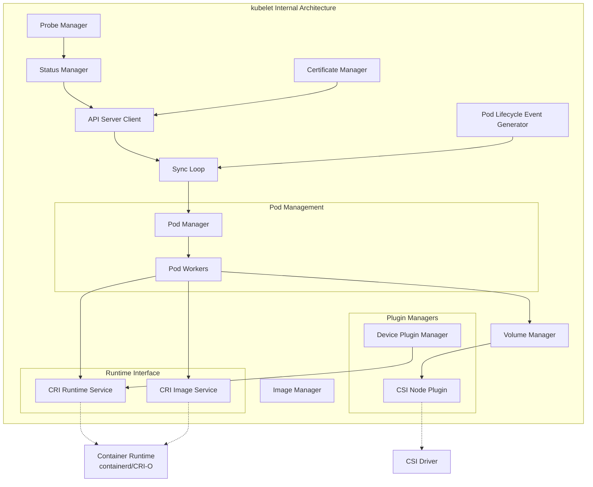

#### Responsibilities

**1. Pod Lifecycle Management**
- Watch API server for pod assignments to this node
- Ensure containers are running as specified
- Restart failed containers
- Execute init containers in order
- Run ephemeral containers for debugging
- Terminate pods gracefully

**2. Container Health Monitoring**
- Execute liveness probes
- Execute readiness probes
- Execute startup probes
- Report probe results to status manager
- Restart containers based on restart policy

**3. Resource Management**
- Enforce resource requests and limits
- Implement QoS classes (Guaranteed, Burstable, BestEffort)
- Evict pods under node pressure (memory, disk, PID)
- Report node resource capacity and allocatable

**4. Volume Management**
- Mount volumes before starting containers
- Unmount volumes after pod termination
- Handle volume plugin operations (attach, detach, mount, unmount)
- Support ephemeral volumes, projected volumes, CSI volumes

**5. Image Management**
- Pull container images
- Implement image pull policies (Always, IfNotPresent, Never)
- Garbage collect unused images
- Report image filesystem usage

**6. Status Reporting**
- Report node status (conditions, capacity, info)
- Report pod status (phase, conditions, container states)
- Update pod status in API server
- Lease-based heartbeats (reduces API server load)

**7. Security**
- Enforce security contexts (user, capabilities, SELinux, AppArmor, seccomp)
- Integrate with credential providers for image pulls
- Validate pod security policies (via admission)
- Restrict node access via NodeRestriction admission

#### Configuration Options

**Basic Configuration:**
```yaml
# /var/lib/kubelet/config.yaml
apiVersion: kubelet.config.k8s.io/v1beta1
kind: KubeletConfiguration

# API Server
clusterDNS:
- 10.96.0.10
clusterDomain: cluster.local
authentication:
  webhook:
    enabled: true
    cacheTTL: 2m0s
  anonymous:
    enabled: false
  x509:
    clientCAFile: /etc/kubernetes/pki/ca.crt
authorization:
  mode: Webhook
  webhook:
    cacheAuthorizedTTL: 5m0s
    cacheUnauthorizedTTL: 30s

# Container Runtime
containerRuntimeEndpoint: unix:///var/run/containerd/containerd.sock
imageServiceEndpoint: ""  # Same as runtime if not specified

# Resource Management
maxPods: 110
podsPerCore: 0  # 0 = no limit
podPidsLimit: 4096
cpuManagerPolicy: none  # Or "static" for CPU pinning
topologyManagerPolicy: none  # Or "best-effort", "restricted", "single-numa-node"
memoryManagerPolicy: None  # Or "Static"
reservedSystemCPUs: ""  # CPUs reserved for system (e.g., "0-3")

# Node Resources
systemReserved:
  cpu: 1000m
  memory: 2Gi
  ephemeral-storage: 10Gi
kubeReserved:
  cpu: 1000m
  memory: 2Gi
  ephemeral-storage: 10Gi
enforceNodeAllocatable:
- pods
- system-reserved
- kube-reserved

# Eviction
evictionHard:
  memory.available: 100Mi
  nodefs.available: 10%
  nodefs.inodesFree: 5%
  imagefs.available: 15%
evictionSoft:
  memory.available: 300Mi
  nodefs.available: 15%
evictionSoftGracePeriod:
  memory.available: 1m30s
  nodefs.available: 2m
evictionPressureTransitionPeriod: 5m
evictionMaxPodGracePeriod: 120

# Image Management
imageGCHighThresholdPercent: 85
imageGCLowThresholdPercent: 80
imageMinimumGCAge: 2m

# Garbage Collection
maxPerPodContainerCount: 1
maxContainerCount: -1  # -1 = unlimited

# Networking
hairpinMode: promiscuous-bridge  # Or "hairpin-veth", "none"
networkPluginMTU: 0  # 0 = use CNI default

# Monitoring
healthzPort: 10248
healthzBindAddress: 127.0.0.1
readOnlyPort: 0  # Disabled for security
enableDebuggingHandlers: true
enableServer: true
port: 10250  # Kubelet API port

# TLS
tlsCertFile: /var/lib/kubelet/pki/kubelet.crt
tlsPrivateKeyFile: /var/lib/kubelet/pki/kubelet.key
serverTLSBootstrap: true
rotateCertificates: true

# Feature Gates
featureGates:
  CSIMigration: true
  DynamicKubeletConfig: false
  GracefulNodeShutdown: true
  LocalStorageCapacityIsolation: true
  MemoryManager: true
  PodOverhead: true

# Logging
logging:
  format: json
  flushFrequency: 5s
  verbosity: 2
  options:
    json:
      infoBufferSize: "0"

# Node Status
nodeStatusUpdateFrequency: 10s
nodeStatusReportFrequency: 5m
nodeLeaseDurationSeconds: 40

# Sync and Runtime
syncFrequency: 1m
fileCheckFrequency: 20s
httpCheckFrequency: 20s
runtimeRequestTimeout: 2m
volumeStatsAggPeriod: 1m

# Shutdown
shutdownGracePeriod: 30s
shutdownGracePeriodCriticalPods: 10s
```

**Advanced Features:**

**CPU Manager (CPU Pinning):**
```yaml
cpuManagerPolicy: static
cpuManagerPolicyOptions:
  full-pcpus-only: "true"
cpuManagerReconcilePeriod: 10s
reservedSystemCPUs: "0-3"  # Reserve CPUs for system and kubelet
```

Pod requesting guaranteed CPUs:
```yaml
spec:
  containers:
  - name: app
    resources:
      requests:
        cpu: "4"
        memory: "8Gi"
      limits:
        cpu: "4"
        memory: "8Gi"  # Must be Guaranteed QoS
```

**Topology Manager:**
```yaml
topologyManagerPolicy: single-numa-node
topologyManagerScope: pod  # Or "container"
```

Ensures CPUs, devices (GPUs), and memory are allocated from same NUMA node for best performance.

**Memory Manager:**
```yaml
memoryManagerPolicy: Static
reservedMemory:
- numaNode: 0
  limits:
    memory: 4Gi
- numaNode: 1
  limits:
    memory: 4Gi
```

Enables guaranteed memory allocation from specific NUMA nodes.

#### Pod Lifecycle Event Generator (PLEG)

Monitors container runtime for pod state changes:

**PLEG Process:**
1. Periodically list all pods from runtime (default 1s)
2. Compare with cached state
3. Generate events for changes (started, died, removed)
4. Trigger sync loop for affected pods

**PLEG Health:**
- Unhealthy PLEG (>3min without relist) marks node NotReady
- High pod churn can cause PLEG issues
- Container runtime performance critical

**Generic vs. Evented PLEG:**
- **Generic PLEG**: Periodic polling (default)
- **Evented PLEG**: Event-driven via CRI events (beta in 1.27)

#### Status Manager

Batches and sends pod status updates to API server:

**Update Strategy:**
- Batch multiple status changes
- Rate limit API server updates
- Use PATCH for efficient updates
- Retry failed updates with backoff

**Status Phases:**
- `Pending`: Pod accepted but not running
- `Running`: Pod bound to node, containers running
- `Succeeded`: All containers terminated successfully
- `Failed`: All containers terminated, at least one failed
- `Unknown`: Pod state cannot be determined

#### Probe Manager

Executes container health checks:

**Probe Types:**

1. **Liveness Probe**
   - Determines if container is alive
   - Restart container if probe fails
   - Respects restart policy (Always, OnFailure, Never)

2. **Readiness Probe**
   - Determines if container ready to serve traffic
   - Remove pod from Service endpoints if probe fails
   - Does not restart container

3. **Startup Probe**
   - Determines if application started
   - Disables liveness and readiness until succeeds
   - Useful for slow-starting applications

**Probe Methods:**

```yaml
# HTTP GET Probe
livenessProbe:
  httpGet:
    path: /healthz
    port: 8080
    httpHeaders:
    - name: X-Custom-Header
      value: Awesome
    scheme: HTTP  # Or HTTPS
  initialDelaySeconds: 15
  periodSeconds: 10
  timeoutSeconds: 1
  successThreshold: 1
  failureThreshold: 3

# TCP Socket Probe
readinessProbe:
  tcpSocket:
    port: 3306
  initialDelaySeconds: 5
  periodSeconds: 5

# Exec Probe
livenessProbe:
  exec:
    command:
    - /bin/sh
    - -c
    - ps aux | grep my-application
  initialDelaySeconds: 30
  periodSeconds: 30

# gRPC Probe (1.24+)
livenessProbe:
  grpc:
    port: 9090
    service: my.service.v1.Health  # Optional
  initialDelaySeconds: 10
  periodSeconds: 10
```

**Probe Configuration:**
- `initialDelaySeconds`: Wait before first probe
- `periodSeconds`: Probe interval
- `timeoutSeconds`: Probe timeout
- `successThreshold`: Consecutive successes to mark healthy
- `failureThreshold`: Consecutive failures to mark unhealthy

#### Volume Manager

Manages volume lifecycle for pods:

**Operations:**

1. **DesiredStateOfWorld (DSW)**
   - Track volumes that should be attached/mounted
   - Built from pod specs

2. **ActualStateOfWorld (ASW)**
   - Track current volume state
   - Updated from runtime and filesystem

3. **Reconciliation Loop**
   - Compare DSW and ASW
   - Attach/detach volumes
   - Mount/unmount volumes
   - Setup/teardown volumes

**Volume Lifecycle:**

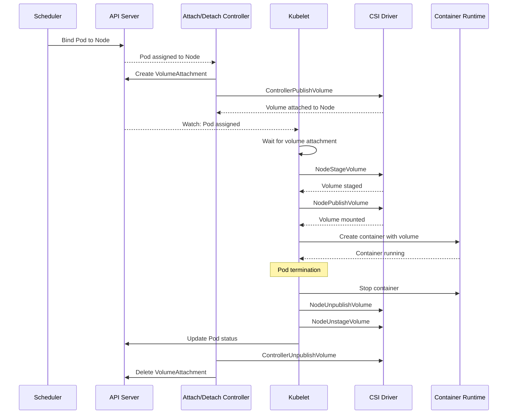

**Volume Types Supported:**

**Ephemeral Volumes:**
- `emptyDir`: Empty directory, pod lifecycle
- `configMap`: ConfigMap as files
- `secret`: Secret as files
- `downwardAPI`: Pod/container metadata as files
- `projected`: Combine multiple sources

**Persistent Volumes:**
- `persistentVolumeClaim`: PVC reference
- `csi`: CSI volume
- Legacy in-tree plugins (being phased out)

**Host Volumes:**
- `hostPath`: Mount from host filesystem
- `local`: Persistent local storage with node affinity

#### Image Manager

Pulls and garbage collects container images:

**Image Pull:**

```yaml
spec:
  containers:
  - name: app
    image: registry.example.com/app:v1.2.3
    imagePullPolicy: IfNotPresent  # Always, Never, IfNotPresent
  imagePullSecrets:
  - name: registry-credentials
```

**Image Pull Policies:**
- `Always`: Pull on every pod start
- `IfNotPresent`: Pull if not exists locally
- `Never`: Never pull, use local only

**Default Policy:**
- `:latest` tag → Always
- Other tags → IfNotPresent
- Digest (@sha256:...) → IfNotPresent

**Image Garbage Collection:**

**Triggers:**
- High disk usage (>85% by default)
- Periodic checks

**Process:**
1. Calculate disk usage
2. If above high threshold, start GC
3. Delete least recently used images
4. Stop when below low threshold (80%)
5. Never delete in-use images

**Configuration:**
```yaml
imageGCHighThresholdPercent: 85
imageGCLowThresholdPercent: 80
imageMinimumGCAge: 2m  # Don't delete images younger than this
```

#### Node Status Reporting

**Node Conditions:**

```yaml
conditions:
- type: Ready
  status: "True"
  reason: KubeletReady
  message: kubelet is posting ready status
  lastHeartbeatTime: 2024-01-15T10:00:00Z
  lastTransitionTime: 2024-01-14T08:00:00Z

- type: MemoryPressure
  status: "False"
  reason: KubeletHasSufficientMemory
  message: kubelet has sufficient memory available

- type: DiskPressure
  status: "False"
  reason: KubeletHasNoDiskPressure
  message: kubelet has no disk pressure

- type: PIDPressure
  status: "False"
  reason: KubeletHasSufficientPID
  message: kubelet has sufficient PID available

- type: NetworkUnavailable
  status: "False"
  reason: RouteCreated
  message: RouteController created a route
```

**Node Info:**
```yaml
nodeInfo:
  machineID: 8f4e3c2a1b9d7e6f
  systemUUID: 8F4E3C2A-1B9D-7E6F-8A5B-9C3D2E1F0A4B
  bootID: a1b2c3d4-e5f6-7a8b-9c0d-1e2f3a4b5c6d
  kernelVersion: 5.15.0-58-generic
  osImage: Ubuntu 22.04.1 LTS
  containerRuntimeVersion: containerd://1.7.2
  kubeletVersion: v1.28.0
  kubeProxyVersion: v1.28.0
  operatingSystem: linux
  architecture: amd64
```

**Resource Reporting:**
```yaml
capacity:
  cpu: "16"
  memory: 64Gi
  ephemeral-storage: 500Gi
  pods: "110"
  hugepages-1Gi: "0"
  hugepages-2Mi: "0"
  nvidia.com/gpu: "2"

allocatable:
  cpu: "14"  # After system/kube reserved
  memory: 60Gi
  ephemeral-storage: 480Gi
  pods: "110"
  nvidia.com/gpu: "2"
```

**Lease-Based Heartbeats:**

Lightweight heartbeat mechanism (reduces API server load):

```yaml
apiVersion: coordination.k8s.io/v1
kind: Lease
metadata:
  name: node-1
  namespace: kube-node-lease
spec:
  holderIdentity: node-1
  renewTime: "2024-01-15T10:00:00Z"
  leaseDurationSeconds: 40
```

### kube-proxy

Network proxy implementing Kubernetes Service abstraction on each node.

#### Architecture

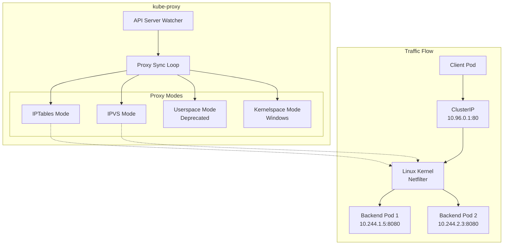

#### Responsibilities

**1. Service Implementation**
- Watch Services and Endpoints/EndpointSlices
- Configure packet forwarding rules
- Implement load balancing across backends
- Handle Service types (ClusterIP, NodePort, LoadBalancer)

**2. Network Policy**
- Not implemented by kube-proxy
- Handled by CNI plugin (Calico, Cilium, etc.)

**3. Session Affinity**
- Implement ClientIP-based affinity
- Maintain session state

#### Proxy Modes

**IPTables Mode (Default)**

Uses iptables NAT rules for packet forwarding.

**Characteristics:**
- Lower overhead than userspace mode
- No port conflicts
- Round-robin load balancing (random endpoint selection)
- Session affinity via recent module
- No connection rebalancing after endpoint changes

**Example IPTables Rules:**

```bash
# Service: my-service, ClusterIP: 10.96.0.1:80
# Endpoints: 10.244.1.5:8080, 10.244.2.3:8080

# KUBE-SERVICES chain (entry point)
-A KUBE-SERVICES -d 10.96.0.1/32 -p tcp -m tcp --dport 80 -j KUBE-SVC-ABCDEF1234567890

# KUBE-SVC chain (load balancing)
-A KUBE-SVC-ABCDEF1234567890 -m statistic --mode random --probability 0.50000000000 -j KUBE-SEP-1111111111111111
-A KUBE-SVC-ABCDEF1234567890 -j KUBE-SEP-2222222222222222

# KUBE-SEP chains (endpoints)
-A KUBE-SEP-1111111111111111 -p tcp -m tcp -j DNAT --to-destination 10.244.1.5:8080
-A KUBE-SEP-2222222222222222 -p tcp -m tcp -j DNAT --to-destination 10.244.2.3:8080
```

**Configuration:**
```yaml
mode: iptables
iptables:
  masqueradeBit: 14
  masqueradeAll: false
  syncPeriod: 30s
  minSyncPeriod: 1s
```

**IPVS Mode**

Uses Linux IPVS (IP Virtual Server) for load balancing.

**Characteristics:**
- Better performance at scale (hash tables vs. rule lists)
- More load balancing algorithms
- Connection rebalancing
- Still uses iptables for packet filtering (masquerading, NodePort)

**Load Balancing Algorithms:**
- `rr`: Round Robin
- `lc`: Least Connection
- `dh`: Destination Hashing
- `sh`: Source Hashing
- `sed`: Shortest Expected Delay
- `nq`: Never Queue

**Example IPVS Configuration:**

```bash
# Virtual Service
IP Virtual Server version 1.2.1 (size=4096)
Prot LocalAddress:Port Scheduler Flags
  -> RemoteAddress:Port           Forward Weight ActiveConn InActConn
TCP  10.96.0.1:80 rr
  -> 10.244.1.5:8080              Masq    1      0          0
  -> 10.244.2.3:8080              Masq    1      0          0
```

**Configuration:**
```yaml
mode: ipvs
ipvs:
  scheduler: rr  # rr, lc, dh, sh, sed, nq
  syncPeriod: 30s
  minSyncPeriod: 1s
  excludeCIDRs: []
  strictARP: false
  tcpTimeout: 0s
  tcpFinTimeout: 0s
  udpTimeout: 0s
```

**Userspace Mode (Deprecated)**

kube-proxy acts as actual proxy, copying data between client and backend.

**Characteristics:**
- Highest overhead (userspace context switches)
- True round-robin
- Port conflicts possible
- Deprecated, not recommended

**Kernelspace Mode (Windows)**

Windows-specific mode using HNS (Host Networking Service) and VFP (Virtual Filtering Platform).

#### Service Types Implementation

**ClusterIP:**
- Virtual IP allocated from service CIDR
- Only accessible within cluster
- Implemented via iptables/IPVS rules on all nodes

**NodePort:**
- Allocates port (30000-32767 by default) on all nodes
- Forwards NodeIP:NodePort → ClusterIP:Port → Pod:TargetPort
- Accessible from outside cluster

**LoadBalancer:**
- Cloud provider provisions external load balancer
- External LB → NodePort → ClusterIP → Pods
- kube-proxy handles NodePort portion

**ExternalName:**
- CNAME record for external service
- No proxy, pure DNS
- Not implemented by kube-proxy (CoreDNS)

#### Session Affinity

```yaml
apiVersion: v1
kind: Service
metadata:
  name: my-service
spec:
  type: ClusterIP
  sessionAffinity: ClientIP
  sessionAffinityConfig:
    clientIP:
      timeoutSeconds: 10800  # 3 hours
  ports:
  - port: 80
    targetPort: 8080
  selector:
    app: web
```

**IPTables Implementation:**
Uses `recent` module to track client IPs:
```bash
-A KUBE-SEP-... -m recent --name KUBE-SEP-... --set
-A KUBE-SEP-... -m recent --name KUBE-SEP-... --rcheck --seconds 10800 --reap
```

**IPVS Implementation:**
Uses IPVS persistence (session affinity built into IPVS).

#### EndpointSlices

Modern replacement for Endpoints, more scalable:

**Endpoints (Legacy):**
```yaml
apiVersion: v1
kind: Endpoints
metadata:
  name: my-service
subsets:
- addresses:
  - ip: 10.244.1.5
  - ip: 10.244.2.3
  - ip: 10.244.3.7
  # ... potentially thousands of IPs
  ports:
  - port: 8080
```

**EndpointSlices (Modern):**
```yaml
apiVersion: discovery.k8s.io/v1
kind: EndpointSlice
metadata:
  name: my-service-abc123
  labels:
    kubernetes.io/service-name: my-service
addressType: IPv4
endpoints:
- addresses:
  - 10.244.1.5
  conditions:
    ready: true
    serving: true
    terminating: false
  nodeName: node-1
  targetRef:
    kind: Pod
    name: web-abc123
- addresses:
  - 10.244.2.3
  conditions:
    ready: true
  nodeName: node-2
ports:
- port: 8080
  protocol: TCP
```

**Benefits:**
- Multiple EndpointSlice objects per Service
- Reduced API server load (only changed slices updated)
- Better scalability (tested with 100k+ endpoints)
- Topology hints for topology-aware routing

#### Configuration

```yaml
apiVersion: kubeproxy.config.k8s.io/v1alpha1
kind: KubeProxyConfiguration

# Client
clientConnection:
  kubeconfig: /var/lib/kube-proxy/kubeconfig.conf

# Mode
mode: ipvs  # iptables, ipvs, userspace, kernelspace

# IPTables
iptables:
  masqueradeBit: 14
  masqueradeAll: false
  syncPeriod: 30s
  minSyncPeriod: 1s

# IPVS
ipvs:
  scheduler: rr
  syncPeriod: 30s
  minSyncPeriod: 1s
  excludeCIDRs: []
  strictARP: false
  tcpTimeout: 0s
  tcpFinTimeout: 0s
  udpTimeout: 0s

# Cluster CIDR
clusterCIDR: 10.244.0.0/16

# Detection
detectLocalMode: ClusterCIDR  # Or "BridgeInterface", "InterfaceNamePrefix"

# Conntrack
conntrack:
  maxPerCore: 32768
  min: 131072
  tcpEstablishedTimeout: 24h
  tcpCloseWaitTimeout: 1h

# Metrics
metricsBindAddress: 127.0.0.1:10249
enableProfiling: false

# NodePort
nodePortAddresses: []  # Empty = all addresses

# Feature Gates
featureGates:
  EndpointSliceProxying: true
  TopologyAwareHints: true
```

### Container Runtime

Software executing containers on nodes. Kubernetes communicates via Container Runtime Interface (CRI).

#### Supported Runtimes

**containerd** (Recommended)
- CNCF graduated project
- Lightweight, focused on container execution
- Default in many Kubernetes distributions
- Excellent performance and reliability

**CRI-O**
- Lightweight runtime specifically for Kubernetes
- Implements CRI spec precisely
- Minimal dependencies
- Red Hat/OpenShift default

**Docker Engine (via cri-dockerd)**
- Docker support removed from kubelet in 1.24
- Requires cri-dockerd shim for compatibility
- Not recommended for new deployments

**Windows Containers**
- containerd with runhcs
- Windows Server containers
- Hyper-V isolated containers

#### Runtime Classes

Specify different runtime configurations:

```yaml
apiVersion: node.k8s.io/v1
kind: RuntimeClass
metadata:
  name: gvisor
handler: runsc
overhead:
  podFixed:
    memory: 128Mi
    cpu: 250m
scheduling:
  nodeSelector:
    runtime: gvisor
  tolerations:
  - key: runtime
    operator: Equal
    value: gvisor
    effect: NoSchedule

---
apiVersion: node.k8s.io/v1
kind: RuntimeClass
metadata:
  name: kata-containers
handler: kata
overhead:
  podFixed:
    memory: 256Mi
    cpu: 500m
```

**Pod Using RuntimeClass:**
```yaml
apiVersion: v1
kind: Pod
metadata:
  name: secure-app
spec:
  runtimeClassName: gvisor
  containers:
  - name: app
    image: app:v1
```

**Runtime Handlers:**
- **runc**: Standard OCI runtime (default)
- **runsc**: gVisor (sandboxed runtime)
- **kata**: Kata Containers (VM-based isolation)
- **firecracker**: Firecracker microVMs
- **runhcs**: Windows containers

## Container Runtime Interface (CRI)

### Overview

gRPC API defining how kubelet interacts with container runtimes.

**Two Services:**
1. **RuntimeService**: Pod and container lifecycle
2. **ImageService**: Image management

### RuntimeService API

**Pod Sandbox Operations:**
```protobuf
service RuntimeService {
    // Sandbox (Pod) management
    rpc RunPodSandbox(RunPodSandboxRequest) returns (RunPodSandboxResponse);
    rpc StopPodSandbox(StopPodSandboxRequest) returns (StopPodSandboxResponse);
    rpc RemovePodSandbox(RemovePodSandboxRequest) returns (RemovePodSandboxResponse);
    rpc PodSandboxStatus(PodSandboxStatusRequest) returns (PodSandboxStatusResponse);
    rpc ListPodSandbox(ListPodSandboxRequest) returns (ListPodSandboxResponse);

    // Container management
    rpc CreateContainer(CreateContainerRequest) returns (CreateContainerResponse);
    rpc StartContainer(StartContainerRequest) returns (StartContainerResponse);
    rpc StopContainer(StopContainerRequest) returns (StopContainerResponse);
    rpc RemoveContainer(RemoveContainerRequest) returns (RemoveContainerResponse);
    rpc ListContainers(ListContainersRequest) returns (ListContainersResponse);
    rpc ContainerStatus(ContainerStatusRequest) returns (ContainerStatusResponse);
    rpc UpdateContainerResources(UpdateContainerResourcesRequest) returns (UpdateContainerResourcesResponse);
    rpc ReopenContainerLog(ReopenContainerLogRequest) returns (ReopenContainerLogResponse);

    // Container execution
    rpc ExecSync(ExecSyncRequest) returns (ExecSyncResponse);
    rpc Exec(ExecRequest) returns (ExecResponse);
    rpc Attach(AttachRequest) returns (AttachResponse);
    rpc PortForward(PortForwardRequest) returns (PortForwardResponse);

    // Stats
    rpc ContainerStats(ContainerStatsRequest) returns (ContainerStatsResponse);
    rpc ListContainerStats(ListContainerStatsRequest) returns (ListContainerStatsResponse);
    rpc PodSandboxStats(PodSandboxStatsRequest) returns (PodSandboxStatsResponse);
    rpc ListPodSandboxStats(ListPodSandboxStatsRequest) returns (ListPodSandboxStatsResponse);

    // Runtime info
    rpc UpdateRuntimeConfig(UpdateRuntimeConfigRequest) returns (UpdateRuntimeConfigResponse);
    rpc Status(StatusRequest) returns (StatusResponse);
}
```

**Pod Lifecycle:**

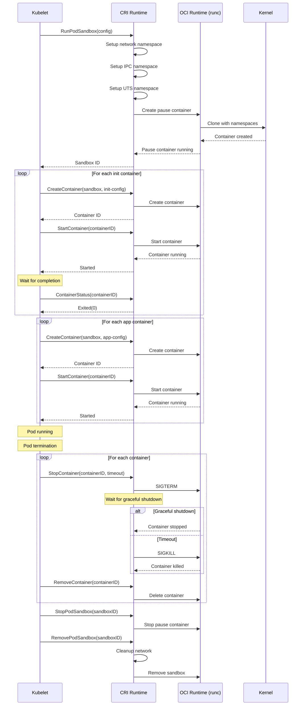

### ImageService API

```protobuf
service ImageService {
    // Image management
    rpc ListImages(ListImagesRequest) returns (ListImagesResponse);
    rpc ImageStatus(ImageStatusRequest) returns (ImageStatusResponse);
    rpc PullImage(PullImageRequest) returns (PullImageResponse);
    rpc RemoveImage(RemoveImageRequest) returns (RemoveImageResponse);
    rpc ImageFsInfo(ImageFsInfoRequest) returns (ImageFsInfoResponse);
}
```

**Image Pull:**
- Supports authentication (pull secrets)
- Progress tracking
- Concurrent pulls
- Deduplication (same image, multiple pods)

### CRI Configuration

**containerd:**
```toml
# /etc/containerd/config.toml
version = 2

[plugins."io.containerd.grpc.v1.cri"]
  sandbox_image = "registry.k8s.io/pause:3.9"
  max_container_log_line_size = 16384

  [plugins."io.containerd.grpc.v1.cri".containerd]
    default_runtime_name = "runc"
    snapshotter = "overlayfs"

    [plugins."io.containerd.grpc.v1.cri".containerd.runtimes.runc]
      runtime_type = "io.containerd.runc.v2"

      [plugins."io.containerd.grpc.v1.cri".containerd.runtimes.runc.options]
        SystemdCgroup = true

    [plugins."io.containerd.grpc.v1.cri".containerd.runtimes.gvisor]
      runtime_type = "io.containerd.runsc.v1"

  [plugins."io.containerd.grpc.v1.cri".cni]
    bin_dir = "/opt/cni/bin"
    conf_dir = "/etc/cni/net.d"

  [plugins."io.containerd.grpc.v1.cri".registry]
    [plugins."io.containerd.grpc.v1.cri".registry.mirrors]
      [plugins."io.containerd.grpc.v1.cri".registry.mirrors."docker.io"]
        endpoint = ["https://registry-1.docker.io"]
      [plugins."io.containerd.grpc.v1.cri".registry.mirrors."myregistry.com"]
        endpoint = ["https://myregistry.com"]
```

**CRI-O:**
```toml
# /etc/crio/crio.conf
[crio]
  log_level = "info"
  log_dir = "/var/log/crio/pods"

[crio.api]
  listen = "/var/run/crio/crio.sock"

[crio.runtime]
  default_runtime = "runc"
  selinux = true
  seccomp_profile = ""
  apparmor_profile = "crio-default"
  default_capabilities = [
    "CHOWN",
    "DAC_OVERRIDE",
    "FSETID",
    "FOWNER",
    "NET_RAW",
    "SETGID",
    "SETUID",
    "SETPCAP",
    "NET_BIND_SERVICE",
    "SYS_CHROOT",
    "KILL",
  ]

  [crio.runtime.runtimes.runc]
    runtime_path = "/usr/bin/runc"
    runtime_type = "oci"

[crio.image]
  pause_image = "registry.k8s.io/pause:3.9"
  pause_command = "/pause"

[crio.network]
  network_dir = "/etc/cni/net.d/"
  plugin_dirs = [
    "/opt/cni/bin",
  ]
```

## Pod Lifecycle

### Pod Phases

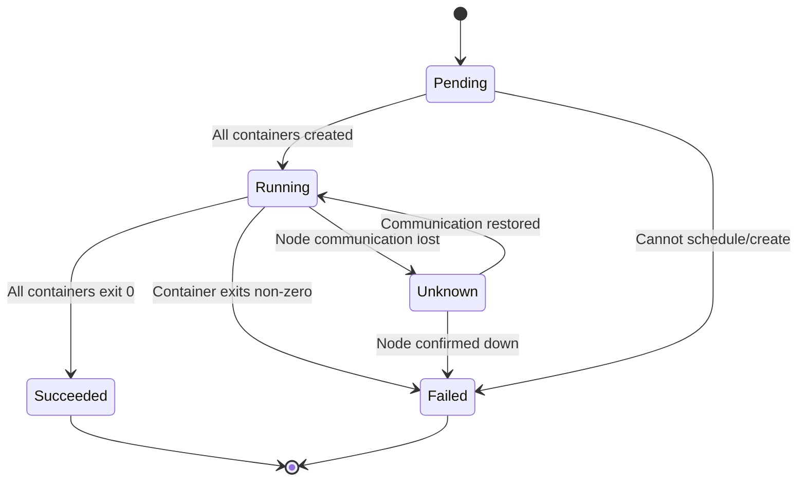

**Phase Definitions:**

1. **Pending**
   - Pod accepted by cluster
   - Not yet scheduled or containers not created
   - Waiting for: scheduling, image pull, volume attachment

2. **Running**
   - Pod bound to node
   - At least one container running
   - May include init containers running

3. **Succeeded**
   - All containers terminated successfully (exit 0)
   - Will not be restarted

4. **Failed**
   - All containers terminated
   - At least one terminated with non-zero exit code
   - May be restarted depending on restartPolicy

5. **Unknown**
   - Cannot determine pod state
   - Usually node communication failure

### Container States

```yaml
containerStatuses:
- name: app
  state:
    running:
      startedAt: "2024-01-15T10:00:00Z"
  ready: true
  restartCount: 0

- name: sidecar
  state:
    waiting:
      reason: CrashLoopBackOff
      message: "Back-off 5m0s restarting failed container"
  ready: false
  restartCount: 5
  lastState:
    terminated:
      exitCode: 1
      reason: Error
      startedAt: "2024-01-15T09:55:00Z"
      finishedAt: "2024-01-15T09:55:10Z"
```

**States:**
- **Waiting**: Container not running (image pull, waiting for dependencies)
- **Running**: Container executing
- **Terminated**: Container finished execution or was killed

### Pod Conditions

```yaml
conditions:
- type: PodScheduled
  status: "True"
  lastProbeTime: null
  lastTransitionTime: "2024-01-15T09:00:00Z"

- type: Initialized
  status: "True"
  lastProbeTime: null
  lastTransitionTime: "2024-01-15T09:01:00Z"
  message: "all init containers completed"

- type: ContainersReady
  status: "True"
  lastProbeTime: null
  lastTransitionTime: "2024-01-15T09:02:00Z"

- type: Ready
  status: "True"
  lastProbeTime: null
  lastTransitionTime: "2024-01-15T09:02:00Z"
```

**Condition Types:**
- `PodScheduled`: Pod assigned to node
- `Initialized`: All init containers completed
- `ContainersReady`: All containers ready
- `Ready`: Pod able to serve requests

### Init Containers

Specialized containers running before app containers:

```yaml
apiVersion: v1
kind: Pod
metadata:
  name: myapp
spec:
  initContainers:
  - name: init-db
    image: busybox
    command: ['sh', '-c', 'until nslookup db-service; do sleep 2; done']

  - name: init-permissions
    image: busybox
    command: ['sh', '-c', 'chown -R 1000:1000 /data']
    volumeMounts:
    - name: data
      mountPath: /data

  containers:
  - name: app
    image: myapp:v1
    volumeMounts:
    - name: data
      mountPath: /data

  volumes:
  - name: data
    emptyDir: {}
```

**Characteristics:**
- Run sequentially (one at a time)
- Must complete successfully before app containers start
- Failure triggers pod restart (subject to restartPolicy)
- Don't support lifecycle, livenessProbe, readinessProbe
- Share volumes, network, and security context with app containers

### Restart Policies

```yaml
spec:
  restartPolicy: Always  # Always, OnFailure, Never
```

**Behavior:**
- `Always`: Always restart, regardless of exit code
- `OnFailure`: Restart only if exits non-zero
- `Never`: Never restart

**Backoff:**
- 10s, 20s, 40s, 80s, 160s, 300s (max)
- Resets to 10s after 10 minutes success

### Termination

**Graceful Termination Process:**

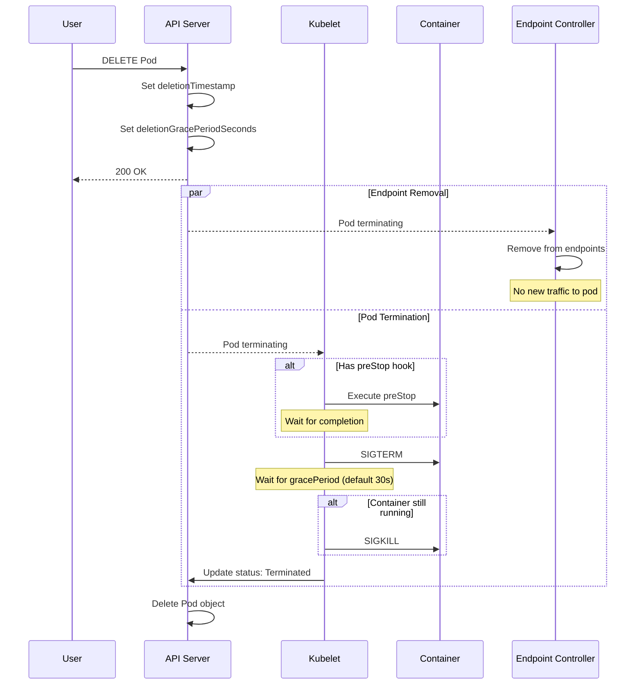

**Configuration:**

```yaml
apiVersion: v1
kind: Pod
metadata:
  name: myapp
spec:
  terminationGracePeriodSeconds: 60
  containers:
  - name: app
    image: myapp:v1
    lifecycle:
      preStop:
        exec:
          command: ["/bin/sh", "-c", "/app/graceful-shutdown.sh"]
```

**Best Practices:**
- Handle SIGTERM for graceful shutdown
- Finish in-flight requests
- Close connections
- Flush logs/metrics
- Save state if necessary
- Use preStop for cleanup (database connections, deregistration)

### Pod Disruptions

**Voluntary Disruptions:**
- Node drain/maintenance
- Pod deletion
- Deployment rollout
- Cluster autoscaling

**Involuntary Disruptions:**
- Node failure
- Out of memory
- Network partition
- Kernel panic

**Pod Disruption Budget:**

```yaml
apiVersion: policy/v1
kind: PodDisruptionBudget
metadata:
  name: web-pdb
spec:
  minAvailable: 2  # Or maxUnavailable: 1
  selector:
    matchLabels:
      app: web
```

Limits voluntary disruptions, ensuring minimum availability.

## Networking

### Pod Networking Model

**Kubernetes Networking Requirements:**
1. All pods can communicate without NAT
2. All nodes can communicate with all pods without NAT
3. Pod sees same IP as others see it (no NAT)

### CNI (Container Network Interface)

**CNI Plugin Responsibilities:**
- Assign IP address to pod
- Configure network interface
- Setup routes
- Configure iptables rules (if needed)

**CNI Configuration:**

```json
{
  "cniVersion": "0.4.0",
  "name": "mynet",
  "plugins": [
    {
      "type": "bridge",
      "bridge": "cni0",
      "isGateway": true,
      "ipMasq": true,
      "hairpinMode": true,
      "ipam": {
        "type": "host-local",
        "ranges": [
          [{
            "subnet": "10.244.0.0/24",
            "gateway": "10.244.0.1"
          }]
        ],
        "routes": [
          {"dst": "0.0.0.0/0"}
        ]
      }
    },
    {
      "type": "portmap",
      "capabilities": {"portMappings": true},
      "snat": true
    },
    {
      "type": "bandwidth",
      "ingressRate": 1000000,
      "ingressBurst": 1000000,
      "egressRate": 1000000,
      "egressBurst": 1000000
    }
  ]
}
```

**CNI Execution:**

```bash
# ADD operation (pod creation)
echo '{
  "cniVersion": "0.4.0",
  "name": "mynet",
  "containerID": "abc123",
  "netns": "/var/run/netns/abc123",
  "ifname": "eth0",
  "args": {
    "K8S_POD_NAME": "mypod",
    "K8S_POD_NAMESPACE": "default"
  },
  "path": "/opt/cni/bin"
}' | /opt/cni/bin/bridge

# DEL operation (pod deletion)
echo '{...}' | CNI_COMMAND=DEL /opt/cni/bin/bridge
```

### CNI Plugins

**Overlay Networks:**

**Flannel:**
- Simple overlay using VXLAN or host-gw
- Layer 3 network fabric
- Minimal features, easy setup

**Calico:**
- BGP-based routing (no overlay) or VXLAN
- Network policy enforcement
- High performance
- Supports IPv6, dual-stack

**Weave:**
- Mesh network with automatic encryption
- Simple setup
- Built-in DNS
- Network policy support

**Cilium:**
- eBPF-based networking
- Advanced network policies (L7, DNS, HTTP)
- Service mesh features
- Excellent observability (Hubble)
- Multi-cluster networking

**Non-Overlay Networks:**

**Calico (BGP mode):**
- Native routing via BGP
- No encapsulation overhead
- Requires BGP-capable network

**Multus:**
- Multiple network interfaces per pod
- SR-IOV support
- Used with other CNI plugins

### Network Policies

Define allowed traffic to/from pods:

```yaml
apiVersion: networking.k8s.io/v1
kind: NetworkPolicy
metadata:
  name: api-network-policy
  namespace: production
spec:
  podSelector:
    matchLabels:
      role: api
  policyTypes:
  - Ingress
  - Egress

  ingress:
  # Allow from frontend pods
  - from:
    - podSelector:
        matchLabels:
          role: frontend
    ports:
    - protocol: TCP
      port: 8080

  # Allow from monitoring namespace
  - from:
    - namespaceSelector:
        matchLabels:
          name: monitoring
    ports:
    - protocol: TCP
      port: 9090

  egress:
  # Allow to database
  - to:
    - podSelector:
        matchLabels:
          role: database
    ports:
    - protocol: TCP
      port: 5432

  # Allow DNS
  - to:
    - namespaceSelector:
        matchLabels:
          name: kube-system
    - podSelector:
        matchLabels:
          k8s-app: kube-dns
    ports:
    - protocol: UDP
      port: 53

  # Allow HTTPS to internet
  - to:
    - ipBlock:
        cidr: 0.0.0.0/0
        except:
        - 10.0.0.0/8
        - 172.16.0.0/12
        - 192.168.0.0/16
    ports:
    - protocol: TCP
      port: 443
```

**Implementation:**
- Not all CNI plugins support NetworkPolicies
- Supported by: Calico, Cilium, Weave, Antrea
- Not supported by: Flannel (basic mode)

### DNS

**CoreDNS Configuration:**

```yaml
apiVersion: v1
kind: ConfigMap
metadata:
  name: coredns
  namespace: kube-system
data:
  Corefile: |
    .:53 {
        errors
        health {
           lameduck 5s
        }
        ready
        kubernetes cluster.local in-addr.arpa ip6.arpa {
           pods insecure
           fallthrough in-addr.arpa ip6.arpa
           ttl 30
        }
        prometheus :9153
        forward . /etc/resolv.conf {
           max_concurrent 1000
        }
        cache 30
        loop
        reload
        loadbalance
    }
```

**DNS Resolution:**

Service DNS:
- `my-service.my-namespace.svc.cluster.local` → ClusterIP
- `my-service.my-namespace` → ClusterIP (within cluster)
- `my-service` → ClusterIP (within same namespace)

Pod DNS:
- `10-244-1-5.my-namespace.pod.cluster.local` → 10.244.1.5

**Pod DNS Configuration:**

```yaml
apiVersion: v1
kind: Pod
metadata:
  name: dns-example
spec:
  dnsPolicy: ClusterFirst  # Default, None, ClusterFirstWithHostNet
  dnsConfig:
    nameservers:
    - 8.8.8.8
    searches:
    - custom.example.com
    options:
    - name: ndots
      value: "2"
  containers:
  - name: app
    image: nginx
```

**DNS Policies:**
- `ClusterFirst`: Use cluster DNS (default)
- `Default`: Inherit from node
- `ClusterFirstWithHostNet`: Use cluster DNS even with hostNetwork
- `None`: Use dnsConfig only

## Storage

### Volume Lifecycle

**Static Provisioning:**

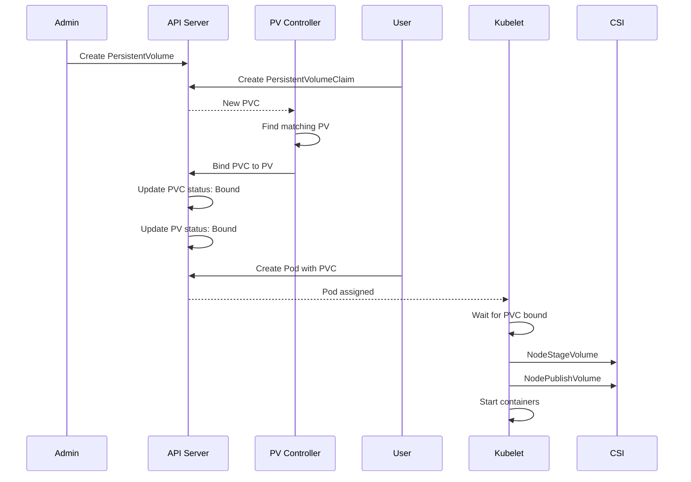

**Dynamic Provisioning:**

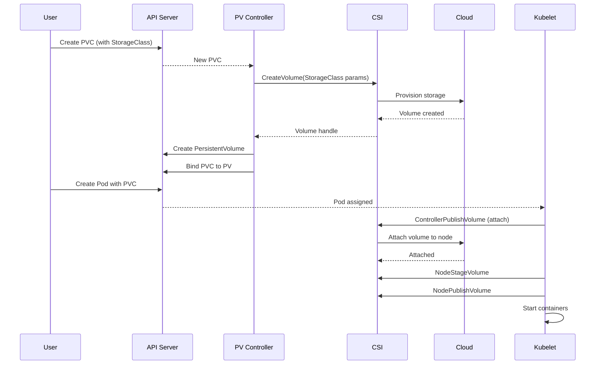

### CSI (Container Storage Interface)

**CSI Architecture:**

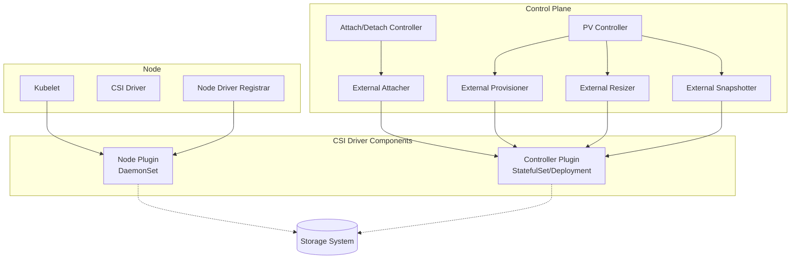

**CSI Driver Example (AWS EBS):**

Controller:
```yaml
apiVersion: apps/v1
kind: Deployment
metadata:
  name: ebs-csi-controller
  namespace: kube-system
spec:
  replicas: 2
  selector:
    matchLabels:
      app: ebs-csi-controller
  template:
    spec:
      containers:
      - name: ebs-plugin
        image: k8s.gcr.io/provider-aws/aws-ebs-csi-driver:v1.20.0
        args:
        - controller
        - --endpoint=$(CSI_ENDPOINT)
        - --logtostderr
        - --v=2

      - name: csi-provisioner
        image: k8s.gcr.io/sig-storage/csi-provisioner:v3.5.0
        args:
        - --csi-address=$(ADDRESS)
        - --v=2
        - --feature-gates=Topology=true
        - --leader-election=true

      - name: csi-attacher
        image: k8s.gcr.io/sig-storage/csi-attacher:v4.3.0
        args:
        - --csi-address=$(ADDRESS)
        - --v=2
        - --leader-election=true

      - name: csi-resizer
        image: k8s.gcr.io/sig-storage/csi-resizer:v1.8.0
        args:
        - --csi-address=$(ADDRESS)
        - --v=2
        - --leader-election=true

      - name: csi-snapshotter
        image: k8s.gcr.io/sig-storage/csi-snapshotter:v6.2.2
        args:
        - --csi-address=$(ADDRESS)
        - --leader-election=true
```

Node:
```yaml
apiVersion: apps/v1
kind: DaemonSet
metadata:
  name: ebs-csi-node
  namespace: kube-system
spec:
  selector:
    matchLabels:
      app: ebs-csi-node
  template:
    spec:
      hostNetwork: true
      containers:
      - name: ebs-plugin
        image: k8s.gcr.io/provider-aws/aws-ebs-csi-driver:v1.20.0
        args:
        - node
        - --endpoint=$(CSI_ENDPOINT)
        securityContext:
          privileged: true
        volumeMounts:
        - name: kubelet-dir
          mountPath: /var/lib/kubelet
          mountPropagation: Bidirectional
        - name: device-dir
          mountPath: /dev

      - name: node-driver-registrar
        image: k8s.gcr.io/sig-storage/csi-node-driver-registrar:v2.8.0
        args:
        - --csi-address=$(ADDRESS)
        - --kubelet-registration-path=$(DRIVER_REG_SOCK_PATH)

      volumes:
      - name: kubelet-dir
        hostPath:
          path: /var/lib/kubelet
          type: Directory
      - name: device-dir
        hostPath:
          path: /dev
          type: Directory
```

### Volume Types

**Ephemeral:**
- `emptyDir`: Empty directory, pod lifetime
- `configMap`: ConfigMap as files
- `secret`: Secret as files
- `downwardAPI`: Pod metadata as files
- `projected`: Multiple sources projected
- `csi` (ephemeral): CSI volume with pod lifetime
- `generic ephemeral`: PVC template, pod lifetime

**Persistent:**
- `persistentVolumeClaim`: PVC reference
- `csi`: CSI driver
- `local`: Local storage with node affinity
- Legacy in-tree (being migrated to CSI)

**Host:**
- `hostPath`: Host file/directory
- `local`: Persistent local storage

### Volume Modes

```yaml
apiVersion: v1
kind: PersistentVolumeClaim
metadata:
  name: block-pvc
spec:
  volumeMode: Block  # Or Filesystem (default)
  accessModes:
  - ReadWriteOnce
  resources:
    requests:
      storage: 10Gi
```

**Filesystem** (default):
- Volume formatted with filesystem
- Mounted as directory

**Block**:
- Raw block device
- No filesystem
- Application manages blocks directly

### Access Modes

- `ReadWriteOnce (RWO)`: Single node, read-write
- `ReadOnlyMany (ROX)`: Multiple nodes, read-only
- `ReadWriteMany (RWX)`: Multiple nodes, read-write
- `ReadWriteOncePod (RWOP)`: Single pod, read-write (1.22+)

## Resource Management

### Resource Requests and Limits

```yaml
apiVersion: v1
kind: Pod
metadata:
  name: resource-demo
spec:
  containers:
  - name: app
    image: nginx
    resources:
      requests:
        cpu: 500m
        memory: 512Mi
        ephemeral-storage: 2Gi
      limits:
        cpu: 1000m
        memory: 1Gi
        ephemeral-storage: 4Gi
```

**Requests:**
- Used for scheduling decisions
- Guaranteed resources
- Basis for QoS class

**Limits:**
- Maximum resources allowed
- CPU: Throttled if exceeded
- Memory: OOMKilled if exceeded

### QoS Classes

**Guaranteed:**
```yaml
resources:
  requests:
    cpu: 1000m
    memory: 1Gi
  limits:
    cpu: 1000m
    memory: 1Gi
```
- All containers have requests = limits
- Lowest eviction priority

**Burstable:**
```yaml
resources:
  requests:
    cpu: 500m
    memory: 512Mi
  limits:
    cpu: 1000m
    memory: 1Gi
```
- Requests < limits, or only requests specified
- Medium eviction priority

**BestEffort:**
```yaml
# No resources specified
```
- No requests or limits
- Highest eviction priority

### Resource Quotas

Namespace-level resource limits:

```yaml
apiVersion: v1
kind: ResourceQuota
metadata:
  name: compute-quota
  namespace: production
spec:
  hard:
    requests.cpu: "100"
    requests.memory: 200Gi
    limits.cpu: "200"
    limits.memory: 400Gi
    pods: "100"
```

### Limit Ranges

Default and enforced limits:

```yaml
apiVersion: v1
kind: LimitRange
metadata:
  name: resource-limits
  namespace: development
spec:
  limits:
  - type: Container
    default:
      cpu: 500m
      memory: 512Mi
    defaultRequest:
      cpu: 200m
      memory: 256Mi
    max:
      cpu: 2000m
      memory: 2Gi
    min:
      cpu: 100m
      memory: 128Mi
```

### Node Eviction

**Eviction Signals:**
- `memory.available`: Available memory
- `nodefs.available`: Node filesystem available
- `nodefs.inodesFree`: Node filesystem inodes free
- `imagefs.available`: Image filesystem available
- `imagefs.inodesFree`: Image filesystem inodes free

**Eviction Thresholds:**

Hard (immediate eviction):
```yaml
evictionHard:
  memory.available: 100Mi
  nodefs.available: 10%
  imagefs.available: 15%
```

Soft (grace period):
```yaml
evictionSoft:
  memory.available: 300Mi
  nodefs.available: 15%
evictionSoftGracePeriod:
  memory.available: 1m30s
  nodefs.available: 2m
```

**Eviction Order:**
1. BestEffort pods using most resources
2. Burstable pods exceeding requests
3. Burstable pods within requests
4. Guaranteed pods (only if system critical)

## Security

### Security Context

**Pod-level:**
```yaml
apiVersion: v1
kind: Pod
metadata:
  name: security-demo
spec:
  securityContext:
    runAsUser: 1000
    runAsGroup: 3000
    fsGroup: 2000
    fsGroupChangePolicy: OnRootMismatch
    supplementalGroups: [4000]
    sysctls:
    - name: net.ipv4.ip_local_port_range
      value: "32768 60999"
  containers:
  - name: app
    image: nginx
```

**Container-level:**
```yaml
securityContext:
  runAsUser: 2000
  runAsNonRoot: true
  allowPrivilegeEscalation: false
  readOnlyRootFilesystem: true
  capabilities:
    drop:
    - ALL
    add:
    - NET_BIND_SERVICE
  seccompProfile:
    type: RuntimeDefault
  seLinuxOptions:
    level: "s0:c123,c456"
```

### Capabilities

Linux capabilities (fine-grained privileges):

```yaml
securityContext:
  capabilities:
    drop:
    - ALL  # Drop all capabilities
    add:
    - NET_BIND_SERVICE  # Bind to ports < 1024
    - CHOWN  # Change file ownership
```

Common capabilities:
- `CAP_NET_BIND_SERVICE`: Bind ports < 1024
- `CAP_CHOWN`: Change file ownership
- `CAP_DAC_OVERRIDE`: Bypass permission checks
- `CAP_SETUID`/`CAP_SETGID`: Change UID/GID
- `CAP_NET_RAW`: Use RAW/PACKET sockets
- `CAP_SYS_ADMIN`: Superuser (avoid!)

### AppArmor

```yaml
metadata:
  annotations:
    container.apparmor.security.beta.kubernetes.io/app: runtime/default
```

Profiles:
- `runtime/default`: Default Docker profile
- `localhost/<profile>`: Custom profile on node
- `unconfined`: No AppArmor

### SELinux

```yaml
securityContext:
  seLinuxOptions:
    level: "s0:c123,c456"
    role: "system_r"
    type: "svirt_lxc_net_t"
    user: "system_u"
```

### Seccomp

```yaml
securityContext:
  seccompProfile:
    type: RuntimeDefault  # Or Localhost, Unconfined
    localhostProfile: "profiles/audit.json"
```

## Observability

### Metrics

**Resource Metrics (Metrics Server):**
```bash
kubectl top nodes
kubectl top pods -n production
```

Provides CPU/memory usage via Metrics API.

**Custom Metrics:**
- Prometheus Adapter
- Custom metrics for HPA
- Datadog, New Relic, etc.

### Logging

**Container Logs:**
```bash
kubectl logs pod-name -c container-name
kubectl logs -f pod-name  # Follow
kubectl logs --previous pod-name  # Previous instance
```

**Log Rotation:**
- kubelet rotates logs automatically
- Configurable via `containerLogMaxSize` and `containerLogMaxFiles`

**Centralized Logging:**
- DaemonSet log collectors (Fluentd, Fluent Bit, Filebeat)
- Ship to backends (Elasticsearch, Loki, Splunk, CloudWatch)

### Events

```bash
kubectl get events -n production
kubectl describe pod pod-name  # Includes events
```

Events are ephemeral (1 hour retention by default).

## Architecture Diagrams

### Complete Data Plane Architecture

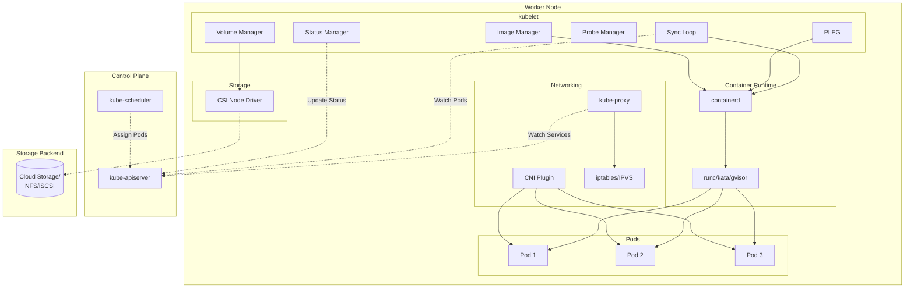

### Pod Creation Flow (Data Plane Perspective)

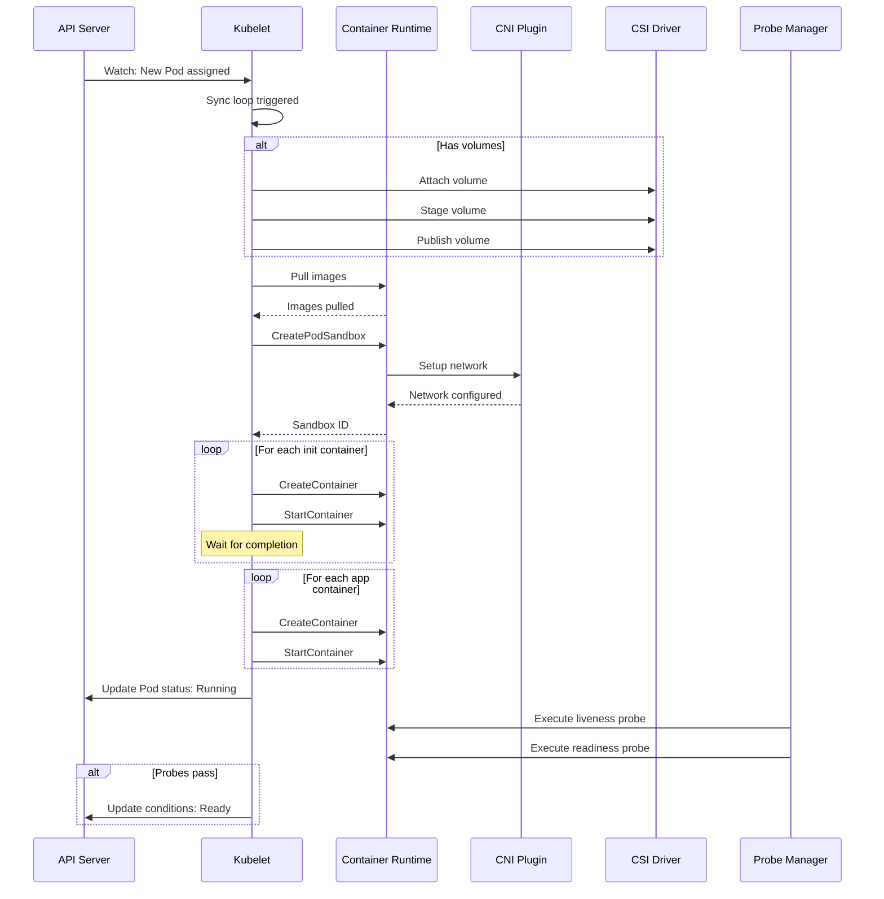

## References

### Official Documentation

- [Kubelet](https://kubernetes.io/docs/reference/command-line-tools-reference/kubelet/)
- [Kube-proxy](https://kubernetes.io/docs/reference/command-line-tools-reference/kube-proxy/)
- [Container Runtime Interface](https://kubernetes.io/docs/concepts/architecture/cri/)
- [CNI Specification](https://github.com/containernetworking/cni)
- [CSI Specification](https://github.com/container-storage-interface/spec)
- [Device Plugins](https://kubernetes.io/docs/concepts/extend-kubernetes/compute-storage-net/device-plugins/)
- [Pod Lifecycle](https://kubernetes.io/docs/concepts/workloads/pods/pod-lifecycle/)
- [Resource Management](https://kubernetes.io/docs/concepts/configuration/manage-resources-containers/)

### Specifications

- [CRI API](https://github.com/kubernetes/cri-api)
- [OCI Runtime Specification](https://github.com/opencontainers/runtime-spec)
- [OCI Image Specification](https://github.com/opencontainers/image-spec)
